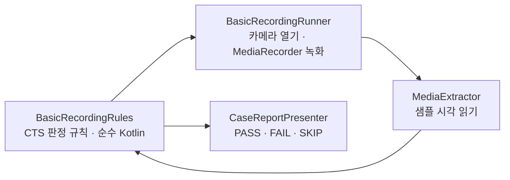

<h1 lang="en">The same test, inside the app.</h1>

**CTS 화면은 CTS가 아닙니다.** `RecordingTest#testBasicRecording`의 판정 규칙과 상수를 그대로 옮겨 앱 안에서 실행하고, 결과를 원본 assertion 문구로 보여 줍니다. 공식 판정은 cts-tradefed의 `test_result.xml`뿐이며, 이 화면은 그 결과를 기다리기 전에 같은 조건을 기기에서 미리 확인하는 용도입니다.

이 그림은 케이스 하나가 진행되는 개념적 순서입니다. 규칙은 카메라를 모르는 순수 Kotlin이라 JVM 테스트로 검증하고, 러너가 CTS가 기기에서 읽는 값을 채워 넣습니다.

<h2 lang="en">What one run does.</h2>

| 단계 | 내용 |
| --- | --- |
| 카메라 선택 | 공개 카메라 전부를 순회합니다. 컬러 출력이 없거나 외장 카메라이면 CTS와 같은 사유로 건너뜁니다. |
| 프로파일 계획 | 카메라마다 CamcorderProfile을 CTS 순서로 최대 9개 계획합니다. 프로파일이 없거나 LEGACY 제한에 걸리면 SKIP으로 기록하고, 크기·FPS가 지원 목록에 없으면 FAIL입니다. |
| 녹화 | 프로파일마다 3초씩 소리를 포함해 녹화합니다. 화면의 SurfaceView가 CTS의 `Camera2SurfaceViewCtsActivity` 역할을 합니다. |
| 판정 | 녹화 파일의 비디오 트랙 크기, 길이 오차 20 % 이내, 프레임 드롭률 5 % 미만을 검사합니다. LEGACY 기기는 크기 검사까지만 합니다. |
| 계속 진행 | CTS와 달리 한 프로파일이 실패해도 나머지 프로파일과 카메라를 계속 실행합니다. 전체 소요 시간은 약 3분입니다. |

A rule you can run on the JVM is a rule you can trust on the device.

<h2 lang="en">Read the verdicts.</h2>

`PASS`·`FAIL`·`SKIP`은 카메라와 프로파일 단위로 붙습니다. FAIL의 상세 문구는 CTS의 assertion 메시지와 같으므로 원본 테스트 결과와 나란히 읽을 수 있습니다. `복사`는 보고서를 클립보드에 넣고 `공유`는 같은 텍스트를 다른 앱으로 보냅니다. 녹화한 동영상 파일은 앱 전용 폴더에 `test_video.mp4`로 쓰고 판정 뒤 삭제하므로 앨범에 남지 않습니다.

<h2 lang="en">Where it sits in the app.</h2>

LIVE 상단 `도구` 메뉴에서 열며, 자기 카메라를 열기 때문에 LIVE 카메라의 `close(done)` 콜백을 받은 뒤에 화면이 열립니다. 화면에 들어간 뒤 `실행`을 눌러야 시작합니다. 케이스를 추가할 때는 규칙을 `cts/recording/`처럼 순수 Kotlin에 두고 JVM 테스트를 함께 씁니다.

코드 근거를 확인하세요

저장소의 <code>app/src/main/java/dev/halcamera/cts/</code>에서 <code>recording/BasicRecordingRules.kt</code>(판정 규칙), <code>recording/BasicRecordingRunner.kt</code>(녹화 실행), <code>CaseReportPresenter.kt</code>(보고서), <code>CtsCaseActivity.kt</code>(화면)를 확인하세요. JVM 테스트는 <code>app/src/test/java/dev/halcamera/cts/</code>에 있습니다. 원고의 검토 상태는 아키텍처 문서 끝에 있습니다.

**다음 단계:** 판정에 쓰인 시간 규칙이 어디서 오는지 [Benchmark](benchmark.md)의 측정 범위와 비교해 읽으세요. CTS는 통과·실패를, Benchmark는 얼마나 걸리는지를 답합니다.
