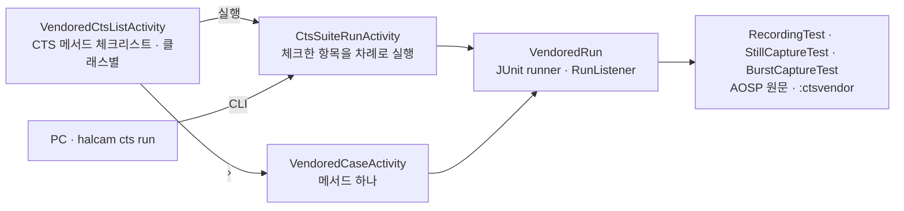

<h1 lang="en">The same test, inside the app.</h1>

**CTS 화면은 CTS가 아닙니다.** 공식 판정은 cts-tradefed의 `test_result.xml`뿐이며, 이 화면은 그 결과를 기다리기 전에 같은 테스트 코드를 기기에서 미리 돌려 보는 용도입니다. 목록의 모든 항목은 AOSP CTS의 Java 테스트 메서드를 그대로 가져와 앱 안의 JUnit으로 실행한 것이고, 앱이 옮겨 적은 검사는 없습니다.

이 그림은 한 번 실행이 지나가는 개념적 순서입니다. 체크리스트에서 고른 항목은 `CtsSuiteRunActivity`가 위에서부터 차례로 실행하고, 행의 `›`는 그 메서드 하나만 여는 화면입니다. 두 실행 화면 모두 CTS의 `Camera2SurfaceViewCtsActivity`를 상속해 테스트가 기대하는 Activity가 됩니다. PC의 [CLI](cli.md)는 같은 실행 화면을 `cts.run`으로 엽니다.

<h2 lang="en">Pick a CTS method.</h2>

목록은 `:ctsvendor` 모듈에 가져온 테스트 클래스의 `@Test` 메서드를 reflection으로 나열합니다. 지금 가져온 클래스는 세 개입니다.

| 클래스 | 검사하는 것 | 실기기 확인 |
| --- | --- | --- |
| `RecordingTest` | CamcorderProfile 녹화, 동영상 스냅샷, 고속·슬로모션·타임랩스 녹화, 프리뷰 크기별 녹화 등 19개 메서드 | `testBasicRecording` PASS(Galaxy S25+, 1분 58초). 나머지는 아직 돌려 보지 않았습니다. |
| `StillCaptureTest` | JPEG·HEIC·RAW·DNG 정지 영상, AE/AF 수렴, 줌, 회전, 초점 거리, 프리뷰와 정지 영상 크기 조합, 타임스탬프 등 21개 메서드 | 21개 모두 실행, PASS 20 · FAIL 1(Galaxy S25+). `testAeCompensation`이 카메라 0의 노출 시간 범위 초과와 카메라 2의 AE 보정 미적용으로 FAIL했고, 이는 HAL 판정입니다. `testStillPreviewCombination`은 18분 29초가 걸립니다. |
| `BurstCaptureTest` | JPEG·YUV·RAW 연속 촬영의 프레임 순서와 처리량 3개 메서드 | 3개 모두 PASS(Galaxy S25+). |

`UiAutomation`이나 `@TestApi`가 필요한 메서드는 실행하면 초기화 단계에서 FAIL로 끝납니다. `StillCaptureTest`·`BurstCaptureTest`의 24개 메서드에는 그런 메서드가 없었고, `RecordingTest`의 나머지 18개는 아직 돌려 보지 않았습니다. 결과 목록은 `docs/STATUS.md`의 실기기 확인 절에 있습니다. 측정된 적 없는 메서드는 행에 `시간 미상`으로 표시됩니다.

가져온 소스는 AOSP `android16-release` 브랜치의 `cts/tests/camera`와 `frameworks/ex/camera2/public`이며, 원본 커밋과 적용한 패치(`@TestApi`·`@FlaggedApi` 호출을 공개 API로 바꾸거나 제거하고, shell 권한 행을 만들지 않게 한 것)는 `ctsvendor/UPSTREAM.md`에 있습니다. Android 14(API 34) 아래 기기에서는 `도구` 메뉴의 `CTS`가 안내만 띄우고 열리지 않습니다. 업스트림이 이 파일 집합을 `min_sdk_version 34`로 빌드하기 때문입니다.

<h2 lang="en">What one run does.</h2>

1. Live 상단 `도구` 메뉴에서 `CTS`를 고릅니다. Live 카메라의 `close(done)` 콜백을 받은 뒤 체크리스트가 열립니다.
2. 실행할 메서드에 체크합니다. 클래스별로 묶여 있고, 그룹의 `전체 선택`으로 한 번에 고를 수 있습니다. 하단 바에 `선택 N개 · 약 M분`이 갱신되며, 선택은 다음에 열 때 그대로 남아 있습니다.
3. 하단 바의 `실행`을 누르면 실행 화면이 열리고, 카메라와 마이크 권한을 확인한 뒤 바로 첫 항목을 시작합니다. 각 메서드는 공개 카메라 전부를 스스로 순회하며, 컬러 출력이 없거나 외장 카메라이면 CTS와 같은 사유로 건너뜁니다. 한 항목이 카메라를 닫고 결과를 보고한 뒤에야 다음 항목이 시작됩니다.
4. 항목마다 카드가 하나씩 놓입니다. 실행 중에는 경과 시간만 갱신되고, 실패가 생기면 그 즉시 실패 문구가 카드에 추가됩니다. `중단`을 누르면 실행 중인 항목만 멈추고(`중단됨`) 나머지는 `실행 안 함`으로 남습니다.
5. 끝나면 머리글에 `N개 중 PASS a · FAIL b · 소요 시간`이 나옵니다. `복사`는 항목 전체의 보고서를 클립보드에 넣고 `공유`는 같은 텍스트를 다른 앱으로 보냅니다. `다시 실행`은 같은 항목을 처음부터 다시 돌립니다.

항목 하나만 따로 보려면 행의 `›`를 누릅니다. `VendoredCaseActivity`가 열리며, `실행`·`중단`·`복사`·`공유`의 동작은 같고 결과 표시만 그 메서드 하나에 맞춰져 있습니다.

`중단`은 실행 중인 테스트가 쥔 카메라를 닫아 테스트를 실패시키는 방식이라 몇 초 뒤에 `중단됨`으로 끝납니다. JUnit에는 실행 중인 본문을 멈출 수단이 없기 때문입니다. 실행 화면을 나가도 같은 방식으로 중단됩니다.

Run the upstream code. Read the upstream message.

<h2 lang="en">Read the verdicts.</h2>

판정은 메서드 하나에 하나입니다. `PASS`는 JUnit이 실패 없이 끝난 것, `FAIL`은 실패가 한 건 이상 있는 것, `SKIP`은 테스트가 assumption으로 스스로 건너뛴 것입니다. 카메라별·프로파일별 세부는 CTS가 `Log`로만 남기고 앱은 logcat을 읽을 권한이 없으므로, 실패 카드에는 예외 메시지와 CTS 코드 안의 호출 위치 세 줄만 남습니다. 어느 카메라에서 무엇이 실패했는지는 그 메시지에 적힌 카메라 ID로 읽습니다. 메시지는 CTS의 assertion 문구 그대로이므로 원본 테스트 결과와 나란히 읽을 수 있습니다.

테스트가 쓰는 동영상과 사진은 앱 전용 폴더(`getExternalFilesDir`)에 남습니다. 앨범에는 아무것도 남지 않습니다.

<h2 lang="en">Run it from the PC.</h2>

[CLI](cli.md)의 `cts cases`가 이 체크리스트와 같은 항목을 `vendored:<class>#<method>` 키와 함께 돌려주고, `cts run --case KEY …`가 고른 항목을 같은 순서로 실행해 보고서 JSON과 공유 텍스트를 받습니다. 마이크 권한은 CLI가 대신 요청하지 않으므로 앱에서 먼저 허용해 두어야 합니다.

<h2 lang="en">Add a class.</h2>

CTS 클래스를 추가하려면 테스트마다 코드를 쓰지 않습니다.

1. AOSP 같은 브랜치·같은 커밋에서 테스트 클래스 파일을 `ctsvendor/src/main/java/`의 같은 패키지 경로에 복사합니다. `Camera2SurfaceViewTestCase` 계열이 아니면 그 기반 클래스도 함께 가져옵니다.
2. `./gradlew :ctsvendor:compileDebugJavaWithJavac`로 컴파일합니다. 오류가 난 호출이 곧 `@TestApi`·`@FlaggedApi` 목록이므로, `UPSTREAM.md`의 패치처럼 공개 API로 바꾸거나 그 메서드를 제거하고 패치 목록에 적습니다. 플랫폼 전용 annotation은 같은 이름의 빈 annotation으로 대신합니다.
3. `VendoredCatalog.classes`에 클래스를 넣습니다. `@Test` 메서드는 reflection으로 나열되므로 체크리스트와 CLI 목록이 함께 늘어납니다.

코드 근거를 확인하세요

저장소의 <code>app/src/main/java/dev/halcamera/cts/</code>에서 <code>vendored/VendoredCtsListActivity.kt</code>·<code>vendored/VendoredCaseActivity.kt</code>(화면), <code>suite/CtsChecklistActivity.kt</code>·<code>suite/CtsSuiteRunActivity.kt</code>(체크리스트와 차례 실행), <code>suite/SuitePlan.kt</code>·<code>suite/SuiteReport.kt</code>(항목 키·예상 시간·보고서)를 확인하세요. 가져온 테스트는 <code>ctsvendor/src/main/java/android/hardware/camera2/cts/</code>에, 실행 장치는 <code>ctsvendor/src/main/java/dev/halcamera/ctsvendor/</code>의 <code>VendoredCts.kt</code>·<code>VendoredRun.kt</code>·<code>VendoredCatalog.kt</code>에, 패치 목록은 <code>ctsvendor/UPSTREAM.md</code>에 있습니다. JVM 테스트는 <code>app/src/test/java/dev/halcamera/cts/</code>에 있습니다. 원고의 검토 상태는 아키텍처 문서 끝에 있습니다.

**다음 단계:** 판정에 쓰인 시간 규칙이 어디서 오는지 [Benchmark](benchmark.md)의 측정 범위와 비교해 읽으세요. CTS는 통과·실패를, Benchmark는 얼마나 걸리는지를 답합니다.
