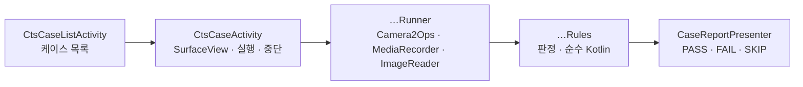

<h1 lang="en">The same test, inside the app.</h1>

**CTS 화면은 CTS가 아닙니다.** CTS 카메라 테스트의 판정 규칙과 상수를 앱 안으로 옮긴 케이스 여섯 가지를 골라 실행하고, 결과를 원본 assertion 문구로 보여 줍니다. 공식 판정은 cts-tradefed의 `test_result.xml`뿐이며, 이 화면은 그 결과를 기다리기 전에 같은 조건을 기기에서 미리 확인하는 용도입니다. 모든 케이스는 단발성 PASS·FAIL·SKIP 판정이고, Benchmark의 반복 측정이나 회귀 점수에는 들어가지 않습니다.

이 그림은 케이스 하나가 진행되는 개념적 순서입니다. 규칙은 카메라를 모르는 순수 Kotlin이라 JVM 테스트로 검증하고, 러너가 CTS가 기기에서 읽는 값을 채워 넣습니다. 여섯 케이스는 같은 `CtsRunner` 계약을 구현하므로 화면은 케이스를 구분하지 않습니다.

<h2 lang="en">Pick a case.</h2>

| 케이스 | 원본 | 한 번 실행하면 |
| --- | --- | --- |
| 기본 녹화 | `RecordingTest#testBasicRecording` | 카메라마다 CamcorderProfile을 CTS 순서로 최대 9개, 각각 3초씩 소리와 함께 녹화합니다. 길이 오차 20 % 이내, 프레임 드롭률 5 % 미만을 검사합니다. |
| 빠른 켜기·끄기 | `custom#FastOnOff` | 표준 열기(열기 → 프리뷰 세션 → 첫 프레임 → 닫기)와 빠른 열기(열기 직후 닫기 → 다시 열기 → 첫 프레임 → 닫기)를 5회씩 번갈아 수행합니다. 첫 프레임의 `SENSOR_TIMESTAMP`와 프레임 번호를 검사하고, 마지막 줄에 두 방식의 첫 프레임 중앙값을 비교합니다. |
| 카메라 전환 | `custom#Switching` | 카메라를 차례로 열어 첫 프레임을 받고 닫는 전환을 5회 반복한 뒤, 카메라마다 가장 큰 CamcorderProfile로 3초 녹화합니다. 녹화는 파일·트랙·크기와 길이 오차 20 %만 검사합니다. |
| 모든 크기 켜기·끄기 | `custom#AllSizeOnOff` | SurfaceHolder로 보고하는 프리뷰 크기 전부를 큰 것부터 하나씩 열어 첫 프레임을 확인합니다. 1080p 상한을 두지 않습니다. |
| 정지 영상 × 프리뷰 조합 | `custom#StillPreviewCombination` | JPEG 크기 전부와 프리뷰 크기(1080p 이하) 전부의 조합마다 세션을 구성해 프리뷰 첫 프레임 뒤 정지 영상을 한 장 찍고, 요청한 크기의 디코딩 가능한 JPEG인지 검사합니다. `StillCaptureTest#testStillPreviewCombination`의 순서와 QCIF 예외를 따르되 AE·AF 수렴은 기다리지 않습니다. |
| 동영상 스냅샷 | `custom#VideoSnapshot` | 가장 큰 CamcorderProfile로 25초를 녹화하면서 5~20초 사이 무작위 시점에 같은 세션으로 JPEG 스냅샷을 한 장 찍습니다. 동영상은 `RecordingTest#testVideoSnapshot`의 프레임 드롭률 8 %(15 MP 초과 스냅샷은 12 %), 스냅샷은 크기와 디코딩을 검사합니다. |

`custom#` 원본은 CTS 클래스에 그대로 대응하는 메서드가 없는 케이스입니다. 검사 문구는 CTS `CameraTestUtils`에 같은 검사가 있으면 그 문구를 따릅니다.

<h2 lang="en">What one run does.</h2>

1. LIVE 상단 `도구` 메뉴에서 `CTS`를 고릅니다. LIVE 카메라의 `close(done)` 콜백을 받은 뒤 케이스 목록이 열립니다.
2. 케이스 카드를 누르면 실행 화면이 열립니다. 카드에는 원본과 한 번 실행할 때 하는 일, 대략의 소요 시간이 적혀 있습니다.
3. `실행`을 누르면 카메라 권한(녹화 케이스는 마이크 권한도)을 확인한 뒤 공개 카메라 전부를 순회합니다. 컬러 출력이 없거나 외장 카메라이면 CTS와 같은 사유로 건너뜁니다.
4. 단계마다 판정이 결정되는 즉시 카메라 카드에 행이 추가됩니다. `중단`을 누르면 진행 중인 단계를 마친 뒤 멈추고, 완료된 행까지만 표시합니다.
5. 끝나면 머리글에 카메라 수와 FAIL 수가 나옵니다. `복사`는 보고서를 클립보드에 넣고 `공유`는 같은 텍스트를 다른 앱으로 보냅니다.

CTS와 달리 한 단계가 실패해도 나머지 단계와 카메라를 계속 실행합니다. 화면의 SurfaceView가 CTS의 `Camera2SurfaceViewCtsActivity` 역할을 하며, 러너가 필요한 크기로 버퍼를 바꾸고 `surfaceChanged`를 기다린 뒤 세션을 엽니다. 카메라 열기·세션 구성·첫 결과·닫기의 대기 시간은 CTS `CameraTestUtils`와 같은 3초입니다.

A rule you can run on the JVM is a rule you can trust on the device.

<h2 lang="en">Read the verdicts.</h2>

`PASS`·`FAIL`·`SKIP`은 카메라와 단계 단위로 붙습니다. 단계는 케이스마다 다릅니다. 기본 녹화와 동영상 스냅샷은 프로파일 이름, 빠른 켜기·끄기는 `standard_1`·`fast_1`과 `compare`, 카메라 전환은 `round_1`과 `record`, 크기 케이스는 `1920x1080`, 조합 케이스는 `4000x3000/1920x1080`처럼 정지 영상과 프리뷰 크기입니다. PASS 행에도 열기·세션 구성·첫 프레임·닫기의 소요 시간이나 녹화 길이·프레임 수 같은 수치를 남겨 경계에 가까운 통과를 다시 실행하지 않고 볼 수 있습니다. FAIL의 상세 문구는 CTS의 assertion 메시지와 같으므로 원본 테스트 결과와 나란히 읽을 수 있습니다.

녹화한 동영상은 앱 전용 폴더에 `test_video.mp4`로 쓰고 판정 뒤 삭제하며, 정지 영상과 스냅샷은 크기와 디코딩만 확인하고 버립니다. 앨범에는 아무것도 남지 않습니다.

<h2 lang="en">Add a case.</h2>

1. 케이스별 하위 패키지(`cts/onoff/`처럼)에 판정을 담은 순수 Kotlin `…Rules`와 카메라를 다루는 `…Runner`를 둡니다. 러너는 `CameraCaseRunner`를 상속해 `runCamera`(카메라마다) 또는 `runCameras`(카메라를 섞어 쓰는 경우)를 구현합니다.
2. 열기 → 프리뷰 → 첫 프레임 → 닫기가 필요하면 `openCycle`과 `OpenCycle`을, 녹화가 필요하면 `CamcorderRecording`을, 정지 영상이 필요하면 `JpegReader`와 `Camera2Ops.captureStill`을 재사용합니다.
3. `CtsCatalog`에 id·원본·제목·요약을, `CtsRunners`에 러너 생성을 등록합니다. 규칙의 JVM 테스트를 함께 씁니다.

코드 근거를 확인하세요

저장소의 <code>app/src/main/java/dev/halcamera/cts/</code>에서 <code>CtsCatalog.kt</code>(케이스 목록), <code>CtsRunner.kt</code>·<code>CameraCaseRunner.kt</code>·<code>Camera2Ops.kt</code>(공통 계약과 Camera2 호출), <code>CtsCaseListActivity.kt</code>·<code>CtsCaseActivity.kt</code>(화면), <code>CaseReportPresenter.kt</code>(보고서), 그리고 <code>recording/</code>·<code>onoff/</code>·<code>switching/</code>·<code>sizes/</code>·<code>combination/</code>·<code>snapshot/</code>의 <code>…Rules.kt</code>(판정)와 <code>…Runner.kt</code>(실행)를 확인하세요. JVM 테스트는 <code>app/src/test/java/dev/halcamera/cts/</code>에 있습니다. 원고의 검토 상태는 아키텍처 문서 끝에 있습니다.

**다음 단계:** 판정에 쓰인 시간 규칙이 어디서 오는지 [Benchmark](benchmark.md)의 측정 범위와 비교해 읽으세요. CTS는 통과·실패를, Benchmark는 얼마나 걸리는지를 답합니다.
