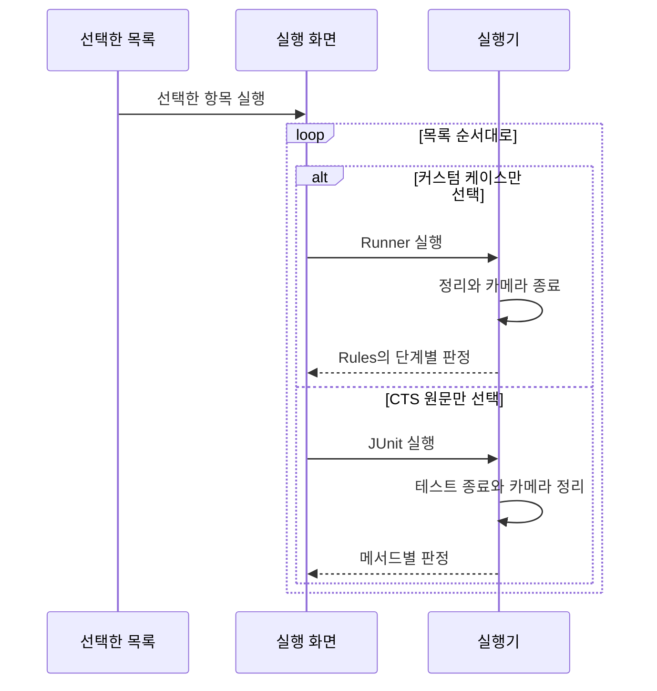
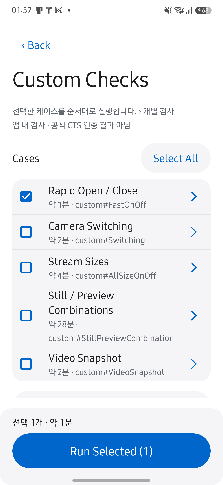
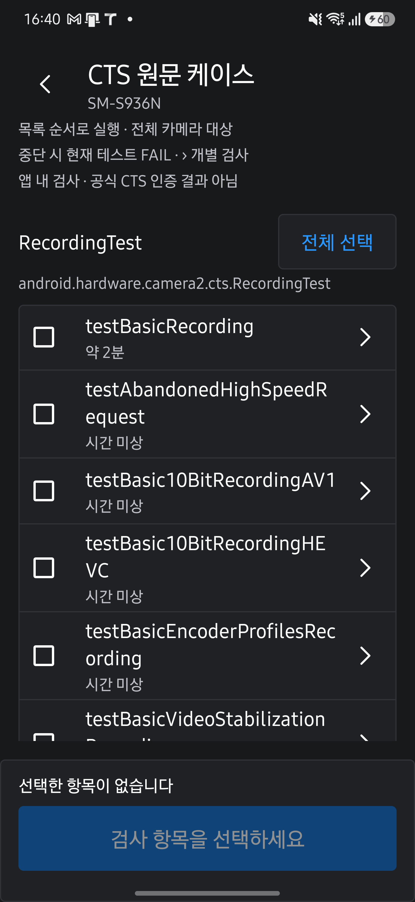
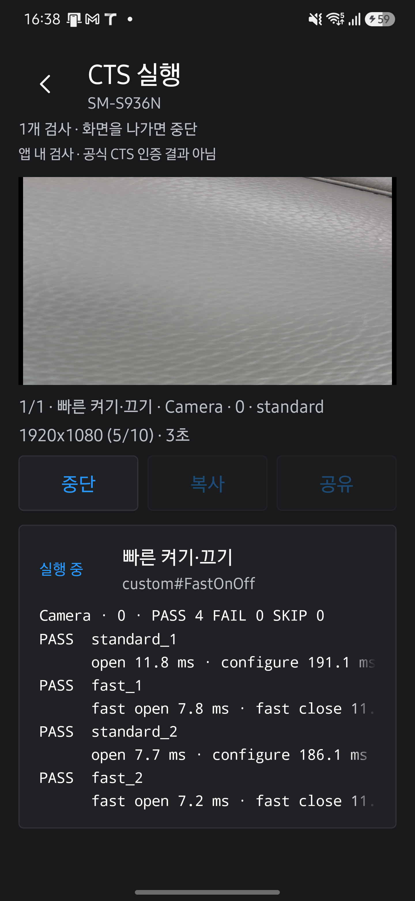
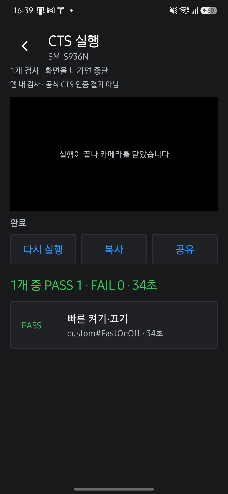

<h1 lang="en">The same test, inside the app.</h1>

**`Lab → CTS`에서 검사 방식을 고르고 실행하세요.** 앱의 결과는 사전 점검용입니다. 공식 CTS 판정은 cts-tradefed의 `test_result.xml`로 확인합니다.

## 선택한 항목을 실행하세요

1. Live의 `Lab → CTS`를 엽니다.
2. `커스텀 케이스` 또는 `CTS 원문 케이스`를 고릅니다. 차이가 궁금하면 [방식 비교](#검사-방식의-차이)를 확인하세요.
3. 실행할 항목을 체크합니다. 하단에서 선택 개수와 예상 시간을 확인합니다.
4. `실행`을 누르고 필요한 권한을 허용합니다.
5. 끝난 카드를 눌러 결과를 확인합니다.

**확인할 결과:** 선택한 항목에 판정과 소요 시간이 표시됩니다. 실패나 SKIP이 있으면 [판정 읽기](#판정을-읽으세요)에서 다음 확인 항목을 찾으세요.

| 필요할 때 | 조작과 결과 |
| --- | --- |
| 한꺼번에 선택합니다. | 그룹의 `전체 선택`을 누릅니다. 선택은 다음에 열 때도 유지됩니다. |
| 도중에 멈춥니다. | `중단`을 누릅니다. 현재 항목은 `중단됨`, 나머지는 `실행 안 함`으로 남습니다. |
| 결과를 가져갑니다. | `복사`는 전체 보고서를 클립보드에 넣습니다. `공유`는 같은 내용을 다른 앱으로 보냅니다. |
| 다시 검사합니다. | `다시 실행`을 누르면 같은 항목을 처음부터 실행합니다. |

권한·예상 시간·실행 순서

- Live의 카메라가 `close(done)`을 마친 뒤 CTS를 엽니다.
- 카메라 권한이 필요하며 녹화 항목은 마이크 권한도 확인합니다.
- 항목마다 공개 카메라를 순회합니다. 컬러 출력이 없거나 외장 카메라이면 CTS와 같은 사유로 건너뜁니다.
- 한 항목이 카메라를 닫고 결과를 보고한 뒤 다음 항목을 시작합니다.
- 행마다 제목과 예상 시간을 표시합니다. 이력이 없는 원문 메서드는 `시간 미상`으로 표시하며, 커스텀 행에는 원본도 표시합니다.
- 진행 중에는 단계별 결과를 바로 추가합니다. 완료 후에는 판정과 소요 시간을 표시하고 머리글에 전체 결과를 모읍니다.

항목 하나만 보려면 행의 `›`를 누릅니다. 커스텀 케이스는 한 단계가 실패해도 나머지를 계속 실행합니다. CTS 원문은 중단 처리에 몇 초가 걸릴 수 있습니다.

단일 항목 실행과 내부 처리

항목 하나만 따로 보려면 행의 `›`를 누릅니다. 커스텀 케이스는 `CtsCaseActivity`, CTS 원문은 `VendoredCaseActivity`가 열립니다. `실행`·`중단`·`복사`·`공유`는 목록 실행과 같은 방식으로 조작하며, 결과는 해당 항목만 표시합니다.

커스텀 케이스는 한 단계가 실패해도 나머지 단계와 카메라를 계속 실행합니다. 화면의 SurfaceView가 CTS의 `Camera2SurfaceViewCtsActivity` 역할을 하며, 러너가 필요한 크기로 버퍼를 바꾸고 `surfaceChanged`를 기다린 뒤 세션을 엽니다. 카메라 열기·세션 구성·첫 결과·닫기의 대기 시간은 CTS `CameraTestUtils`와 같은 3초입니다.

CTS 원문 케이스의 한 번 실행은 다릅니다. `실행`을 누르면 카메라와 마이크 권한을 확인한 뒤 JUnit이 테스트 메서드를 작업 스레드에서 돌립니다. 테스트는 카메라 전부를 스스로 순회하므로 진행 중에는 경과 시간만 갱신되고, 실패가 생기면 그 즉시 실패 카드가 추가됩니다. `중단`은 실행 중인 테스트가 쥔 카메라를 닫아 테스트를 실패시키는 방식이라 몇 초 뒤에 `중단됨`으로 끝납니다. JUnit에는 실행 중인 본문을 멈출 수단이 없기 때문입니다. 실행 화면 자체가 CTS의 `Camera2SurfaceViewCtsActivity`를 상속하므로 테스트의 `updatePreviewSurface`가 같은 SurfaceView를 그대로 씁니다.

## 검사 방식의 차이

| 방식 | 무엇을 실행하나요? | 판정 단위 |
| --- | --- | --- |
| 커스텀 케이스 | CTS 규칙과 상수를 앱의 Kotlin으로 옮긴 다섯 가지 검사입니다. | 카메라와 단계별로 판정합니다. |
| CTS 원문 케이스 | AOSP의 Java 테스트를 앱 안의 JUnit으로 실행합니다. | 테스트 메서드 하나에 판정 하나를 냅니다. |

두 방식 모두 Benchmark의 반복 측정과 회귀 점수에는 포함하지 않습니다.

검사 실행 구조

```mermaid
sequenceDiagram
    participant U as 선택한 목록
    participant S as 실행 화면
    participant R as 실행기
    U->>S: 선택한 항목 실행
    loop 목록 순서대로
        alt 커스텀 케이스만 선택
            S->>R: Runner 실행
            R->>R: 정리와 카메라 종료
            R-->>S: Rules의 단계별 판정
        else CTS 원문만 선택
            S->>R: JUnit 실행
            R->>R: 테스트 종료와 카메라 정리
            R-->>S: 메서드별 판정
        end
    end
```

한 번의 실행에는 한 종류만 들어갑니다. 취소하면 남은 항목은 실행하지 않으며, 다음 케이스는 현재 케이스의 정리가 끝난 뒤 시작합니다.

두 목록은 모두 체크리스트이고, 체크한 항목을 `실행`하면 `CtsSuiteRunActivity`가 위에서부터 차례로 돌립니다.

이 화면은 가져온 `Camera2SurfaceViewCtsActivity`를 상속하면서 커스텀 러너의 `PreviewHost`도 구현하므로 SurfaceView 하나로 두 종류를 다 호스트하지만, 목록이 분리되어 있으므로 한 번의 실행에는 한 종류만 들어갑니다.

커스텀 케이스의 규칙은 카메라를 모르는 순수 Kotlin이라 JVM 테스트로 검증하고, 러너가 CTS가 기기에서 읽는 값을 채워 넣습니다.

다섯 케이스는 같은 `CtsRunner` 계약을 구현하므로 화면은 케이스를 구분하지 않습니다.

CTS 원문 케이스는 코드를 옮기지 않으므로 검사 본문은 AOSP 소스를 따르며, 앱 실행에 필요한 instrumentation 대역과 공개 API 호환 패치를 적용합니다.

아래 화면은 2026년 9월 29일 Galaxy S25+·Android 16에서 HAL CAMERA 0.15.0을 실행해 촬영했습니다. <a href="evidence.html#앱-화면-촬영">촬영 조건과 확인 범위</a>를 함께 확인하세요. 이미지를 누르면 원본이 열립니다.

## 커스텀 케이스를 선택하세요

| 케이스 | 확인하는 동작 |
| --- | --- |
| 빠른 켜기·끄기 | 열고 닫는 두 순서의 첫 프레임을 비교합니다. |
| 카메라 전환 | 카메라를 바꿔 열고 녹화합니다. |
| 모든 크기 켜기·끄기 | 지원하는 모든 프리뷰 크기를 엽니다. |
| 정지 영상 × 프리뷰 조합 | JPEG와 프리뷰 크기 조합을 검사합니다. |
| 동영상 스냅샷 | 녹화하면서 사진을 한 장 찍습니다. |

횟수·시간·통과 조건

**빠른 켜기·끄기** · `custom#FastOnOff`

표준 열기(열기 → 프리뷰 세션 → 첫 프레임 → 닫기)와 빠른 열기(열기 직후 닫기 → 다시 열기 → 첫 프레임 → 닫기)를 5회씩 번갈아 수행합니다. 첫 프레임의 `SENSOR_TIMESTAMP`와 프레임 번호를 검사하고, 마지막 줄에 두 방식의 첫 프레임 중앙값을 비교합니다.

**카메라 전환** · `custom#Switching`

카메라를 차례로 열어 첫 프레임을 받고 닫는 전환을 5회 반복한 뒤, 카메라마다 가장 큰 CamcorderProfile로 3초 녹화합니다. 녹화는 파일·트랙·크기와 길이 오차 20 %만 검사합니다.

**모든 크기 켜기·끄기** · `custom#AllSizeOnOff`

SurfaceHolder로 보고하는 프리뷰 크기 전부를 큰 것부터 하나씩 열어 첫 프레임을 확인합니다. 1080p 상한을 두지 않습니다.

**정지 영상 × 프리뷰 조합** · `custom#StillPreviewCombination`

JPEG 크기 전부와 프리뷰 크기(1080p 이하) 전부의 조합마다 세션을 구성해 프리뷰 첫 프레임 뒤 정지 영상을 한 장 찍고, 요청한 크기의 디코딩 가능한 JPEG인지 검사합니다. `StillCaptureTest#testStillPreviewCombination`의 순서와 QCIF 예외를 따르되 AE·AF 수렴은 기다리지 않습니다.

**동영상 스냅샷** · `custom#VideoSnapshot`

가장 큰 CamcorderProfile로 25초를 녹화하면서 5~20초 사이 무작위 시점에 같은 세션으로 JPEG 스냅샷을 한 장 찍습니다. 동영상은 `RecordingTest#testVideoSnapshot`의 프레임 드롭률 8 %(15 MP 초과 스냅샷은 12 %), 스냅샷은 크기와 디코딩을 검사합니다.

실제 화면 보기

<figure class="app-screenshot">

<figcaption>커스텀 케이스에서 빠른 켜기·끄기 한 개를 선택했습니다. 하단 실행 버튼은 선택한 항목 수를 표시합니다. <a href="assets/screenshots/cts-custom.png">원본 보기</a></figcaption>
</figure>

`custom#` 원본은 CTS 클래스에 그대로 대응하는 메서드가 없는 케이스입니다. 검사 문구는 CTS `CameraTestUtils`에 같은 검사가 있으면 그 문구를 따릅니다. `RecordingTest#testBasicRecording`은 커스텀 케이스에 없습니다. 원문 그대로 실행하는 쪽이 옮겨 적는 쪽보다 정확하므로 CTS 원문 케이스로만 제공하며, 녹화 판정 규칙(`BasicRecordingRules`)은 카메라 전환과 동영상 스냅샷이 계속 공유합니다.

## CTS 원문 메서드를 선택하세요

CTS 원문 케이스 목록은 `:ctsvendor` 모듈에 가져온 테스트 클래스의 `@Test` 메서드를 reflection으로 나열합니다. 지금 가져온 클래스는 세 개입니다.

| 클래스 | 검사하는 범위 |
| --- | --- |
| `RecordingTest` | CamcorderProfile 녹화, 동영상 스냅샷, 고속·슬로모션 녹화, 프리뷰 크기별 녹화 등 16개 메서드입니다. |
| `StillCaptureTest` | JPEG·HEIC·RAW·DNG 촬영, AE/AF 수렴, 줌, 회전, 초점 거리, 프리뷰와 정지 영상 크기 조합, 타임스탬프 등 21개 메서드입니다. |
| `BurstCaptureTest` | JPEG·YUV·RAW 연속 촬영의 프레임 순서와 처리량을 검사하는 3개 메서드입니다. |

업스트림 본문이 TODO뿐인 `testCameraRecorderOrdering`·`testMediaCodecRecording`·`testTimelapseRecording`은 목록에서 제외합니다. 측정 이력이 없는 메서드는 `시간 미상`으로 표시합니다. `UiAutomation`이나 `@TestApi`가 필요한 메서드는 초기화 단계에서 실패할 수 있습니다. 기존 기기별 결과와 소요 시간은 [Validation](evidence.md#cts-원문-케이스)에 있습니다.

실제 화면 보기

<figure class="app-screenshot">

<figcaption>AOSP 원문 메서드 목록을 연 화면입니다. 이 장면에서는 항목을 선택하거나 원문 테스트를 실행하지 않았습니다. <a href="assets/screenshots/cts-vendored.png">원본 보기</a></figcaption>
</figure>

가져온 소스는 AOSP `android16-release` 브랜치의 `cts/tests/camera`와 `frameworks/ex/camera2/public`이며, 원본 커밋과 적용한 패치 여덟 건(`@TestApi`·`@FlaggedApi` 호출을 공개 API로 바꾸거나 제거하고, shell 권한 행을 만들지 않게 한 것)은 `ctsvendor/UPSTREAM.md`에 있습니다. Android 14(API 34) 아래 기기에서는 이 경로가 비활성화됩니다. 업스트림이 이 파일 집합을 `min_sdk_version 34`로 빌드하기 때문입니다.

실제 화면 보기

<figure class="app-screenshot">

<figcaption>빠른 켜기·끄기를 실행 중인 화면입니다. 카메라 프리뷰와 현재 회차, 단계별 판정을 함께 표시합니다. <a href="assets/screenshots/cts-running.png">원본 보기</a></figcaption>
</figure>

## 판정을 읽으세요

**커스텀 케이스는 카메라와 단계별로 판정합니다.** PASS 행에도 시간과 수치를 남깁니다. FAIL의 상세 문구는 CTS assertion 메시지와 같습니다.

카메라·단계 이름 읽기

커스텀 케이스의 `PASS`·`FAIL`·`SKIP`은 카메라와 단계 단위로 붙습니다.

카메라는 진행 줄과 보고서 모두 `Camera · 0`처럼 축약 표기로 적습니다.

한 줄에 단계와 수치가 함께 들어가기 때문입니다.

단계는 케이스마다 다릅니다.

동영상 스냅샷은 프로파일 이름, 빠른 켜기·끄기는 `standard_1`·`fast_1`과 `compare`, 카메라 전환은 `round_1`과 `record`, 크기 케이스는 `1920x1080`, 조합 케이스는 `4000x3000/1920x1080`처럼 정지 영상과 프리뷰 크기입니다.

PASS 행에도 열기·세션 구성·첫 프레임·닫기의 소요 시간이나 녹화 길이·프레임 수 같은 수치를 남겨 경계에 가까운 통과를 다시 실행하지 않고 볼 수 있습니다.

FAIL의 상세 문구는 CTS의 assertion 메시지와 같으므로 원본 테스트 결과와 나란히 읽을 수 있습니다.

**CTS 원문은 아래 표로 판정을 읽으세요.** `SKIP`은 통과했다는 뜻이 아닙니다.

| 판정 | 조건 | 다음에 확인할 내용 |
| --- | --- | --- |
| PASS | JUnit 실패가 없고 카메라를 하나 이상 열었습니다. | 실행 조건과 측정값을 확인합니다. |
| FAIL | 실패가 한 건 이상 있습니다. | 실패 카드의 예외 메시지와 카메라 ID를 확인합니다. |
| SKIP | assumption으로 건너뛰었거나 모든 카메라를 건너뛰어 하나도 열지 않았습니다. | `건너뛴 이유`에서 미지원 기능과 조건을 확인합니다. |

SKIP 이유와 로그 읽기

앱은 `openDevice` 호출 기록으로 카메라를 실제로 열었는지 확인합니다. 원문에서 모든 카메라를 `continue`로 건너뛰고 통과한 경우도 앱에서는 SKIP으로 표시합니다.

`건너뛴 이유` 카드는 다음 근거를 모읍니다.

1. assumption 메시지를 표시합니다.
2. 테스트가 남긴 “… skipping” 로그를 표시합니다. 예를 들어 `Camera 0 does not support HEIC_ULTRAHDR, skipping`은 카메라 0이 해당 형식을 지원하지 않는다는 뜻입니다.
3. `SkipDiagnosis`가 원문의 `continue` 조건을 다시 확인한 키와 값을 표시합니다. HEIC UltraHDR 검사라면 `SCALER_STREAM_CONFIGURATION_MAP`에 `ImageFormat.HEIC_ULTRAHDR(0x48455548)`가 있는지와 실제 출력 형식 목록을 보여 줍니다.

모든 카메라의 이유가 같으면 한 줄로, 다르면 카메라별로 표시합니다. 업스트림 코드 자체가 카메라를 열지 않는 메서드도 이유를 남깁니다. 예를 들어 10비트 AV1 경로는 `getDynamicRangeProfile()`의 switch에 AV1 case가 없습니다.

앱은 자기 프로세스의 logcat만 읽습니다. 카메라별·프로파일별 세부 정보가 모두 남는 것은 아닙니다. 실패 카드에는 예외 메시지와 CTS 호출 위치 세 줄을 표시합니다. 어느 카메라에서 실패했는지는 메시지의 카메라 ID로 확인하세요.

녹화한 동영상은 앱 전용 폴더에 `test_video.mp4`로 쓰고 판정 뒤 삭제하며, 정지 영상과 스냅샷은 크기와 디코딩만 확인하고 버립니다. CTS 원문 케이스도 같은 앱 전용 폴더(`getExternalFilesDir`)에 씁니다. 앨범에는 아무것도 남지 않습니다.

실제 화면 보기

<figure class="app-screenshot">

<figcaption>이번 실행은 35초에 PASS로 끝났습니다. 이 결과는 해당 기기의 앱 내 검사 한 건이며 공식 CTS 인증 결과가 아닙니다. <a href="assets/screenshots/cts-result.png">원본 보기</a></figcaption>
</figure>

## 케이스를 추가하세요

커스텀 케이스를 추가하려면 다음 순서를 따릅니다.

1. 케이스별 하위 패키지(`cts/onoff/`처럼)에 판정을 담은 순수 Kotlin `…Rules`와 카메라를 다루는 `…Runner`를 둡니다. 러너는 `CameraCaseRunner`를 상속해 `runCamera`(카메라마다) 또는 `runCameras`(카메라를 섞어 쓰는 경우)를 구현합니다.
2. 열기 → 프리뷰 → 첫 프레임 → 닫기가 필요하면 `openCycle`과 `OpenCycle`을, 녹화가 필요하면 `CamcorderRecording`을, 정지 영상이 필요하면 `JpegReader`와 `Camera2Ops.captureStill`을 재사용합니다.
3. `CtsCatalog`에 id·원본·제목·요약을, `CtsRunners`에 러너 생성을 등록합니다. 규칙의 JVM 테스트를 함께 씁니다.

CTS 원문 클래스를 추가하려면 테스트마다 코드를 쓰지 않습니다.

1. AOSP 같은 브랜치에서 테스트 클래스 파일을 `ctsvendor/src/main/java/`의 같은 패키지 경로에 복사합니다. `Camera2SurfaceViewTestCase`나 `Camera2AndroidTestRule` 계열이 아니면 그 기반 클래스도 함께 가져옵니다.
2. `./gradlew :ctsvendor:compileDebugJavaWithJavac`로 컴파일합니다. 오류가 난 호출이 곧 `@TestApi`·`@FlaggedApi` 목록이므로, `UPSTREAM.md`의 패치처럼 공개 API로 바꾸거나 그 메서드를 제거하고 패치 목록에 적습니다.
3. `VendoredCatalog.classes`에 클래스를 넣습니다. `@Test` 메서드는 reflection으로 나열되므로 목록은 자동으로 늘어납니다.

코드 근거를 확인하세요

저장소의 <code>app/src/main/java/dev/halcamera/cts/</code>에서 <code>CtsEntryActivity.kt</code>(방식 선택), <code>CtsCatalog.kt</code>(케이스 목록), <code>CtsRunner.kt</code>·<code>CameraCaseRunner.kt</code>·<code>Camera2Ops.kt</code>(공통 계약과 Camera2 호출), <code>CtsCaseListActivity.kt</code>·<code>CtsCaseActivity.kt</code>(화면), <code>CaseReportPresenter.kt</code>(보고서), <code>suite/</code>의 <code>CtsChecklistActivity.kt</code>·<code>CtsSuiteRunActivity.kt</code>(체크리스트와 차례 실행)와 <code>SuitePlan.kt</code>·<code>SuiteReport.kt</code>(선택·예상 시간·통합 보고서), 그리고 <code>onoff/</code>·<code>switching/</code>·<code>sizes/</code>·<code>combination/</code>·<code>snapshot/</code>의 <code>…Rules.kt</code>(판정)와 <code>…Runner.kt</code>(실행), 공유 규칙 <code>recording/BasicRecordingRules.kt</code>를 확인하세요. CTS 원문 경로는 <code>cts/vendored/</code>의 두 화면과 <code>ctsvendor/src/main/java/dev/halcamera/ctsvendor/</code>의 <code>VendoredCts.kt</code>·<code>VendoredRun.kt</code>·<code>VendoredCatalog.kt</code>, 패치 목록 <code>ctsvendor/UPSTREAM.md</code>입니다. JVM 테스트는 <code>app/src/test/java/dev/halcamera/cts/</code>에 있습니다. 코드 확인과 기기 검증의 범위는 <a href="evidence.html">Validation</a>에서 구분합니다.

**다음 단계:** 판정에 쓰인 시간 규칙이 어디서 오는지 [Benchmark](benchmark.md)의 측정 범위와 비교해 읽으세요. CTS는 통과·실패를, Benchmark는 얼마나 걸리는지를 답합니다.
