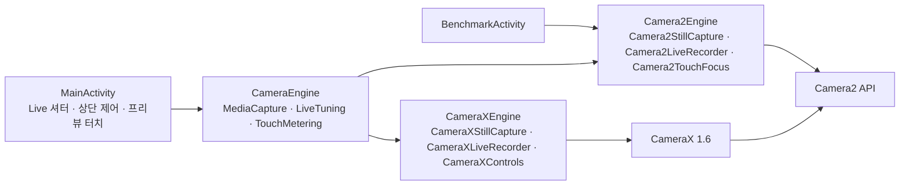

# 카메라 엔진

**측정값을 보기 전에 Live가 Camera2와 CameraX 중 어느 엔진으로 열렸는지 확인하세요.** 두 엔진은 같은 계약을 구현하므로 Live의 조작은 같지만, 카메라에 보내는 요청과 앱이 기록하는 시각은 엔진마다 다릅니다. 이 문서는 엔진 계약, 두 엔진의 구현, 두 엔진이 다르게 동작하는 지점을 설명합니다.

| 지금 확인할 내용 | 이동할 절 |
| --- | --- |
| 엔진이 구현하는 계약과, 엔진을 고르고 바꾸는 순서를 확인합니다. | [엔진 계약](#엔진-계약) |
| Camera2 엔진의 세션과 요청 구성을 확인합니다. | [Camera2 엔진](#camera2-엔진) |
| CameraX 엔진이 같은 기능을 제공하는 방법을 확인합니다. | [CameraX 엔진](#camerax-엔진) |
| 두 엔진의 결과가 달라질 수 있는 지점을 확인합니다. | [두 엔진의 차이](#두-엔진의-차이) |

엔진이 앱 전체 구조에서 차지하는 위치는 [아키텍처](architecture.md#패키지별-역할)에 있습니다.

## 엔진 계약

이 그림은 화면과 엔진의 호출 방향을 나타냅니다. Benchmark는 Camera2 엔진만 사용하고, CameraX도 결국 Camera2 API로 카메라를 엽니다.

<!-- omm:begin id=contract -->
<!-- omm:end id=contract -->

## Camera2 엔진

<!-- omm:begin id=camera2 -->
<!-- omm:end id=camera2 -->

## CameraX 엔진

<!-- omm:begin id=camerax -->
<!-- omm:end id=camerax -->

## 두 엔진의 차이

<!-- omm:begin id=comparison -->
<!-- omm:end id=comparison -->

### 기기에서 관찰한 차이

<!-- omm:begin id=device-notes -->
<!-- omm:end id=device-notes -->

## 문서 검토 상태

기준 앱 버전과 검토 커밋 확인

<!-- omm:begin id=status -->
<!-- omm:end id=status -->

표의 `최신`은 기록된 근거와 원고가 검토 이후 바뀌지 않았다는 뜻입니다. 모든 기기에서 동작을 검증했다는 뜻은 아닙니다.

## 관련 설계 자료

- 엔진 구조의 근거는 저장소의 `.omm/overall-architecture/camera-engines/`에 있습니다.
- 기기 검증 기록은 [`device-verification.yaml`](https://github.com/TTolsun/hal-camera/blob/main/guide/_inputs/device-verification.yaml)에 있습니다.
- CLI가 다루는 엔진 범위는 [CLI 계약](https://github.com/TTolsun/hal-camera/blob/main/docs/design/CLI.md)에 있습니다.

**다음 단계:** 엔진에서 나온 이벤트가 지표로 바뀌는 순서는 [주요 실행 흐름](architecture.md#주요-실행-흐름)에서 확인하세요.
