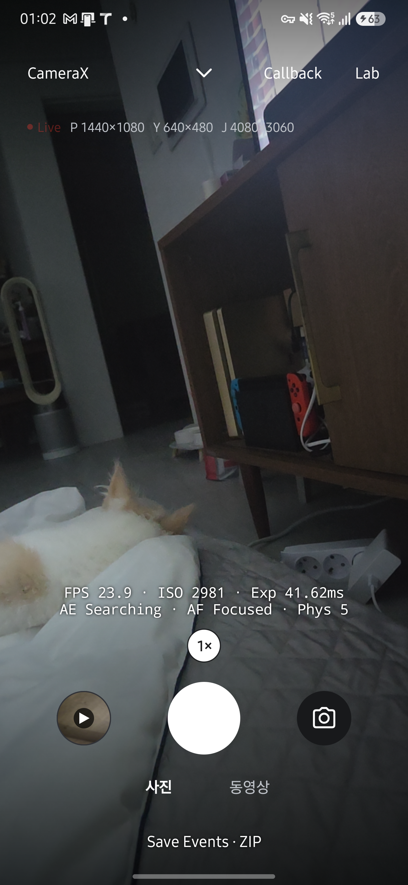
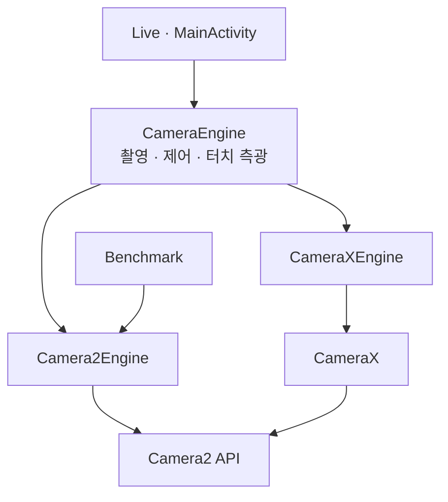

<h1 lang="en">Two engines. One camera contract.</h1>

**Live가 Camera2와 CameraX 중 어느 엔진으로 열렸는지 확인하세요.** 같은 조작이라도 요청 구성과 관측 가능한 버퍼가 다릅니다. 이 페이지는 엔진의 구현을 설명하며, 화면 조작은 [Quickstart](getting-started.md#live에서-촬영하세요), 그래프 해석은 [Callback](callback.md)에서 확인합니다.

| 지금 확인할 내용 | 이동할 절 |
| --- | --- |
| 엔진이 구현하는 계약과, 엔진을 고르고 바꾸는 순서를 확인합니다. | [엔진 계약](#엔진-계약) |
| Camera2 엔진의 세션과 요청 구성을 확인합니다. | [Camera2 엔진](#camera2-엔진) |
| CameraX 엔진이 같은 기능을 제공하는 방법을 확인합니다. | [CameraX 엔진](#camerax-엔진) |
| 두 엔진의 결과가 달라질 수 있는 지점을 확인합니다. | [두 엔진의 차이](#두-엔진의-차이) |

엔진이 앱 전체 구조에서 차지하는 위치는 [아키텍처](architecture.md#패키지별-역할)에 있습니다.

아래 화면은 2026년 9월 27일 Galaxy S25+·Android 16에서 HAL CAMERA 0.15.0을 실행해 촬영했습니다. <a href="evidence.html#앱-화면-촬영">촬영 조건과 확인 범위</a>를 함께 확인하세요. 이미지를 누르면 원본이 열립니다.

<figure class="app-screenshot" id="screen-engine-camerax">

<figcaption>CameraX로 전환한 뒤 프리뷰와 실시간 정보가 갱신되는 화면입니다. 상단의 엔진 이름으로 현재 경로를 확인합니다. <a href="assets/screenshots/engine-camerax.png">원본 보기</a></figcaption>
</figure>

## 엔진 계약

화면에서 카메라 API까지의 호출 방향입니다. 클래스별 구현은 아래에서 설명합니다.

<!-- omm:begin id=contract -->

**화면은 엔진 클래스가 아니라 엔진이 구현한 인터페이스로 기능을 확인합니다.** 그래서 Live의 셔터, 상단 제어, 프리뷰 터치는 Camera2와 CameraX에서 같은 코드로 동작하고, 엔진을 바꾸지 않습니다.

| 인터페이스 | 담당하는 동작 | 구현 |
| --- | --- | --- |
| `CameraEngine` | 카메라 열기(`start`), 촬영(`capture`), 줌(`setZoom`), 닫기(`close(done)`) | 두 엔진 |
| `MediaCapture` | 선택한 사진 출력 저장(`capturePhoto`, 기본은 YUV·JPEG 쌍), 녹화 시작·정지, 녹화 중 사진(`snapshot`, `captureSnapshot`), 촬영이나 녹화가 진행 중인지(`mediaBusy`) | 두 엔진. 벤치마크용 Camera2Engine은 사진 쌍을 만들지 않고 녹화 요청을 거절합니다 |
| `LiveTuning` | EV, AE·AF 잠금, 플래시와 수동 촬영(`setControls`) | 기본 제어는 두 엔진, 수동 노출·초점·WB는 Camera2 |
| `TouchMetering` | 짧게 터치한 지점의 초점, 길게 누른 지점의 노출(`meterAt`) | 두 엔진 |

`MainActivity`는 `engine as? MediaCapture`처럼 인터페이스로 확인한 뒤 호출합니다. 카메라가 다시 열리는 중이라 엔진이 없으면 셔터와 제어 버튼이 비활성화되어 있으므로, 엔진이 없을 때 다른 엔진으로 바꾸는 경로는 없습니다. CLI의 촬영 요청이 이 상태에 도착하면 `Media capture unavailable; camera not ready`로 실패합니다.

### 엔진을 고르고 바꾸는 순서

1. Live 상단의 API 버튼을 누를 때마다 Camera2와 CameraX가 번갈아 선택됩니다. 저장된 화면 상태가 없으면 Camera2로 시작합니다.
2. 엔진이나 카메라를 바꾸면 기존 엔진의 `close(done)` 완료 콜백을 받은 뒤에 새 엔진을 엽니다. 카메라를 점유하는 엔진은 항상 하나입니다.
3. 엔진이나 카메라를 바꾸면 EV, AE·AF 잠금, 플래시는 기본값으로 돌아가고 상단 제어 줄이 접힙니다. 일시정지 후 재개처럼 같은 카메라를 다시 여는 경우에는 이전 제어 값을 `setControls(controls, restore = true)`로 다시 적용합니다.
4. 녹화 중에는 API 버튼과 카메라 선택이 비활성화되어 엔진을 바꿀 수 없습니다.

### Benchmark와 CLI가 쓰는 엔진

Benchmark는 Camera2 전용입니다. CameraX가 선택된 상태에서 Benchmark로 들어가면 `StartCardPresenter`가 Camera2로 전환한다고 알립니다. Live와 다른 스트림 크기 및 저장 방식은 [Camera2 엔진](#camera2-엔진)에서 설명합니다.

CLI의 `preview`·`capture`·`record.start`는 `LiveController`를 통해 Camera2 또는 CameraX를 엽니다. 기본 엔진은 Camera2이며 `--engine CameraX`로 바꿉니다. 크기 옵션을 생략하면 기본 사진 쌍 구성을 유지하고, 명시한 옵션은 지원 검사 후 적용합니다. 이전 UI 설정은 이어받지 않습니다. `streams`는 화면 없이 지원 크기와 녹화 후보를 조회합니다. 인자와 예제는 [CLI](cli.md)에 있습니다.

### 두 엔진이 함께 남기는 기록

두 엔진은 세션을 열 때 `Telemetry.registerSession`에 엔진 이름(`Camera2` 또는 `CameraX`)을 남기고, 같은 `Telemetry.callback`으로 capture 콜백을 기록합니다. 그래서 `capture_started`, `capture_result` 같은 이벤트 종류가 엔진과 관계없이 같습니다. 엔진별로 요청을 만드는 방법이 다르므로, 같은 이벤트라도 요청에 들어간 키는 엔진마다 다를 수 있습니다.

Live 제어와 터치 측광은 다음 이벤트를 추가로 남깁니다.

| 이벤트 | 기록하는 내용 |
| --- | --- |
| `controls_set` | 요청한 EV, AE·AF 잠금, 플래시 모드와 Camera2 수동 ISO·노출 시간·초점·WB |
| `live_streams_requested` | Camera2 Live의 출력·FPS·녹화 설정과 요청한 `stabilization` 모드 |
| `ae_relock_wait`, `ae_relock`, `ae_relocked` | AE 잠금을 켠 채 세션을 새로 만들었을 때 잠금을 풀고 기다린 시점, 다시 잠근 이유(수렴 또는 2초 timeout), 잠금 전후의 노출 시간·ISO와 EV 차이 |
| `touch_meter`, `touch_meter_result` | 터치 종류(AF·AE), 정규화 좌표, 결과(FOCUSED·FAILED·METERED) |
| `media_saved`, `video_saved` | 저장한 사진 쌍의 센서 시각과 URI, 저장한 동영상의 URI |

`request_observed`의 `afRegions`·`aeRegions`와 `capture_result`의 `afRegions`·`aeRegions`를 비교하면, 요청한 영역과 HAL이 적용한 영역을 대조할 수 있습니다.

손떨림 보정도 두 이벤트의 `opticalStabilization`·`videoStabilization`·`cropRegion`으로 요청과 결과를 구분합니다. 결과 키가 없으면 적용 여부를 알 수 없습니다. Live 상단은 현재 프리뷰·녹화의 EIS 결과를 표시합니다. 세션·촬영 단계·요청 모드가 바뀌면 이전 결과를 제외하며, 결과 키가 없거나 1.5초 이상 오래됐으면 확인 불가로 표시합니다. 명시적으로 요청한 EIS 모드와 다른 결과가 1초 이상 이어지면 경고하고 일치하는 결과를 받으면 해제합니다. 반복 조회한 프레임 하나로는 경고가 확정되지 않습니다. CameraX의 EIS (Video)는 VideoCapture가 연결된 녹화 중에만 대조하며 녹화 전에는 실제 결과만 표시합니다. 사진 결과는 Camera2의 요청 태그와 CameraX의 `captureIntent`로 제외합니다. 설정 화면은 구성 실패 오류만 표시하며 이전 세션 결과 목록을 제공하지 않습니다.

근거와 검토 정보

- 근거 파일: `app/src/main/java/dev/halcamera/camera/CameraEngine.kt`, `app/src/main/java/dev/halcamera/camera/Camera2Engine.kt`, `app/src/main/java/dev/halcamera/camera/CameraXEngine.kt`, `app/src/main/java/dev/halcamera/MainActivity.kt`, `app/src/main/java/dev/halcamera/ui/LiveControlBar.kt`, `app/src/main/java/dev/halcamera/ui/FocusRing.kt`, `app/src/main/java/dev/halcamera/camera/LiveControls.kt`, `app/src/main/java/dev/halcamera/benchmark/BenchmarkActivity.kt`, `app/src/main/java/dev/halcamera/benchmark/domain/StartCardPresenter.kt`, `app/src/main/java/dev/halcamera/cli/LiveController.kt`, `app/src/main/java/dev/halcamera/telemetry/Telemetry.kt`
- 근거 수준: 코드 확인
- 검토 2026-10-05 @ `fcabbc9` · Codex-CameraX-stabilization-review

<!-- omm:end id=contract -->

## Camera2 엔진

<!-- omm:begin id=camera2 -->

**Camera2Engine은 앱에서 CaptureRequest를 직접 구성합니다.** `request_observed`에 기록한 키를 HAL 로그와 대조할 수 있습니다. 엔진 자체는 세션, 요청 구성, 줌, Live 제어를 담당하고, 사진은 `Camera2StillCapture`, Live 녹화는 `Camera2LiveRecorder`, 터치 측광은 `Camera2TouchFocus`, 벤치마크 녹화는 `BenchmarkRecorder`가 맡습니다. 카메라 요청과 capture 콜백은 엔진이 만든 카메라 스레드 하나에서 처리하고, 버퍼 relay와 파일 저장은 각자의 스레드에서 처리합니다.

### 수동 촬영

`ManualControls`는 ISO와 노출 시간을 한 쌍으로 저장하고 초점과 WB를 독립적으로 관리합니다. `manualSupport`는 capability와 요청 키, 센서 범위, 초점 이동 범위, 지원 AWB 모드를 확인합니다. 고정 초점에는 수동 초점을 제공하지 않습니다. `ManualControlPanel`은 요청값과 capture result의 실제 값을 구분해서 표시합니다.

Camera2 Live의 프리뷰·사진·녹화·녹화 중 사진 요청은 기존 제어와 터치 영역을 적용한 뒤 `applyManualControls`를 호출합니다. 수동 노출에서는 AE를 끄고 ISO·노출 시간·frame duration을 지정합니다. 수동 초점은 AF를 끄고 lens focus distance를 지정하므로 이전 터치가 모드를 덮어쓰지 못합니다. 자동으로 복귀하면 새 요청에는 수동 센서 키를 넣지 않습니다. Benchmark는 이 경로를 호출하지 않습니다.

수동 frame duration은 Live FPS의 상한으로 정하며 Auto FPS에서는 30fps를 사용합니다. 노출 시간은 센서 범위와 frame duration 중 작은 값으로 제한합니다. 영상 출력 자체의 최소 프레임 시간이나 HAL 양자화 때문에 실제 값이 다를 수 있으므로 `capture_result`의 ISO·노출·frame duration을 함께 확인합니다. 수동 WB는 MANUAL_POST_PROCESSING과 관련 요청 키가 있고 수동 노출이 켜져 있을 때 gains와 transform을 사용합니다. 색온도를 추정하지 않습니다.

### 손떨림 보정

Live Streams의 Stabilization에서 Auto, Off와 기기가 지원하는 OIS·EIS (Video)·EIS (Preview + Video)를 선택합니다. EIS (Preview + Video)는 Android 13 이상에서 지원 목록과 요청 키가 모두 있을 때 제공합니다. OIS와 EIS (Video)는 동시에 요청하지 않으며, EIS (Preview + Video)에서는 플랫폼이 OIS를 제어합니다. Auto는 새 요청 템플릿의 기본값을 유지합니다.

설정은 프리뷰·사진·녹화·녹화 중 사진 요청에 적용합니다. 촬영·녹화가 끝난 뒤 카메라를 닫고 재개하며 카메라와 엔진마다 값을 분리합니다. 지원 모드가 있어도 모든 크기·FPS에서 적용된다는 뜻은 아닙니다. Live 상단에서 현재 프리뷰·녹화의 EIS 적용 상태를 확인하세요. 요청과 다른 결과가 1초 이상 이어지면 요청값과 결과값을 함께 표시합니다. 결과 키가 없거나 1.5초 이상 오래됐으면 확인 불가로 표시하며, 사진 요청의 결과를 프리뷰 상태에 섞지 않습니다. `request_observed`와 `capture_result`에는 `opticalStabilization`, `videoStabilization`, `cropRegion`을 기록합니다. crop metadata는 보정 변환 전체나 실제 화각을 나타내지 않습니다. Benchmark의 요청은 이 설정을 읽지 않습니다.

### 세션 구성

Live의 기본 세션은 프리뷰, YUV_420_888, JPEG 세 스트림으로 구성합니다. `Lab → Settings → Live Streams`에서 정확한 크기와 프리뷰 FPS 범위를 선택하고 YUV·JPEG를 각각 끌 수 있습니다. 프리뷰는 항상 켜집니다. 아래 표는 설정을 지정하지 않았을 때의 픽셀 예산입니다. 예산 이하 크기가 없으면 가장 작은 지원 크기를 고릅니다.

| 스트림 | Live에서 고르는 크기 | 용도 |
| --- | --- | --- |
| 프리뷰 | 1280×720 이하에서 가장 큰 크기 | TextureView 표시 |
| YUV (`analysis_acquire_latest`) | 640×480 이하에서 가장 큰 크기 | 프레임 도착 기록, 사진 쌍의 YUV |
| JPEG (`still`) | 1920×1080 이하에서 가장 큰 크기 | 사진 쌍의 JPEG, 벤치마크 still |

벤치마크 세션은 profile의 `StreamSpec` 크기를 그대로 사용합니다. 지원하지 않는 크기이면 작은 크기로 대체하지 않고 구성 단계에서 실패합니다. 같은 profile ID로 다른 크기를 측정하면 비교가 무의미해지기 때문입니다.

명시한 Live 설정도 작은 크기로 대체하지 않습니다. `LiveStreamSupport`는 개별 크기·일반 FPS 범위·녹화 인코더 지원을 검사하고, 엔진은 출력의 최소 프레임 시간과 FPS 하한을 대조합니다. Android 10 이상에서는 `isSessionConfigurationSupported`로 출력 조합을 조회합니다. 조회를 지원하지 않거나 Android 9 이하이면 지원 여부를 미확인으로 기록하고 실제 세션 구성으로 확인합니다. 조합 조회만으로 FPS 지원을 확정하지 않으며 `capture_result.fpsRange`와 `frameDurationNs`로 실제 결과를 확인합니다.

설정 적용은 기존 엔진의 `close(done)` 뒤 새 엔진을 여는 순서입니다. 실패 이유는 화면에 남고, 설정 적용에 실패했고 정상 구성 기록이 있을 때만 오류 아래에 나타나는 `이전 설정으로 복원` 버튼으로 해당 카메라에서 마지막으로 구성이 성공했던 값으로 돌아갑니다. 사진·녹화·저장 중에는 적용하지 않습니다. 카메라와 엔진마다 설정을 분리하고 Activity 재생성 시 복원합니다. CameraX도 같은 설정 화면에서 출력과 크기를 선택합니다. Live 옆의 크기 표시를 누르면 설정을 바로 열며 이 경로의 뒤로 가기와 저장은 Live로 돌아갑니다. Benchmark는 Live 설정을 읽지 않습니다. CLI는 기본값에 명시한 크기 옵션을 적용하며 이전 화면 설정을 이어받지 않습니다.

`StreamConfiguration`은 세션을 만드는 출력, 요청의 대상, Callback 그래프가 표시하는 스트림을 같은 목록에서 만듭니다. Android 13 이상의 Live에서는 `PreviewBufferRelay`가 PRIVATE 프리뷰 버퍼를 먼저 받아 도착 시각을 기록한 뒤 TextureView로 넘깁니다. 픽셀은 복사하지 않습니다. 그보다 낮은 버전에서는 TextureView에 직접 연결하고, 프리뷰 출력을 관측할 수 없다고 표시합니다.

### 사진

1. `capture()`나 `capturePhoto()`를 받으면, 플래시가 Auto·On이고 AE가 잠겨 있지 않은 경우에만 AE precapture를 먼저 실행합니다. trigger를 프리뷰 capture 하나로 보내고, AE 상태가 PRECAPTURE를 지나 벗어날 때까지 기다립니다. PRECAPTURE 없이 안정 상태가 결과 3개 연속으로 이어지면 이 순서를 건너뛰는 기기로 보고, 3초 안에 끝나지 않으면 `precapture_timeout`을 남기고 그대로 촬영합니다.
2. still 요청 하나에 켜진 YUV·JPEG 출력을 대상으로 지정하고, 화면 방향을 `JPEG_ORIENTATION`으로, 품질을 95로 설정합니다. 둘 다 꺼져 있으면 셔터를 비활성화하고 엔진도 촬영을 거절합니다.
3. `StillPair`가 센서 타임스탬프로 요청한 버퍼만 기다립니다. 단일 출력도 capture의 센서 시각과 일치해야 하며 꺼진 출력은 기다리지 않습니다. 기다리는 동안에는 reader가 `acquireLatestImage` 대신 `acquireNextImage`로 이미지를 순서대로 꺼냅니다. 최신 이미지만 꺼내면 촬영 대상인 YUV 프레임을 버릴 수 있기 때문입니다.
4. 이미지 콜백에서 `YuvPacking`이 stride와 crop을 고려해 NV21으로 복사하고 Image를 닫습니다. 별도 저장 스레드에서 `encodeYuvStill`이 JPEG로 압축한 뒤 화면 방향만큼 회전합니다.
5. `MediaLibrary.savePhotos`가 선택한 한 장 또는 두 장을 `DCIM/HALCamera`에 쓰고 모두 성공했을 때만 공개합니다. 실패하면 이번 촬영에서 만든 항목을 지웁니다. YUV 저장은 원본 plane 내보내기가 아니라 JPEG 변환입니다.
6. 5초 안에 짝이 완성되지 않으면 `capture_timeout`으로 끝냅니다. 녹화 중에는 촬영 요청을 거절합니다.

벤치마크 still은 JPEG만 대상으로 하고, JPEG 도착이 측정값이며 저장하지 않습니다.

### 녹화

`Camera2LiveRecorder`의 기본값은 MediaRecorder가 지원하는 가로 크기 중 1920×1080 픽셀 예산으로 고른 크기, H.264, 30fps, 10Mbps입니다. Live 스트림 설정에서는 카메라 크기·고정 AE FPS 범위·인코더의 surface 입력, 크기·프레임률·비트레이트 지원을 만족하는 H.264/HEVC 조합을 선택합니다. 후보 FPS는 24·25·30·60이며 고속 세션은 제공하지 않습니다. 명시한 크기·FPS·코덱으로 준비하고 실패하면 이유를 표시합니다. 소리를 포함하면 AAC 128kbps, 44.1kHz를 사용합니다.

1. 녹화를 시작하면 프리뷰와 인코더, 그리고 녹화 중 사진용 JPEG 스트림으로 새 세션을 만듭니다. YUV 스트림은 이 세션에 없으므로 녹화 중 사진은 JPEG만 저장합니다. 카메라가 이 조합을 거절하면 JPEG 없이 프리뷰와 인코더만으로 다시 구성하고, 이 경우 녹화 중 사진을 지원하지 않는다는 이유를 화면에 알립니다.
2. Android 13 이상에서는 `RecordingBufferRelay`가 인코더로 가는 PRIVATE 버퍼를 먼저 받아 도착 시각을 기록합니다. 그보다 낮은 버전에서는 인코더에 직접 연결하고, 녹화 출력을 관측할 수 없다고 표시합니다.
3. 녹화 요청은 `TEMPLATE_RECORD`이며, 연속 동영상 AF(`CONTINUOUS_VIDEO`)를 지원하면 사용합니다. 줌과 Live 제어는 녹화 중에도 같은 요청을 다시 만들어 적용합니다.
4. 정지하면 세션을 닫고, 파일을 `MediaLibrary.saveVideo`로 앨범에 공개한 뒤 프리뷰 세션을 다시 만듭니다. 파일이 재생할 수 없을 만큼 짧으면 저장하지 않고 알립니다.

**녹화 중 사진(`Camera2VideoSnapshot`)은 녹화를 멈추지 않고 JPEG 한 장을 저장합니다.** 녹화 세션의 JPEG 크기는 요청한 크기(없으면 1080p 이하 중 가장 큰 크기)를 먼저 시도하고, 세션 조합 조회(`isSessionConfigurationSupported`)가 거절하면 녹화 크기 안에 들어가는 가장 큰 크기로 내려갑니다. 실제 크기는 `recording_started`의 `snapshotSize`에 남아 요청값과 구분됩니다. 사진 요청은 `TEMPLATE_VIDEO_SNAPSHOT`이며 프리뷰·인코더·JPEG 세 출력을 모두 대상으로 합니다. 사진은 한 번에 한 장만 처리하고, 앞의 사진이 저장되는 중이거나 녹화가 멈추는 중이면 새 요청을 거절합니다. 5초 안에 JPEG이 오지 않거나 저장에 실패하면 `video_snapshot_failed`를 기록하고 알림만 표시하며, 녹화 파일과 세션은 그대로 유지합니다. 정지와 겹친 사진은 세션이 닫히기 전에 도착하면 저장하고, 그렇지 않으면 실패로 답합니다. Live 스트림 설정에서 JPEG을 끄면 녹화 중 사진도 지원하지 않습니다.

`live_streams_changed`·`live_streams_requested`는 변경·요청값을, `live_stream_preflight`는 출력 조합 조회 결과를 기록합니다. 성공한 출력 크기는 `configured`와 `negotiatedStreams`에 남습니다. 녹화는 `live_recording_requested`·`live_recording_preflight`·`recording_started`로 구분하며, 요청한 인코더 설정과 결과 FPS를 혼동하지 않습니다.

벤치마크의 RECORD 단계는 `BenchmarkRecorder`가 따로 처리합니다. 측정은 크기를 스스로 고르거나 소리를 녹음하거나 앨범에 저장하면 안 되기 때문입니다.

### Live 제어

`applyLiveControls`가 프리뷰·still·녹화 요청에 같은 값을 넣으므로, 요청 종류가 바뀌어도 잠금이나 EV가 빠지지 않습니다.

| 제어 | 요청 키 |
| --- | --- |
| EV | `CONTROL_AE_EXPOSURE_COMPENSATION`. AE 잠금 중에도 적용됩니다. |
| AE 잠금 | `CONTROL_AE_LOCK` |
| 플래시 Auto·On | `CONTROL_AE_MODE`의 `ON_AUTO_FLASH`·`ON_ALWAYS_FLASH` |
| 토치 | `FLASH_MODE_TORCH` |
| AF 잠금 | 키가 아니라 연속 AF 모드에서 보내는 `CONTROL_AF_TRIGGER_START` 한 번입니다. 잠금을 풀 때는 `CANCEL`을 보냅니다. |

녹화 시작·정지로 세션이 바뀌면 `AeRelock`이 새 세션을 잠금 없이 시작합니다. AE 상태가 결과 2개 연속으로 안정되거나 2초가 지나면 다시 잠급니다. 새 세션의 첫 요청부터 잠그면 아직 수렴하지 않은 노출이 고정되기 때문입니다. 다시 잠근 노출이 이전보다 1/3 EV 넘게 다르면 "Exposure locked again · 0.8 EV darker" 같은 안내를 표시합니다. AF 잠금도 새 세션에서 trigger를 다시 보냅니다.

줌과 제어는 입력마다 요청을 보내지 않습니다. 값을 먼저 저장하고 카메라 스레드에 요청 하나만 예약하므로, 빠른 드래그는 스레드 한 차례에 요청 하나로 합쳐집니다.

### 터치 측광

`Camera2TouchFocus`는 탭한 AF 지점과 길게 누른 AE 지점을 따로 가집니다.

1. TextureView의 변환 행렬을 거꾸로 적용해 기기 기본 방향의 정규화 좌표를 구합니다. `TouchMeter.toSensor`가 전면 카메라의 좌우 반전을 되돌리고 `SENSOR_ORIENTATION`만큼 돌려 센서 좌표로 바꿉니다.
2. `TouchMeter.region`이 보이는 영역의 짧은 변의 1/6 크기 정사각형을 만듭니다. 16:9 프리뷰는 4:3 active array의 가운데만 보여 주므로, 영역도 보이는 범위 안으로 제한합니다.
3. 짧은 터치는 AF 영역과 AUTO AF 모드를 repeating 요청에 넣고 `AF_TRIGGER_START`를 한 번 보냅니다. trigger capture가 끝난 뒤의 결과만 읽으며, FOCUSED_LOCKED는 성공, NOT_FOCUSED_LOCKED는 실패입니다. 3초 안에 결과가 없으면 실패로 처리하고, 결과가 나온 뒤 5초가 지나면 연속 AF로 돌아갑니다. AF 잠금 중이면 지점을 유지합니다.
4. 길게 누르면 AE 영역을 넣고, AE 상태가 결과 2개 연속으로 안정되거나 2초가 지나면 측광이 끝난 것으로 봅니다. 그다음 화면이 AE 잠금을 겁니다.

근거와 검토 정보

- 근거 파일: `app/src/main/java/dev/halcamera/camera/Camera2Engine.kt`, `app/src/main/java/dev/halcamera/camera/LiveStreamSettings.kt`, `app/src/main/java/dev/halcamera/camera/LiveStabilization.kt`, `app/src/main/java/dev/halcamera/camera/LiveStreamCapabilities.kt`, `app/src/main/java/dev/halcamera/camera/LiveSessionCheck.kt`, `app/src/main/java/dev/halcamera/camera/Camera2StillCapture.kt`, `app/src/main/java/dev/halcamera/camera/Camera2LiveRecorder.kt`, `app/src/main/java/dev/halcamera/camera/Camera2VideoSnapshot.kt`, `app/src/main/java/dev/halcamera/camera/VideoSnapshot.kt`, `app/src/main/java/dev/halcamera/camera/BenchmarkRecorder.kt`, `app/src/main/java/dev/halcamera/camera/PreviewBufferRelay.kt`, `app/src/main/java/dev/halcamera/camera/RecordingBufferRelay.kt`, `app/src/main/java/dev/halcamera/camera/StreamConfiguration.kt`, `app/src/main/java/dev/halcamera/camera/StillPair.kt`, `app/src/main/java/dev/halcamera/camera/YuvPacking.kt`, `app/src/main/java/dev/halcamera/camera/StillEncoding.kt`, `app/src/main/java/dev/halcamera/camera/MediaLibrary.kt`, `app/src/main/java/dev/halcamera/camera/LiveControls.kt`, `app/src/main/java/dev/halcamera/camera/LiveControlRequests.kt`, `app/src/main/java/dev/halcamera/camera/ManualControls.kt`, `app/src/main/java/dev/halcamera/camera/ManualControlRequests.kt`, `app/src/main/java/dev/halcamera/camera/TouchMeter.kt`, `app/src/main/java/dev/halcamera/camera/TouchMeterRequests.kt`
- 근거 수준: 코드 확인
- 검토 2026-10-05 @ `fcabbc9` · Codex-CameraX-stabilization-review

<!-- omm:end id=camera2 -->

## CameraX 엔진

<!-- omm:begin id=camerax -->

CameraX의 Live Streams도 Auto·Off 및 지원되는 OIS·EIS 모드를 제공합니다. EIS 후보는 하드웨어 모드와 CameraX의 Preview·Video 보정 capability를 교차해 표시합니다. EIS (Preview + Video)는 Preview builder에, EIS (Video)는 녹화 시 VideoCapture builder에 요청합니다. 다른 builder는 미지정으로 두어 명시적인 Off가 보정을 취소하지 않게 합니다. OIS는 Camera2Interop으로 요청하고 EIS와 함께 켜지 않습니다. Auto는 보정 옵션을 지정하지 않습니다.

실제 EIS 결과 키가 전달되면 Live 상단의 현재 프리뷰·녹화 상태와 `capture_result`에서 확인할 수 있습니다. 키가 없거나 결과가 오래됐으면 확인 불가로 표시합니다. Auto는 특정 EIS 모드를 요구하지 않으므로 불일치 경고를 표시하지 않습니다. EIS (Video)는 녹화 중에만 요청과 결과를 대조합니다. CameraX가 보정을 포함한 출력 조합을 거절하면 설정을 자동 변경하지 않고 실패를 표시하며 이전 정상 설정을 복원할 수 있습니다.

**CameraXEngine은 CameraX use case로 Live 촬영과 제어를 제공하지만, 요청 키 일부는 CameraX가 정합니다.** Live 스트림 설정에서 Preview·YUV·JPEG 크기와 출력 활성화를 선택할 수 있습니다. 앱이 CameraX 1.6.2에 직접 넣는 Camera2 키에는 AE 잠금(`CONTROL_AE_LOCK`), AF 잠금 해제용 cancel trigger, 광학 보정(`LENS_OPTICAL_STABILIZATION_MODE`)이 있습니다. 엔진 자체는 use case bind, 줌, 수명 주기를 담당하고, 사진은 `CameraXStillCapture`, 녹화는 `CameraXLiveRecorder`, Live 제어와 터치 측광은 `CameraXControls`가 맡습니다.

### 세션 구성

`ProcessCameraProvider`로 Preview, ImageAnalysis(`STRATEGY_KEEP_ONLY_LATEST`), ImageCapture(`CAPTURE_MODE_MINIMIZE_LATENCY`)를 Activity 수명 주기에 bind합니다. 기본값은 Camera2 엔진의 프리뷰·YUV·JPEG 세 스트림에 대응하는 구성입니다. 명시한 크기는 ResolutionSelector의 필터로 해당 해상도만 남기고, 꺼진 출력의 use case는 만들지 않습니다. Preview는 항상 유지하며 ImageAnalysis가 없는 구성에서도 PreviewView의 STREAMING으로 프리뷰 준비를 알립니다. 크기 후보가 없거나 bind가 실패하면 다른 크기로 바꾸지 않고 오류를 표시합니다. 카메라는 `Camera2CameraInfo`의 카메라 ID로 거르므로 전면·후면이 아닌 특정 카메라를 열 수 있습니다.

Preview에 `Camera2Interop.Extender.setSessionCaptureCallback`으로 Camera2 엔진과 같은 `Telemetry` 콜백을 붙입니다. 엔진은 이 콜백을 한 번 감싸서, 모든 repeating 결과를 `CameraXControls`에도 넘깁니다. AE 재잠금과 길게 누르기 측광이 결과의 AE 상태를 읽기 때문입니다. Callback 그래프에는 프리뷰(관측 불가), analysis, still 출력을 등록합니다. CameraX는 프리뷰와 인코더 버퍼를 앱에 넘겨주지 않으므로 두 출력의 도착 시각은 기록하지 않습니다.

### 사진

CameraX에는 analysis 스트림을 still 요청의 대상에 넣는 공개 API가 없습니다. 그래서 두 버퍼가 한 capture에서 나오는 Camera2와 달리, YUV는 JPEG와 센서 시각이 가장 가까운 analysis 프레임을 씁니다.

1. 촬영 직전에 ImageCapture와 ImageAnalysis의 `targetRotation`을 현재 화면 회전으로 맞춥니다.
2. 촬영 요청부터 짝이 정해질 때까지 analysis 프레임을 NV21로 복사해 최근 8개를 보관합니다. 평소에는 복사하지 않습니다.
3. JPEG가 도착하면 그 센서 시각 이후의 프레임이 하나 올 때까지 최대 100ms 기다립니다. 이후 프레임이 가장 가까운 후보의 위쪽 경계가 되기 때문입니다. 아직 프레임이 하나도 없으면(still을 찍는 동안 repeating 스트림을 멈추는 HAL) 다음 프레임을 기다립니다.
4. 가장 가까운 프레임을 `encodeYuvStill`로 JPEG로 만들고 프레임의 `rotationDegrees`만큼 회전한 뒤, Camera2와 공유하는 `MediaLibrary.savePhotos`로 켜진 출력을 저장합니다.
5. 두 시각의 차이를 `media_saved`의 `yuvOffsetNs`에 기록합니다. 5초 안에 끝나지 않으면 `capture_timeout`으로 실패를 돌려줍니다.

JPEG만 켜면 analysis 프레임을 기다리지 않습니다. YUV만 켜면 촬영 요청 뒤 도착한 analysis 프레임을 저장하며 ImageCapture 요청은 보내지 않습니다. 두 출력이 모두 꺼져 있으면 사진 촬영을 거절합니다.

카메라 JPEG는 CameraX가 넣은 방향 정보(EXIF)를 그대로 저장합니다. 플래시 Auto·On의 precapture는 ImageCapture가 자기 순서대로 실행하므로 이 클래스에는 측광 단계가 없습니다.

### 녹화

`CameraXLiveRecorder`는 CameraX `Recorder`로 캐시 폴더의 임시 MP4에 기록하고, 끝나면 `MediaLibrary.saveVideo`로 앨범에 공개합니다.

1. 녹화를 시작하면 ImageAnalysis와 ImageCapture를 unbind한 뒤 VideoCapture와 ImageCapture를 함께 bind합니다. 녹화가 끝나면 반대로 되돌립니다. ImageAnalysis를 빼는 이유는 Camera2처럼 프리뷰·인코더·JPEG 세 스트림만 쓰기 위해서이며, 네 use case를 한꺼번에 bind하면 스트림 조합을 CameraX의 stream sharing이 정하게 됩니다. 카메라가 이 조합을 거절하면 VideoCapture만 bind하여 녹화를 이어가고, 녹화 중 사진을 지원하지 않는다는 이유를 화면에 알립니다.
2. 설정을 지정하지 않으면 품질은 FHD를 우선 선택합니다. FHD가 없으면 더 낮은 품질을 먼저 찾고, 낮은 품질도 없으면 더 높은 품질을 선택할 수 있습니다. 30fps, 10Mbps를 요청합니다. 코덱과 오디오 형식은 기기의 encoder profile을 따르므로, 기본 H.264와 44.1kHz AAC를 사용하는 Camera2와 다를 수 있습니다.
3. 소리를 요청했는데 `RECORD_AUDIO` 권한이 없으면 소리 없이 녹화하지 않고 실패로 처리합니다.
4. 첫 `VideoRecordEvent.Status`가 오면 AF 잠금과 길게 누른 AE 지점을 한 번 더 보냅니다. CameraX는 동영상 surface가 실제로 켜질 때 repeating 요청을 다시 구성하는데, 그 전에 보낸 FocusMeteringAction은 사라지기 때문입니다.
5. `Finalize`의 오류가 `ERROR_NONE`이거나, 카메라가 닫혀서 멈춘 `ERROR_SOURCE_INACTIVE`이면 파일을 저장합니다. 그 밖의 오류나 빈 파일은 저장하지 않고 알립니다.

명시한 녹화 크기는 지원 Quality의 해상도와 정확히 일치해야 하며, bind 후 실제 해상도도 검사합니다. 설정 화면의 후보는 CameraX Quality 해상도와 하드웨어의 크기·FPS 조건을 교차해 만듭니다. FPS와 비트레이트는 요청값이고 실제 결과와 구분합니다. CameraX 1.6.2의 공개 Recorder API는 녹화 코덱을 직접 선택하지 않으므로 Format과 Live 표시는 Auto입니다.

녹화 중 사진(`CameraXVideoSnapshot`)은 녹화와 함께 bind한 ImageCapture의 `takePicture`로 JPEG 한 장을 저장합니다. analysis 스트림이 없으므로 YUV 짝은 저장하지 않으며, Camera2와 같이 한 번에 한 장만 처리합니다. 실패하거나 5초 안에 오지 않아도 녹화는 끝나지 않고 알림만 표시합니다. Live 스트림 설정에서 JPEG을 끄면 bind할 ImageCapture가 없으므로 녹화 중 사진을 지원하지 않는다고 알립니다. 사진 크기는 사진 모드와 같은 ImageCapture를 쓰므로 설정한 JPEG 크기를 따르고, 설정이 없으면 CameraX가 고른 크기(Galaxy S25+에서 4080×3060)로 저장합니다.

Galaxy S25+에서는 사진을 찍는 시점마다 영상 프레임이 1개씩 빠졌습니다(간격 67ms, 기준은 33.5ms). 사진 크기를 1080p로 줄여도, `CONTROL_CAPTURE_INTENT`를 `VIDEO_SNAPSHOT`으로 지정해도 같았습니다. 앱이 CameraX의 사진 요청을 바꿀 수 없으므로 CameraX 내부 경로의 동작으로 보고 그대로 두었습니다. 같은 기기의 Camera2는 전 구간에서 50ms를 넘는 간격이 없었으므로, 녹화 연속성이 중요하면 Camera2를 사용합니다.

녹화 시작과 정지는 use case를 다시 bind하므로, 엔진은 그때마다 줌과 Live 제어를 새 세션에 다시 보내고 Callback 그래프의 출력 목록도 바꿉니다.

### Live 제어와 터치 측광

| 제어 | CameraX에서 적용하는 방법 |
| --- | --- |
| EV | `CameraControl.setExposureCompensationIndex` |
| 토치 | `CameraControl.enableTorch` |
| 플래시 Auto·On | ImageCapture의 `flashMode` |
| AE 잠금 | `Camera2CameraControl`로 repeating 요청에 넣는 `CONTROL_AE_LOCK` |
| AF 잠금 | 화면 전체를 대상으로 하는 FocusMeteringAction(`FLAG_AF`, 자동 취소 없음) |

CameraX는 FocusMeteringAction을 하나만 유지하고, 새 action은 이전 action을 취소합니다. 그래서 `CameraXControls`는 AF 잠금, 탭한 AF 지점, 길게 누른 AE 지점을 하나의 action으로 합쳐 다시 보냅니다. CameraX의 자동 취소는 쓰지 않고, 탭한 지점은 결과가 나온 뒤 5초가 지나면 이 클래스가 직접 끝냅니다. 탭의 결과는 그 지점을 담은 action 가운데 먼저 끝난 것이 알리고, 3초 안에 결과가 없으면 실패로 처리합니다.

`cancelFocusAndMetering`은 호출하지 않습니다. CameraX 1.6의 camera-pipe 구현에서 이 호출은 `unlock3A(ae = true)`이며, 그래프의 3A 상태에 `aeLock = false`를 남깁니다. camera-pipe는 최종 요청을 만들 때 3A 상태를 요청 옵션보다 나중에 덮어쓰므로, 한 번 취소하면 같은 세션에서는 `Camera2CameraControl`로 건 AE 잠금이 더 이상 적용되지 않습니다. 그 대신 다음과 같이 처리합니다.

1. 유지할 지점이 없으면 화면 전체에 AE만 측광하는 action을 보냅니다. AE만 있는 action은 측광 영역만 갱신하므로 AE 잠금에 영향을 주지 않습니다.
2. 이전 action이 잠근 AF는 interop 옵션에 `CONTROL_AF_TRIGGER_CANCEL`을 싣고, 그 trigger가 담긴 결과가 오면 옵션에서 뺍니다.
3. AF가 들어간 action은 camera-pipe의 `lock3A(aeLockBehavior = null)`로 처리되므로 AE 잠금을 바꾸지 않습니다.

AE 재잠금은 Camera2와 같은 `AeRelock` 규칙을 씁니다. 다만 CameraX는 `bindToLifecycle`이 반환된 뒤에 자기 실행기에서 세션을 다시 만들기 때문에, 이전 세션의 잠긴 결과가 늦게 도착합니다. 그래서 재잠금을 기다리는 동안에는 `CONTROL_AE_LOCK`을 끈 요청의 결과만 셉니다. 카메라를 닫은 뒤에 남은 지연 작업(탭 유지 시간 종료, 재잠금 timeout)은 아무것도 보내지 않습니다. 같은 카메라를 다시 열면 새 엔진이 같은 CameraControl을 쓰기 때문입니다.

근거와 검토 정보

- 근거 파일: `app/src/main/java/dev/halcamera/camera/CameraXEngine.kt`, `app/src/main/java/dev/halcamera/camera/CameraXStillCapture.kt`, `app/src/main/java/dev/halcamera/camera/CameraXLiveRecorder.kt`, `app/src/main/java/dev/halcamera/camera/CameraXVideoSnapshot.kt`, `app/src/main/java/dev/halcamera/camera/VideoSnapshot.kt`, `app/src/main/java/dev/halcamera/camera/CameraXControls.kt`, `app/src/main/java/dev/halcamera/camera/StillEncoding.kt`, `app/src/main/java/dev/halcamera/camera/YuvPacking.kt`, `app/src/main/java/dev/halcamera/camera/MediaLibrary.kt`, `app/src/main/java/dev/halcamera/camera/StreamConfiguration.kt`, `app/src/main/java/dev/halcamera/camera/LiveControls.kt`, `app/src/main/java/dev/halcamera/camera/TouchMeter.kt`, `app/build.gradle.kts`
- 근거 수준: 코드 확인
- 검토 2026-10-05 @ `fcabbc9` · Codex-CameraX-stabilization-review

<!-- omm:end id=camerax -->

## 두 엔진의 차이

<!-- omm:begin id=comparison -->

**두 엔진의 측정값을 비교하기 전에 아래 차이가 결과에 영향을 주는지 확인하세요.** 같은 조작이라도 엔진이 카메라에 보내는 요청과 앱이 기록하는 시각이 다를 수 있습니다.

| 항목 | Camera2 | CameraX |
| --- | --- | --- |
| 수동 촬영 | ISO·노출 시간·초점과 WB를 프리뷰·사진·녹화에 적용합니다. 지원 여부와 실제 적용값을 표시합니다. | Manual 패널에서 미지원 사유와 기존 상단 엔진 버튼의 위치를 안내합니다. |
| 요청 키 | 앱이 CaptureRequest를 직접 구성하며 `request_observed`에 기록합니다. | 3A 모드와 영역 일부를 CameraX가 정합니다. 앱은 `CONTROL_AE_LOCK`, AF cancel trigger, 광학 보정 키를 직접 넣습니다. |
| 사진 쌍의 YUV | 같은 capture의 버퍼입니다. 센서 시각이 JPEG와 같습니다. | JPEG와 센서 시각이 가장 가까운 analysis 프레임입니다. 차이는 `yuvOffsetNs`에 기록됩니다. |
| 스트림 선택 | Preview 크기와 YUV·JPEG 활성화·크기, FPS 범위를 선택합니다. | Preview·YUV·JPEG 크기와 출력 활성화를 선택합니다. 요청한 해상도만 필터에 남기며 조합은 bind 성공 여부로 확인합니다. |
| 손떨림 보정 | Auto·Off 및 지원 OIS·EIS (Video)·EIS (Preview + Video)를 선택하고 결과 메타데이터를 대조합니다. | 같은 모드를 하드웨어와 CameraX capability에 따라 제공합니다. EIS (Video)는 녹화 중에 적용하고, EIS (Preview + Video)는 프리뷰부터 적용합니다. 출력 조합에 따른 지원 범위는 다를 수 있습니다. |
| 녹화 코덱 | 기본 H.264이며 지원 조합에서 HEVC도 선택합니다. 오디오는 AAC 128kbps 44.1kHz입니다. | 기기의 encoder profile을 따릅니다. |
| 녹화 중 사진 | 녹화 세션에 JPEG 스트림을 넣고 `TEMPLATE_VIDEO_SNAPSHOT`으로 요청합니다. 조합을 거절하면 JPEG 없이 녹화합니다. | 녹화와 ImageCapture를 함께 bind하고 `takePicture`를 호출합니다. 거절하면 VideoCapture만 bind합니다. 두 엔진 모두 JPEG만 저장합니다. Galaxy S25+에서 Camera2는 영상 프레임 누락이 없었고, CameraX는 사진마다 프레임 1개가 빠졌습니다. |
| AE 잠금 중 플래시 사진 | precapture를 건너뛰고 잠긴 노출로 촬영합니다(`Camera2StillCapture`). | ImageCapture가 자기 순서대로 precapture를 수행합니다. |
| AF 잠금 중 길게 누르기 | 탭한 AF 지점이 없으면 AF trigger를 보내지 않습니다. 탭한 지점이 있으면 그 지점을 끝내면서 `AF_TRIGGER_CANCEL`을 보냅니다(`Camera2TouchFocus`). | AF 잠금도 FocusMeteringAction이므로, 합친 action을 다시 보내면서 AF가 한 번 더 스캔합니다. action에서 AF를 빼면 CameraX가 AF 잠금을 풀기 때문에 피할 수 없습니다(`CameraXControls`). |
| 버퍼 도착 기록 (Android 13 이상) | 프리뷰와 녹화 버퍼의 도착 시각을 relay로 기록합니다. | 프리뷰와 녹화 버퍼는 직접 관측하지 못합니다. ImageAnalysis와 ImageCapture의 이미지 수신은 기록합니다. |
| Live 표시의 프리뷰 판정 | TextureView의 화면 갱신 시각을 씁니다. | PreviewView가 STREAMING 상태이고 최근 capture 결과가 있는지로 판정합니다. |
| Benchmark | 지원합니다. | 지원하지 않으며 Camera2로 엽니다. |
| CLI | 기본 엔진입니다. 크기와 녹화 H264·HEVC를 지정합니다. | `--engine CameraX`로 선택합니다. 크기를 지정하며 녹화 코덱은 Auto입니다. |

근거와 검토 정보

- 근거 파일: `app/src/main/java/dev/halcamera/camera/Camera2Engine.kt`, `app/src/main/java/dev/halcamera/camera/Camera2StillCapture.kt`, `app/src/main/java/dev/halcamera/camera/Camera2LiveRecorder.kt`, `app/src/main/java/dev/halcamera/camera/TouchMeterRequests.kt`, `app/src/main/java/dev/halcamera/camera/CameraXEngine.kt`, `app/src/main/java/dev/halcamera/camera/CameraXStillCapture.kt`, `app/src/main/java/dev/halcamera/camera/CameraXLiveRecorder.kt`, `app/src/main/java/dev/halcamera/camera/CameraXControls.kt`, `app/src/main/java/dev/halcamera/MainActivity.kt`
- 근거 수준: 코드 확인
- 검토 2026-10-05 @ `fcabbc9` · Codex-CameraX-stabilization-review

<!-- omm:end id=comparison -->

### 기기에서 관찰한 차이

Galaxy S25+에서 확인한 CameraX 관찰 결과와 검증 조건은 [Evidence](evidence.md#camerax-기기-관찰)에 있습니다.

## 문서 검토 상태

기준 앱 버전과 검토 커밋 확인

<!-- omm:begin id=status -->

- 검증 기준 앱 버전: 0.19.0 (versionCode 628)

| 항목 | 최신성 | 검토 |
| --- | --- | --- |
| 구조 원본 `overall-architecture` | 최신 | 검토 2026-10-05 @ `fcabbc9` · Codex-CameraX-stabilization-review |
| 원고 `contract` | 최신 | 검토 2026-10-05 @ `fcabbc9` · Codex-CameraX-stabilization-review |
| 원고 `camera2` | 최신 | 검토 2026-10-05 @ `fcabbc9` · Codex-CameraX-stabilization-review |
| 원고 `camerax` | 최신 | 검토 2026-10-05 @ `fcabbc9` · Codex-CameraX-stabilization-review |
| 원고 `comparison` | 최신 | 검토 2026-10-05 @ `fcabbc9` · Codex-CameraX-stabilization-review |

<!-- omm:end id=status -->

표의 `최신`은 기록된 근거와 원고가 검토 이후 바뀌지 않았다는 뜻입니다. 모든 기기에서 동작을 검증했다는 뜻은 아닙니다.

## 관련 설계 자료

- 엔진 구조의 근거는 저장소의 `.omm/overall-architecture/camera-engines/`에 있습니다.
- 기기 검증 기록은 [`device-verification.yaml`](https://github.com/TTolsun/hal-camera/blob/main/guide/_inputs/device-verification.yaml)에 있습니다.
- CLI가 다루는 엔진 범위는 [CLI 계약](https://github.com/TTolsun/hal-camera/blob/main/docs/design/CLI.md)에 있습니다.

**다음 단계:** 엔진에서 나온 이벤트가 지표로 바뀌는 순서는 [주요 실행 흐름](architecture.md#주요-실행-흐름)에서 확인하세요.
