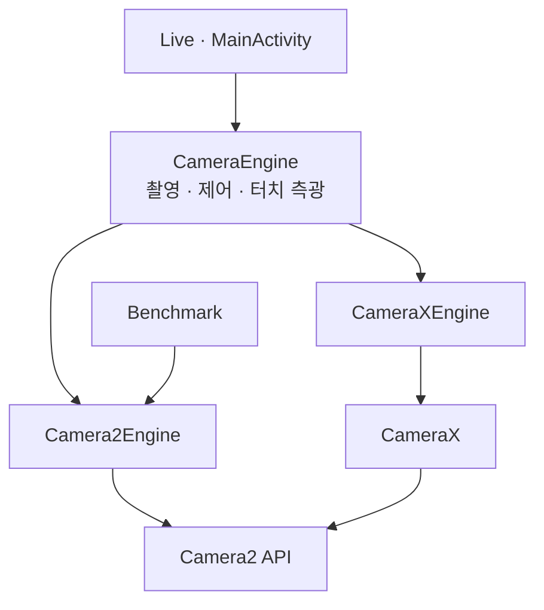

<h1 lang="en">Two engines. One camera contract.</h1>

**Live가 Camera2와 CameraX 중 어느 엔진으로 열렸는지 확인하세요.** 같은 조작이라도 요청 구성과 관측 가능한 버퍼가 다릅니다. 이 페이지는 엔진의 구현을 설명하며, 화면 조작은 [Quickstart](getting-started.md#live에서-촬영하세요), 그래프 해석은 [Callback](callback.md)에서 확인합니다.

| 지금 확인할 내용 | 이동할 절 |
| --- | --- |
| 엔진이 구현하는 계약과, 엔진을 고르고 바꾸는 순서를 확인합니다. | [엔진 계약](#엔진-계약) |
| Camera2 엔진의 세션과 요청 구성을 확인합니다. | [Camera2 엔진](#camera2-엔진) |
| CameraX 엔진이 같은 기능을 제공하는 방법을 확인합니다. | [CameraX 엔진](#camerax-엔진) |
| 두 엔진의 결과가 달라질 수 있는 지점을 확인합니다. | [두 엔진의 차이](#두-엔진의-차이) |

엔진이 앱 전체 구조에서 차지하는 위치는 [아키텍처](architecture.md#패키지별-역할)에 있습니다.

## 엔진 계약

화면에서 카메라 API까지의 호출 방향입니다. 클래스별 구현은 아래에서 설명합니다.

<!-- omm:begin id=contract -->

**화면은 엔진 클래스가 아니라 엔진이 구현한 인터페이스로 기능을 확인합니다.** 그래서 Live의 셔터, 상단 제어, 프리뷰 터치는 Camera2와 CameraX에서 같은 코드로 동작하고, 엔진을 바꾸지 않습니다.

| 인터페이스 | 담당하는 동작 | 구현 |
| --- | --- | --- |
| `CameraEngine` | 카메라 열기(`start`), 촬영(`capture`), 줌(`setZoom`), 닫기(`close(done)`) | 두 엔진 |
| `MediaCapture` | YUV·JPEG 사진 쌍 저장(`capturePhoto`), 녹화 시작·정지, 촬영이나 녹화가 진행 중인지(`mediaBusy`) | 두 엔진. 벤치마크용 Camera2Engine은 사진 쌍을 만들지 않고 녹화 요청을 거절합니다 |
| `LiveTuning` | EV, AE·AF 잠금, 플래시(`setControls`) | 두 엔진 |
| `TouchMetering` | 짧게 터치한 지점의 초점, 길게 누른 지점의 노출(`meterAt`) | 두 엔진 |

`MainActivity`는 `engine as? MediaCapture`처럼 인터페이스로 확인한 뒤 호출합니다. 카메라가 다시 열리는 중이라 엔진이 없으면 셔터와 제어 버튼이 비활성화되어 있으므로, 엔진이 없을 때 다른 엔진으로 바꾸는 경로는 없습니다. CLI의 촬영 요청이 이 상태에 도착하면 `Media capture unavailable; camera not ready`로 실패합니다.

### 엔진을 고르고 바꾸는 순서

1. Live 상단의 API 버튼을 누를 때마다 Camera2와 CameraX가 번갈아 선택됩니다. 저장된 화면 상태가 없으면 Camera2로 시작합니다.
2. 엔진이나 카메라를 바꾸면 기존 엔진의 `close(done)` 완료 콜백을 받은 뒤에 새 엔진을 엽니다. 카메라를 점유하는 엔진은 항상 하나입니다.
3. 엔진이나 카메라를 바꾸면 EV, AE·AF 잠금, 플래시는 기본값으로 돌아가고 상단 제어 줄이 접힙니다. 일시정지 후 재개처럼 같은 카메라를 다시 여는 경우에는 이전 제어 값을 `setControls(controls, restore = true)`로 다시 적용합니다.
4. 녹화 중에는 API 버튼과 카메라 선택이 비활성화되어 엔진을 바꿀 수 없습니다.

### Benchmark와 CLI가 쓰는 엔진

Benchmark는 Camera2 전용입니다. CameraX가 선택된 상태에서 Benchmark로 들어가면 `StartCardPresenter`가 Camera2로 전환한다고 알립니다. Live와 다른 스트림 크기 및 저장 방식은 [Camera2 엔진](#camera2-엔진)에서 설명합니다.

CLI의 `preview` 명령은 `LiveController`를 통해 Camera2로 카메라를 엽니다. CameraX 제어는 [CLI 계약](https://github.com/TTolsun/hal-camera/blob/main/docs/design/CLI.md)의 후속 범위에 있습니다.

### 두 엔진이 함께 남기는 기록

두 엔진은 세션을 열 때 `Telemetry.registerSession`에 엔진 이름(`Camera2` 또는 `CameraX`)을 남기고, 같은 `Telemetry.callback`으로 capture 콜백을 기록합니다. 그래서 `capture_started`, `capture_result` 같은 이벤트 종류가 엔진과 관계없이 같습니다. 엔진별로 요청을 만드는 방법이 다르므로, 같은 이벤트라도 요청에 들어간 키는 엔진마다 다를 수 있습니다.

Live 제어와 터치 측광은 다음 이벤트를 추가로 남깁니다.

| 이벤트 | 기록하는 내용 |
| --- | --- |
| `controls_set` | 요청한 EV, AE·AF 잠금, 플래시 모드 |
| `ae_relock_wait`, `ae_relock`, `ae_relocked` | AE 잠금을 켠 채 세션을 새로 만들었을 때 잠금을 풀고 기다린 시점, 다시 잠근 이유(수렴 또는 2초 timeout), 잠금 전후의 노출 시간·ISO와 EV 차이 |
| `touch_meter`, `touch_meter_result` | 터치 종류(AF·AE), 정규화 좌표, 결과(FOCUSED·FAILED·METERED) |
| `media_saved`, `video_saved` | 저장한 사진 쌍의 센서 시각과 URI, 저장한 동영상의 URI |

`request_observed`의 `afRegions`·`aeRegions`와 `capture_result`의 `afRegions`·`aeRegions`를 비교하면, 요청한 영역과 HAL이 적용한 영역을 대조할 수 있습니다.

근거와 검토 정보

- 근거 파일: `app/src/main/java/dev/halcamera/camera/CameraEngine.kt`, `app/src/main/java/dev/halcamera/camera/Camera2Engine.kt`, `app/src/main/java/dev/halcamera/camera/CameraXEngine.kt`, `app/src/main/java/dev/halcamera/MainActivity.kt`, `app/src/main/java/dev/halcamera/ui/LiveControlBar.kt`, `app/src/main/java/dev/halcamera/ui/FocusRing.kt`, `app/src/main/java/dev/halcamera/camera/LiveControls.kt`, `app/src/main/java/dev/halcamera/benchmark/BenchmarkActivity.kt`, `app/src/main/java/dev/halcamera/benchmark/domain/StartCardPresenter.kt`, `app/src/main/java/dev/halcamera/cli/LiveController.kt`, `app/src/main/java/dev/halcamera/telemetry/Telemetry.kt`
- 근거 수준: 코드 확인
- 검토 상태: 원본이 갱신됨: 검토 대기

<!-- omm:end id=contract -->

## Camera2 엔진

<!-- omm:begin id=camera2 -->

**Camera2Engine은 앱에서 CaptureRequest를 직접 구성합니다.** `request_observed`에 기록한 키를 HAL 로그와 대조할 수 있습니다. 엔진 자체는 세션, 요청 구성, 줌, Live 제어를 담당하고, 사진은 `Camera2StillCapture`, Live 녹화는 `Camera2LiveRecorder`, 터치 측광은 `Camera2TouchFocus`, 벤치마크 녹화는 `BenchmarkRecorder`가 맡습니다. 카메라 요청과 capture 콜백은 엔진이 만든 카메라 스레드 하나에서 처리하고, 버퍼 relay와 파일 저장은 각자의 스레드에서 처리합니다.

### 세션 구성

Live 세션은 프리뷰, YUV_420_888, JPEG 세 스트림으로 구성합니다.

| 스트림 | Live에서 고르는 크기 | 용도 |
| --- | --- | --- |
| 프리뷰 | 1280×720 이하에서 가장 큰 크기 | TextureView 표시 |
| YUV (`analysis_acquire_latest`) | 640×480 이하에서 가장 큰 크기 | 프레임 도착 기록, 사진 쌍의 YUV |
| JPEG (`still`) | 1920×1080 이하에서 가장 큰 크기 | 사진 쌍의 JPEG, 벤치마크 still |

벤치마크 세션은 profile의 `StreamSpec` 크기를 그대로 사용합니다. 지원하지 않는 크기이면 작은 크기로 대체하지 않고 구성 단계에서 실패합니다. 같은 profile ID로 다른 크기를 측정하면 비교가 무의미해지기 때문입니다.

`StreamConfiguration`은 세션을 만드는 출력, 요청의 대상, Callback 그래프가 표시하는 스트림을 같은 목록에서 만듭니다. Android 13 이상의 Live에서는 `PreviewBufferRelay`가 PRIVATE 프리뷰 버퍼를 먼저 받아 도착 시각을 기록한 뒤 TextureView로 넘깁니다. 픽셀은 복사하지 않습니다. 그보다 낮은 버전에서는 TextureView에 직접 연결하고, 프리뷰 출력을 관측할 수 없다고 표시합니다.

### 사진

1. `capture()`나 `capturePhoto()`를 받으면, 플래시가 Auto·On이고 AE가 잠겨 있지 않은 경우에만 AE precapture를 먼저 실행합니다. trigger를 프리뷰 capture 하나로 보내고, AE 상태가 PRECAPTURE를 지나 벗어날 때까지 기다립니다. PRECAPTURE 없이 안정 상태가 결과 3개 연속으로 이어지면 이 순서를 건너뛰는 기기로 보고, 3초 안에 끝나지 않으면 `precapture_timeout`을 남기고 그대로 촬영합니다.
2. still 요청 하나에 YUV와 JPEG를 모두 대상으로 지정하고, 화면 방향을 `JPEG_ORIENTATION`으로, 품질을 95로 설정합니다.
3. `StillPair`가 센서 타임스탬프로 두 버퍼를 연결합니다. 짝을 기다리는 동안에는 reader가 `acquireLatestImage` 대신 `acquireNextImage`로 이미지를 순서대로 꺼냅니다. 최신 이미지만 꺼내면 짝이 될 YUV 프레임을 버릴 수 있기 때문입니다.
4. 별도 작업 스레드에서 `YuvPacking`이 stride와 crop을 고려해 NV21을 만들고, `encodeYuvStill`이 JPEG로 압축한 뒤 화면 방향만큼 회전합니다.
5. `MediaLibrary.savePair`가 두 파일을 `DCIM/HALCamera`에 쓰고 둘 다 성공했을 때만 공개합니다. 하나라도 실패하면 둘 다 지웁니다.
6. 5초 안에 짝이 완성되지 않으면 `capture_timeout`으로 끝냅니다. 녹화 중에는 촬영 요청을 거절합니다.

벤치마크 still은 JPEG만 대상으로 하고, JPEG 도착이 측정값이며 저장하지 않습니다.

### 녹화

`Camera2LiveRecorder`는 MediaRecorder로 H.264 MPEG-4 파일을 기록합니다. 크기는 MediaRecorder가 지원하는 가로 크기 중 1920×1080 이하에서 가장 큰 것이고, 30fps, 10Mbps입니다. 소리를 포함하면 AAC 128kbps, 44.1kHz를 사용합니다.

1. 녹화를 시작하면 프리뷰와 인코더 두 스트림으로 새 세션을 만듭니다. YUV와 JPEG는 이 세션에 없으므로 녹화 중에는 사진을 찍지 않습니다.
2. Android 13 이상에서는 `RecordingBufferRelay`가 인코더로 가는 PRIVATE 버퍼를 먼저 받아 도착 시각을 기록합니다. 그보다 낮은 버전에서는 인코더에 직접 연결하고, 녹화 출력을 관측할 수 없다고 표시합니다.
3. 녹화 요청은 `TEMPLATE_RECORD`이며, 연속 동영상 AF(`CONTINUOUS_VIDEO`)를 지원하면 사용합니다. 줌과 Live 제어는 녹화 중에도 같은 요청을 다시 만들어 적용합니다.
4. 정지하면 세션을 닫고, 파일을 `MediaLibrary.saveVideo`로 앨범에 공개한 뒤 프리뷰 세션을 다시 만듭니다. 파일이 재생할 수 없을 만큼 짧으면 저장하지 않고 알립니다.

벤치마크의 RECORD 단계는 `BenchmarkRecorder`가 따로 처리합니다. 측정은 크기를 스스로 고르거나 소리를 녹음하거나 앨범에 저장하면 안 되기 때문입니다.

### Live 제어

`applyLiveControls`가 프리뷰·still·녹화 요청에 같은 값을 넣으므로, 요청 종류가 바뀌어도 잠금이나 EV가 빠지지 않습니다.

| 제어 | 요청 키 |
| --- | --- |
| EV | `CONTROL_AE_EXPOSURE_COMPENSATION`. AE 잠금 중에도 적용됩니다. |
| AE 잠금 | `CONTROL_AE_LOCK` |
| 플래시 Auto·On | `CONTROL_AE_MODE`의 `ON_AUTO_FLASH`·`ON_ALWAYS_FLASH` |
| 토치 | `FLASH_MODE_TORCH` |
| AF 잠금 | 키가 아니라 연속 AF 모드에서 보내는 `CONTROL_AF_TRIGGER_START` 한 번입니다. 잠금을 풀 때는 `CANCEL`을 보냅니다. |

녹화 시작·정지로 세션이 바뀌면 `AeRelock`이 새 세션을 잠금 없이 시작합니다. AE 상태가 결과 2개 연속으로 안정되거나 2초가 지나면 다시 잠급니다. 새 세션의 첫 요청부터 잠그면 아직 수렴하지 않은 노출이 고정되기 때문입니다. 다시 잠근 노출이 이전보다 1/3 EV 넘게 다르면 "노출을 다시 잠갔습니다 · 이전보다 0.8 EV 어둡습니다" 같은 안내를 표시합니다. AF 잠금도 새 세션에서 trigger를 다시 보냅니다.

줌과 제어는 입력마다 요청을 보내지 않습니다. 값을 먼저 저장하고 카메라 스레드에 요청 하나만 예약하므로, 빠른 드래그는 스레드 한 차례에 요청 하나로 합쳐집니다.

### 터치 측광

`Camera2TouchFocus`는 탭한 AF 지점과 길게 누른 AE 지점을 따로 가집니다.

1. TextureView의 변환 행렬을 거꾸로 적용해 기기 기본 방향의 정규화 좌표를 구합니다. `TouchMeter.toSensor`가 전면 카메라의 좌우 반전을 되돌리고 `SENSOR_ORIENTATION`만큼 돌려 센서 좌표로 바꿉니다.
2. `TouchMeter.region`이 보이는 영역의 짧은 변의 1/6 크기 정사각형을 만듭니다. 16:9 프리뷰는 4:3 active array의 가운데만 보여 주므로, 영역도 보이는 범위 안으로 제한합니다.
3. 짧은 터치는 AF 영역과 AUTO AF 모드를 repeating 요청에 넣고 `AF_TRIGGER_START`를 한 번 보냅니다. trigger capture가 끝난 뒤의 결과만 읽으며, FOCUSED_LOCKED는 성공, NOT_FOCUSED_LOCKED는 실패입니다. 3초 안에 결과가 없으면 실패로 처리하고, 결과가 나온 뒤 5초가 지나면 연속 AF로 돌아갑니다. AF 잠금 중이면 지점을 유지합니다.
4. 길게 누르면 AE 영역을 넣고, AE 상태가 결과 2개 연속으로 안정되거나 2초가 지나면 측광이 끝난 것으로 봅니다. 그다음 화면이 AE 잠금을 겁니다.

근거와 검토 정보

- 근거 파일: `app/src/main/java/dev/halcamera/camera/Camera2Engine.kt`, `app/src/main/java/dev/halcamera/camera/Camera2StillCapture.kt`, `app/src/main/java/dev/halcamera/camera/Camera2LiveRecorder.kt`, `app/src/main/java/dev/halcamera/camera/BenchmarkRecorder.kt`, `app/src/main/java/dev/halcamera/camera/PreviewBufferRelay.kt`, `app/src/main/java/dev/halcamera/camera/RecordingBufferRelay.kt`, `app/src/main/java/dev/halcamera/camera/StreamConfiguration.kt`, `app/src/main/java/dev/halcamera/camera/StillPair.kt`, `app/src/main/java/dev/halcamera/camera/YuvPacking.kt`, `app/src/main/java/dev/halcamera/camera/StillEncoding.kt`, `app/src/main/java/dev/halcamera/camera/MediaLibrary.kt`, `app/src/main/java/dev/halcamera/camera/LiveControls.kt`, `app/src/main/java/dev/halcamera/camera/LiveControlRequests.kt`, `app/src/main/java/dev/halcamera/camera/TouchMeter.kt`, `app/src/main/java/dev/halcamera/camera/TouchMeterRequests.kt`
- 근거 수준: 코드 확인
- 검토 상태: 원본이 갱신됨: 검토 대기

<!-- omm:end id=camera2 -->

## CameraX 엔진

<!-- omm:begin id=camerax -->

**CameraXEngine은 CameraX use case로 Camera2 엔진과 같은 Live 기능을 제공하지만, 요청 키 일부는 CameraX가 정합니다.** 앱이 CameraX 1.6.2에 직접 넣는 Camera2 키는 AE 잠금(`CONTROL_AE_LOCK`)과 AF 잠금 해제용 cancel trigger뿐입니다. 엔진 자체는 use case bind, 줌, 수명 주기를 담당하고, 사진은 `CameraXStillCapture`, 녹화는 `CameraXLiveRecorder`, Live 제어와 터치 측광은 `CameraXControls`가 맡습니다.

### 세션 구성

`ProcessCameraProvider`로 Preview, ImageAnalysis(`STRATEGY_KEEP_ONLY_LATEST`), ImageCapture(`CAPTURE_MODE_MINIMIZE_LATENCY`)를 Activity 수명 주기에 bind합니다. Camera2 엔진의 프리뷰·YUV·JPEG 세 스트림에 대응하는 구성입니다. 카메라는 `Camera2CameraInfo`의 카메라 ID로 거르므로 전면·후면이 아닌 특정 카메라를 열 수 있습니다.

Preview에 `Camera2Interop.Extender.setSessionCaptureCallback`으로 Camera2 엔진과 같은 `Telemetry` 콜백을 붙입니다. 엔진은 이 콜백을 한 번 감싸서, 모든 repeating 결과를 `CameraXControls`에도 넘깁니다. AE 재잠금과 길게 누르기 측광이 결과의 AE 상태를 읽기 때문입니다. Callback 그래프에는 프리뷰(관측 불가), analysis, still 출력을 등록합니다. CameraX는 프리뷰와 인코더 버퍼를 앱에 넘겨주지 않으므로 두 출력의 도착 시각은 기록하지 않습니다.

### 사진

CameraX에는 analysis 스트림을 still 요청의 대상에 넣는 공개 API가 없습니다. 그래서 두 버퍼가 한 capture에서 나오는 Camera2와 달리, YUV는 JPEG와 센서 시각이 가장 가까운 analysis 프레임을 씁니다.

1. 촬영 직전에 ImageCapture와 ImageAnalysis의 `targetRotation`을 현재 화면 회전으로 맞춥니다.
2. 촬영 요청부터 짝이 정해질 때까지 analysis 프레임을 NV21로 복사해 최근 8개를 보관합니다. 평소에는 복사하지 않습니다.
3. JPEG가 도착하면 그 센서 시각 이후의 프레임이 하나 올 때까지 최대 100ms 기다립니다. 이후 프레임이 가장 가까운 후보의 위쪽 경계가 되기 때문입니다. 아직 프레임이 하나도 없으면(still을 찍는 동안 repeating 스트림을 멈추는 HAL) 다음 프레임을 기다립니다.
4. 가장 가까운 프레임을 `encodeYuvStill`로 JPEG로 만들고 프레임의 `rotationDegrees`만큼 회전한 뒤, Camera2와 같은 `MediaLibrary.savePair`로 저장합니다.
5. 두 시각의 차이를 `media_saved`의 `yuvOffsetNs`에 기록합니다. 5초 안에 끝나지 않으면 `capture_timeout`으로 실패를 돌려줍니다.

카메라 JPEG는 CameraX가 넣은 방향 정보(EXIF)를 그대로 저장합니다. 플래시 Auto·On의 precapture는 ImageCapture가 자기 순서대로 실행하므로 이 클래스에는 측광 단계가 없습니다.

### 녹화

`CameraXLiveRecorder`는 CameraX `Recorder`로 캐시 폴더의 임시 MP4에 기록하고, 끝나면 `MediaLibrary.saveVideo`로 앨범에 공개합니다.

1. 녹화를 시작하면 ImageAnalysis와 ImageCapture를 unbind하고 VideoCapture를 bind합니다. 녹화가 끝나면 반대로 되돌립니다. Camera2처럼 프리뷰와 인코더 두 스트림만 쓰기 위해서이며, 네 use case를 한꺼번에 bind하면 스트림 조합을 CameraX의 stream sharing이 정하게 됩니다.
2. 품질은 FHD를 우선 선택합니다. FHD가 없으면 더 낮은 품질을 먼저 찾고, 낮은 품질도 없으면 더 높은 품질을 선택할 수 있습니다. 30fps, 10Mbps를 요청합니다. 코덱과 오디오 형식은 기기의 encoder profile을 따르므로, H.264와 44.1kHz AAC로 고정한 Camera2와 다를 수 있습니다.
3. 소리를 요청했는데 `RECORD_AUDIO` 권한이 없으면 소리 없이 녹화하지 않고 실패로 처리합니다.
4. 첫 `VideoRecordEvent.Status`가 오면 AF 잠금과 길게 누른 AE 지점을 한 번 더 보냅니다. CameraX는 동영상 surface가 실제로 켜질 때 repeating 요청을 다시 구성하는데, 그 전에 보낸 FocusMeteringAction은 사라지기 때문입니다.
5. `Finalize`의 오류가 `ERROR_NONE`이거나, 카메라가 닫혀서 멈춘 `ERROR_SOURCE_INACTIVE`이면 파일을 저장합니다. 그 밖의 오류나 빈 파일은 저장하지 않고 알립니다.

녹화 시작과 정지는 use case를 다시 bind하므로, 엔진은 그때마다 줌과 Live 제어를 새 세션에 다시 보내고 Callback 그래프의 출력 목록도 바꿉니다.

### Live 제어와 터치 측광

| 제어 | CameraX에서 적용하는 방법 |
| --- | --- |
| EV | `CameraControl.setExposureCompensationIndex` |
| 토치 | `CameraControl.enableTorch` |
| 플래시 Auto·On | ImageCapture의 `flashMode` |
| AE 잠금 | `Camera2CameraControl`로 repeating 요청에 넣는 `CONTROL_AE_LOCK` |
| AF 잠금 | 화면 전체를 대상으로 하는 FocusMeteringAction(`FLAG_AF`, 자동 취소 없음) |

CameraX는 FocusMeteringAction을 하나만 유지하고, 새 action은 이전 action을 취소합니다. 그래서 `CameraXControls`는 AF 잠금, 탭한 AF 지점, 길게 누른 AE 지점을 하나의 action으로 합쳐 다시 보냅니다. CameraX의 자동 취소는 쓰지 않고, 탭한 지점은 결과가 나온 뒤 5초가 지나면 이 클래스가 직접 끝냅니다. 탭의 결과는 그 지점을 담은 action 가운데 먼저 끝난 것이 알리고, 3초 안에 결과가 없으면 실패로 처리합니다.

`cancelFocusAndMetering`은 호출하지 않습니다. CameraX 1.6의 camera-pipe 구현에서 이 호출은 `unlock3A(ae = true)`이며, 그래프의 3A 상태에 `aeLock = false`를 남깁니다. camera-pipe는 최종 요청을 만들 때 3A 상태를 요청 옵션보다 나중에 덮어쓰므로, 한 번 취소하면 같은 세션에서는 `Camera2CameraControl`로 건 AE 잠금이 더 이상 적용되지 않습니다. 그 대신 다음과 같이 처리합니다.

1. 유지할 지점이 없으면 화면 전체에 AE만 측광하는 action을 보냅니다. AE만 있는 action은 측광 영역만 갱신하므로 AE 잠금에 영향을 주지 않습니다.
2. 이전 action이 잠근 AF는 interop 옵션에 `CONTROL_AF_TRIGGER_CANCEL`을 싣고, 그 trigger가 담긴 결과가 오면 옵션에서 뺍니다.
3. AF가 들어간 action은 camera-pipe의 `lock3A(aeLockBehavior = null)`로 처리되므로 AE 잠금을 바꾸지 않습니다.

AE 재잠금은 Camera2와 같은 `AeRelock` 규칙을 씁니다. 다만 CameraX는 `bindToLifecycle`이 반환된 뒤에 자기 실행기에서 세션을 다시 만들기 때문에, 이전 세션의 잠긴 결과가 늦게 도착합니다. 그래서 재잠금을 기다리는 동안에는 `CONTROL_AE_LOCK`을 끈 요청의 결과만 셉니다. 카메라를 닫은 뒤에 남은 지연 작업(탭 유지 시간 종료, 재잠금 timeout)은 아무것도 보내지 않습니다. 같은 카메라를 다시 열면 새 엔진이 같은 CameraControl을 쓰기 때문입니다.

근거와 검토 정보

- 근거 파일: `app/src/main/java/dev/halcamera/camera/CameraXEngine.kt`, `app/src/main/java/dev/halcamera/camera/CameraXStillCapture.kt`, `app/src/main/java/dev/halcamera/camera/CameraXLiveRecorder.kt`, `app/src/main/java/dev/halcamera/camera/CameraXControls.kt`, `app/src/main/java/dev/halcamera/camera/StillEncoding.kt`, `app/src/main/java/dev/halcamera/camera/YuvPacking.kt`, `app/src/main/java/dev/halcamera/camera/MediaLibrary.kt`, `app/src/main/java/dev/halcamera/camera/StreamConfiguration.kt`, `app/src/main/java/dev/halcamera/camera/LiveControls.kt`, `app/src/main/java/dev/halcamera/camera/TouchMeter.kt`, `app/build.gradle.kts`
- 근거 수준: 코드 확인
- 검토 상태: 원본이 갱신됨: 검토 대기

<!-- omm:end id=camerax -->

## 두 엔진의 차이

<!-- omm:begin id=comparison -->

**두 엔진의 측정값을 비교하기 전에 아래 차이가 결과에 영향을 주는지 확인하세요.** 같은 조작이라도 엔진이 카메라에 보내는 요청과 앱이 기록하는 시각이 다를 수 있습니다.

| 항목 | Camera2 | CameraX |
| --- | --- | --- |
| 요청 키 | 앱이 CaptureRequest를 직접 구성하며 `request_observed`에 기록합니다. | 3A 모드와 영역 일부를 CameraX가 정합니다. 앱이 직접 넣는 키는 `CONTROL_AE_LOCK`과 AF cancel trigger뿐입니다. |
| 사진 쌍의 YUV | 같은 capture의 버퍼입니다. 센서 시각이 JPEG와 같습니다. | JPEG와 센서 시각이 가장 가까운 analysis 프레임입니다. 차이는 `yuvOffsetNs`에 기록됩니다. |
| 녹화 코덱 | H.264, AAC 128kbps 44.1kHz로 고정합니다. | 기기의 encoder profile을 따릅니다. |
| AE 잠금 중 플래시 사진 | precapture를 건너뛰고 잠긴 노출로 촬영합니다(`Camera2StillCapture`). | ImageCapture가 자기 순서대로 precapture를 수행합니다. |
| AF 잠금 중 길게 누르기 | 탭한 AF 지점이 없으면 AF trigger를 보내지 않습니다. 탭한 지점이 있으면 그 지점을 끝내면서 `AF_TRIGGER_CANCEL`을 보냅니다(`Camera2TouchFocus`). | AF 잠금도 FocusMeteringAction이므로, 합친 action을 다시 보내면서 AF가 한 번 더 스캔합니다. action에서 AF를 빼면 CameraX가 AF 잠금을 풀기 때문에 피할 수 없습니다(`CameraXControls`). |
| 버퍼 도착 기록 (Android 13 이상) | 프리뷰와 녹화 버퍼의 도착 시각을 relay로 기록합니다. | 프리뷰와 녹화 버퍼는 직접 관측하지 못합니다. ImageAnalysis와 ImageCapture의 이미지 수신은 기록합니다. |
| Live 표시의 프리뷰 판정 | TextureView의 화면 갱신 시각을 씁니다. | PreviewView가 STREAMING 상태이고 최근 capture 결과가 있는지로 판정합니다. |
| Benchmark·CLI | 지원합니다. | 지원하지 않습니다. 두 경로 모두 Camera2로 엽니다. |

근거와 검토 정보

- 근거 파일: `app/src/main/java/dev/halcamera/camera/Camera2Engine.kt`, `app/src/main/java/dev/halcamera/camera/Camera2StillCapture.kt`, `app/src/main/java/dev/halcamera/camera/Camera2LiveRecorder.kt`, `app/src/main/java/dev/halcamera/camera/TouchMeterRequests.kt`, `app/src/main/java/dev/halcamera/camera/CameraXEngine.kt`, `app/src/main/java/dev/halcamera/camera/CameraXStillCapture.kt`, `app/src/main/java/dev/halcamera/camera/CameraXLiveRecorder.kt`, `app/src/main/java/dev/halcamera/camera/CameraXControls.kt`, `app/src/main/java/dev/halcamera/MainActivity.kt`
- 근거 수준: 코드 확인
- 검토 상태: 원본이 갱신됨: 검토 대기

<!-- omm:end id=comparison -->

### 기기에서 관찰한 차이

Galaxy S25+에서 확인한 CameraX 관찰 결과와 검증 조건은 [Evidence](evidence.md#camerax-기기-관찰)에 있습니다.

## 문서 검토 상태

기준 앱 버전과 검토 커밋 확인

<!-- omm:begin id=status -->

- 검증 기준 앱 버전: 0.15.0 (versionCode 543)

| 항목 | 최신성 | 검토 |
| --- | --- | --- |
| 구조 원본 `overall-architecture` | 원본이 갱신됨: 검토 대기 | 검토 2026-09-27 @ `9f821a0` · Codex |
| 원고 `contract` | 원본이 갱신됨: 검토 대기 | 검토 2026-09-27 @ `9f821a0` · Codex |
| 원고 `camera2` | 원본이 갱신됨: 검토 대기 | 검토 2026-09-27 @ `9f821a0` · Codex |
| 원고 `camerax` | 원본이 갱신됨: 검토 대기 | 검토 2026-09-27 @ `9f821a0` · Codex |
| 원고 `comparison` | 원본이 갱신됨: 검토 대기 | 검토 2026-09-27 @ `9f821a0` · Codex |

<!-- omm:end id=status -->

표의 `최신`은 기록된 근거와 원고가 검토 이후 바뀌지 않았다는 뜻입니다. 모든 기기에서 동작을 검증했다는 뜻은 아닙니다.

## 관련 설계 자료

- 엔진 구조의 근거는 저장소의 `.omm/overall-architecture/camera-engines/`에 있습니다.
- 기기 검증 기록은 [`device-verification.yaml`](https://github.com/TTolsun/hal-camera/blob/main/guide/_inputs/device-verification.yaml)에 있습니다.
- CLI가 다루는 엔진 범위는 [CLI 계약](https://github.com/TTolsun/hal-camera/blob/main/docs/design/CLI.md)에 있습니다.

**다음 단계:** 엔진에서 나온 이벤트가 지표로 바뀌는 순서는 [주요 실행 흐름](architecture.md#주요-실행-흐름)에서 확인하세요.
