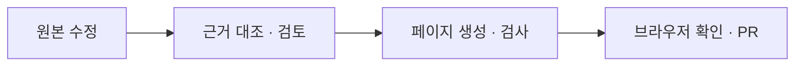

<h1 lang="en">Trust starts with a trace.</h1>

**코드로 확인한 동작과 기기에서 관찰한 결과를 구분하세요.** 이 페이지에서 근거의 종류, 검증 기록, 문서 갱신 절차를 확인할 수 있습니다.

## 근거와 검토 범위

| 근거 수준 | 의미 | 확인할 자료 |
| --- | --- | --- |
| 코드 확인 | 구현을 읽고 설명과 대조했습니다. 기기 실측을 의미하지 않습니다. | 각 페이지의 코드 근거와 PR 검토 기록을 확인합니다. |
| 기기 검증 | 명시된 기기·빌드·조건에서 관찰한 결과입니다. | 아래의 기기 검증 자료를 확인합니다. |
| 설계 의도 | 과거 결정 기록에 명시된 선택입니다. 현재 구현과 다를 수 있습니다. | [설계 결정 원문](_inputs/decisions.md)의 D-번호를 확인합니다. |

[Architecture](architecture.md)·[Engine](engine.md)·[디버깅](troubleshooting.md)과 이 페이지 끝의 **문서 검토 상태**에는 해당 페이지에 연결된 구조 근거와 생성 원고의 기준 버전·검토 커밋이 있습니다. 관련 소스나 원고가 바뀌면 다시 검토해야 합니다. 이 상태는 수동으로 작성한 Probe·CTS·Benchmark·Callback 등 다른 페이지의 검토까지 보장하지 않습니다.

## 기기 검증 기록

검증 날짜, 앱 빌드, 기기와 실행 조건을 함께 확인하세요. 앱 화면 촬영 기록과 이전 기기 검증 기록은 수행 시점과 확인 범위가 다릅니다.

### 앱 화면 촬영

2026년 9월 27일 Galaxy S25+(SM-S936N)·Android 16(API 36)에서 배포된 0.15.0(versionCode 543)을 실행해 16개 화면을 촬영했습니다. 원본은 1440×3120 PNG이며, 각 기능의 담당 문서에 한 번씩 배치했습니다.

Live·CameraX 전환·사진 자동 고정·Recording 콜백·Probe 조회·CTS 실행·Benchmark 완료와 기록 저장을 확인했습니다. CTS 원문 목록, CLI 허용 설정, ZIP 기록은 화면 조회만 확인했습니다. 자세한 절차와 한계는 [촬영 기록](https://github.com/TTolsun/hal-camera/blob/main/docs/validation/2026-09-27-app-screenshots.md)에 있습니다. 화면에 보이는 수치는 해당 순간의 관찰이며 기기의 대표 성능값이 아닙니다.

2026년 9월 29일 같은 기기의 Lab 디자인 적용 빌드로 Probe, CTS 4개, Benchmark 4개, CLI 설정, ZIP 목록의 기존 이미지 11개를 교체했습니다. 설치 빌드는 기존 데이터 보존을 위해 versionCode 590을 유지했습니다. Rapid Open / Close는 35초 PASS로 완료했고, Benchmark 완료·결과·기록을 확인했습니다. Live 관련 이미지는 이전 촬영본입니다. [Lab 검증 기록](https://github.com/TTolsun/hal-camera/blob/main/docs/validation/lab-ui-20260929.md)에서 확인 범위를 구분합니다.

### CTS 원문 케이스

Galaxy S25+·Android 16에서 2026년 9월 17~19일, versionCode 106~108로 수행한 기록입니다. versionCode 108의 SKIP 판정을 적용한 결과는 40개 메서드 중 **PASS 33 · FAIL 1 · SKIP 6**입니다. 여러 실행과 재실행을 합친 기록입니다. 원본 요청 ID와 로그 해석은 [STATUS.md](https://github.com/TTolsun/hal-camera/blob/main/docs/STATUS.md)에 있습니다.

| 클래스 | 결과 | 확인한 내용 |
| --- | --- | --- |
| `RecordingTest` | PASS 14 · SKIP 2 | `testBasic10BitRecordingAV1`은 AV1 10비트 인코더와 업스트림의 AV1 매핑이 없었으며, `testSlowMotionRecording`은 모든 카메라에 `HIGH_SPEED_VIDEO` 지원이 없어 건너뛰었습니다. `testVideoSnapshot`은 9분 52초, `testSupportedVideoSizes`는 4분 46초가 걸렸습니다. |
| `StillCaptureTest` | PASS 17 · FAIL 1 · SKIP 3 | `testAeCompensation`은 카메라 0의 노출 시간 범위 초과와 카메라 2의 AE 보정 미적용으로 실패했습니다. HEIC·HEIC UltraHDR·dynamic depth 미지원으로 관련 세 메서드는 건너뛰었습니다. `testStillPreviewCombination`은 18분 29초가 걸렸습니다. |
| `BurstCaptureTest` | PASS 2 · SKIP 1 | 정지 영상 bokeh를 지원하지 않아 `testYuvBurstWithStillBokeh`를 건너뛰었습니다. |

이 기록에서 초기화 단계의 `UiAutomation`·`@TestApi` 실패는 없었습니다. 공식 CTS 인증 결과는 아니며 다른 기기나 현재 빌드의 결과를 보장하지 않습니다. 실행 방법과 PASS·FAIL·SKIP의 정의는 [CTS](cts.md)에 있습니다.

추가 관찰은 [기기 검증 입력](_inputs/device-verification.yaml), [검증 문서](https://github.com/TTolsun/hal-camera/tree/main/docs/validation), [릴리스 기록](https://github.com/TTolsun/hal-camera/tree/main/docs/releases)에서 확인하세요.

### CameraX 기기 관찰

2026년 9월 27일의 V-002 기록입니다. 앱은 0.14.0 로컬 release 빌드(versionCode 540~542)이며, 마지막 빌드의 앱 코드는 main의 `06717ba`와 같습니다. Galaxy S25+의 Android 16 환경에서 후면 카메라 0으로 확인했습니다. 전면 카메라·다른 기기와 `yuvOffsetNs` 값은 검증하지 않았습니다.

<!-- omm:begin id=device-notes -->

아래는 위 조건에서 수행한 V-002 기록의 관찰 결과입니다.

| 확인 항목 | 관찰 결과 |
| --- | --- |
| 사진 | 엔진 전환 없이 두 장이 저장됐습니다. JPEG는 4080×3060에 EXIF 방향 6, YUV는 480×640이었습니다. |
| 녹화 | H.264 1920×1080(90도 회전 정보), 약 10Mbps, AAC 48kHz 파일이 저장됐습니다. |
| AE 잠금 중 EV | EV +0.5를 적용하자 노출 시간×ISO가 1.42배가 됐고, 사진 EXIF는 1/59초, ISO 287, 노출 보정 +0.5였습니다. |
| AE 잠금 중 플래시 On 사진 | 플래시가 발광했고 1/1169초, ISO 25로 저장됐습니다. 잠금 직전 프리뷰는 ISO 161, 8.33ms였습니다. |
| 녹화 중 AF 잠금 | 첫 Status 이벤트에서 초점 요청을 다시 보내기 전에는 AF Idle, 다시 보낸 뒤에는 No focus(잠김)로 표시됐습니다. |
| `cancelFocusAndMetering` 뒤의 AE 잠금 | 이 호출을 쓰던 빌드에서는 탭 초점이 끝난 뒤 AE 잠금을 켜도 결과가 AE OK였고, 최신 프레임 메타데이터의 `android.control.aeLock`이 OFF였습니다. 호출을 없앤 빌드에서는 탭 초점 종료, 녹화 시작·종료, 플래시 사진 뒤에도 AE Locked가 유지됐습니다. |

`CameraXControls`의 `cancelFocusAndMetering` 우회와 녹화 중 초점 요청 재전송은 이 관찰에서 나온 수정입니다. 플래시 사진의 재측광은 CameraX ImageCapture의 precapture 순서에서 온 것으로 보지만, CameraX 내부 로그로 확인하지는 않았습니다.

근거와 검토 정보

- 근거 파일: `app/src/main/java/dev/halcamera/camera/CameraXControls.kt`, `app/src/main/java/dev/halcamera/camera/CameraXStillCapture.kt`, `app/src/main/java/dev/halcamera/camera/CameraXLiveRecorder.kt`
- 기기 검증: `V-002`
- 근거 수준: 기기 검증
- 검토 2026-09-29 @ `2347e04` · Codex-code-review

<!-- omm:end id=device-notes -->

## 문서를 수정하고 검증하세요

문서 도구에는 **Node.js 24**가 필요합니다. `npm ci --prefix tools/docgen --ignore-scripts`로 공용 엔진을 설치합니다. 문서 원본은 다음과 같이 나뉩니다.

| 수정할 내용 | 원본 |
| --- | --- |
| 구조와 코드 근거 | `.omm/`와 추출 대상 소스를 수정합니다. |
| 생성 본문 | `guide/_content/`의 원고를 수정합니다. 페이지의 `omm:begin`·`omm:end` 사이를 직접 고치지 않습니다. |
| 일반 본문과 메뉴 | `guide/*.md`의 마커 밖 본문과 `guide/_config.yml`을 수정합니다. |
| 페이지별 근거 연결 | `guide/_bindings.yaml`을 수정합니다. |
| 사이트 스타일 | `docs/design/editorial.css`를 수정합니다. 생성된 CSS와 `docs/*.html`은 직접 고치지 않습니다. |

1. 원본을 수정한 뒤 사실 정보를 추출하고 변경된 근거를 확인합니다.

   ~~~powershell
   node tools/docgen/docflow.mjs extract
   node tools/docgen/docflow.mjs verify --changes
   ~~~

2. 코드와 원고를 대조하고 변경 사항을 커밋합니다. 검토 상태를 승인할 때에는 추적되지 않은 파일까지 없는 깨끗한 작업 트리를 사용합니다.

   ~~~powershell
   node tools/docgen/docflow.mjs verify --accept --reviewer=검토자
   node tools/docgen/docflow.mjs generate
   node tools/docgen/docflow.mjs site build
   ~~~

3. 생성된 페이지와 검토 기록을 커밋한 뒤 회귀 검사와 CI용 검사를 실행합니다.

   ~~~powershell
   npm test --prefix tools/docgen
   node tools/docgen/docflow.mjs check --ci
   ~~~

4. 브라우저에서 문장, 링크, 표와 모바일 배치를 확인하고 PR에 검증 결과를 남깁니다. 검토 승인 명령과 자동 검사는 원고를 읽는 일이나 기기 검증을 대신하지 않습니다.

`docs-sync`는 main의 관련 변경에서 근거의 최신성을 확인합니다. PR에서 검토와 재생성을 마쳐 근거 해시가 같으면 추가 동기화 PR 없이 끝납니다. 운영과 실패 복구는 [문서 도구 안내](https://github.com/TTolsun/hal-camera/blob/main/tools/docgen/README.md)에 있습니다.

한국어 문장은 [fluent-korean](https://github.com/snflkd/fluent-korean)과 [공통 집필 규칙](https://github.com/TTolsun/omm-doc-workflow/blob/main/style/README.md)에 따라 다듬습니다. 사용법은 해당 기능 페이지에 한 번만 설명하고, 다른 페이지에서는 필요한 부분으로 연결합니다.

## 문서 검토 상태

아래 표는 이 페이지에 연결된 CameraX 기기 관찰 원고의 검토 상태입니다. 위 CTS 요약을 포함한 수동 본문의 검토 범위는 PR 기록에서 확인합니다.

<!-- omm:begin id=status -->

- 검증 기준 앱 버전: 0.16.0 (versionCode 593)

| 항목 | 최신성 | 검토 |
| --- | --- | --- |
| 구조 원본 `overall-architecture` | 최신 | 검토 2026-09-29 @ `2347e04` · Codex-code-review |
| 원고 `device-notes` | 최신 | 검토 2026-09-29 @ `2347e04` · Codex-code-review |

<!-- omm:end id=status -->

**다음 단계:** 구현 구조는 [Architecture](architecture.md), 과거의 선택은 [설계 결정 원문](_inputs/decisions.md)에서 확인하세요.
