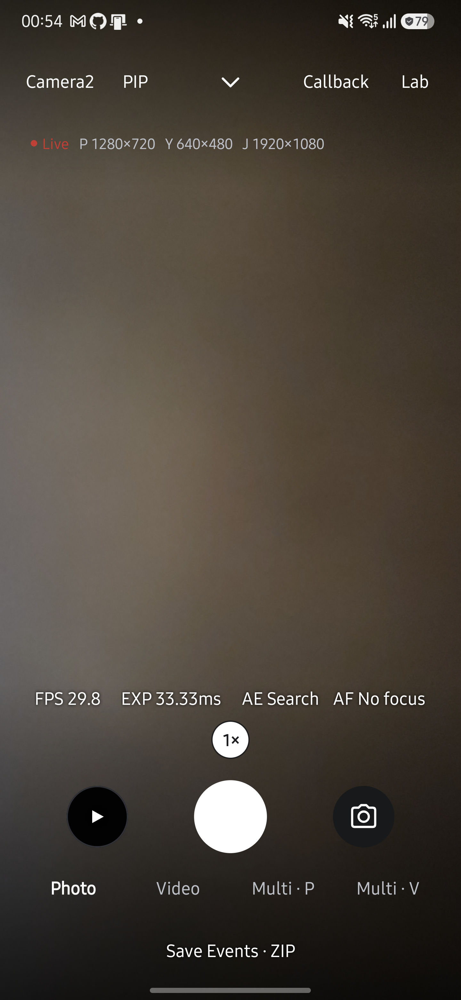
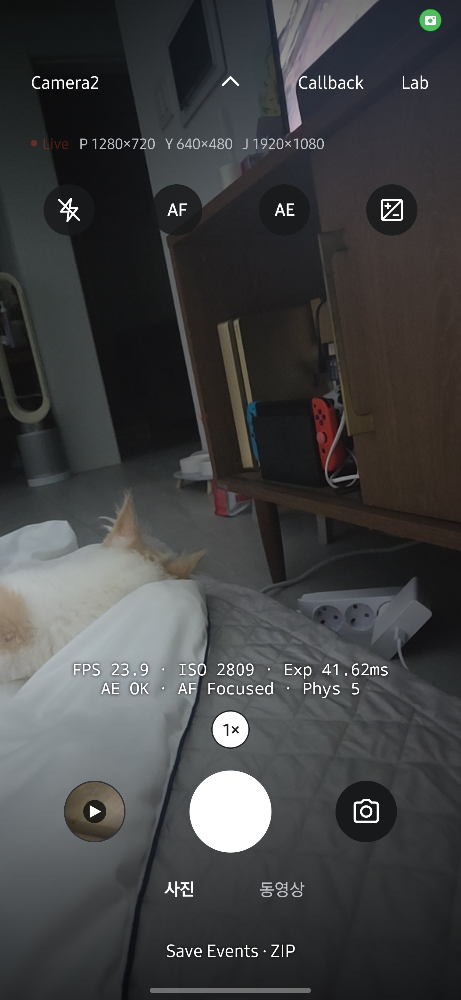

<h1 lang="en">Build. Run. Observe.</h1>

**저장소 루트에서 Gradle Wrapper로 앱을 빌드하세요.** 아래 명령은 Windows PowerShell을 기준으로 작성했습니다.

## 실행 전에 준비하세요

JDK 17과 Android SDK 36, `adb`가 필요합니다. PowerShell에서 `$env:JAVA_HOME`을 JDK 설치 경로로 설정합니다. SDK와 JVM 대상 버전은 [아래 빌드 정보](#앱-버전과-빌드-설정)를 확인하세요.

Android SDK 경로는 저장소 루트의 `local.properties`에 설정합니다. 이 파일은 개인 환경 설정이므로 커밋하지 않습니다. 기기에서 USB 디버깅을 켜고 PC의 연결 요청을 허용한 뒤 `adb devices`로 연결 상태를 확인하세요.

## 앱을 빌드하고 실행하세요

1. 디버그 APK를 빌드합니다.

   ~~~powershell
   .\gradlew.bat :app:assembleDebug
   ~~~

2. JVM 단위 테스트를 실행합니다.

   ~~~powershell
   .\gradlew.bat :app:testDebugUnitTest
   ~~~

3. 연결한 기기에 APK를 설치합니다.

   ~~~powershell
   adb install -r app/build/outputs/apk/debug/app-debug.apk
   ~~~

4. 앱을 열고 카메라 권한을 허용합니다. Live에서 프리뷰가 나오는지 확인합니다.

PC 터미널에서 촬영·녹화·CTS를 실행하려면 앱의 `도구 → 설정 · 앱 정보 → ADB CLI 설정`에서 `ADB CLI 허용`을 켜고 [CLI](cli.md)를 따르세요. PC에는 `adb`만 있으면 되며, 프리뷰·사진·녹화 명령과 무선 연결 절차도 그 페이지에 있습니다.

빌드와 테스트가 통과하면 APK 생성과 JVM 테스트 결과를 확인한 것입니다. 측정 정확성과 기기 동작은 별도로 검증해야 합니다. 검증 자료의 구분과 기록 위치는 [Evidence](evidence.md)를 확인하세요.

아래 화면은 2026년 9월 27일 Galaxy S25+·Android 16에서 HAL CAMERA 0.15.0을 실행해 촬영했습니다. <a href="evidence.html#앱-화면-촬영">촬영 조건과 확인 범위</a>를 함께 확인하세요. 이미지를 누르면 원본이 열립니다.

## Live에서 촬영하세요

1. 상단에서 엔진과 카메라를 선택합니다. Camera2와 CameraX 모두 선택한 엔진에서 사진·동영상을 저장합니다.
2. 사진 모드에서 셔터를 누릅니다. 기본 설정은 YUV를 변환한 JPEG와 카메라가 만든 JPEG 두 장을 `DCIM/HALCamera`에 저장합니다. Camera2에서 출력을 하나만 켜면 해당 사진만 저장합니다. 두 엔진이 사진 쌍을 구성하는 차이는 [Engine](engine.md#두-엔진의-차이)에서 확인합니다.
3. 동영상 모드에서 셔터를 눌러 녹화를 시작하고 다시 눌러 종료합니다. 종료 처리 중에는 셔터를 사용할 수 없으며, 저장이 끝나면 안내 문구가 나타납니다.
4. 최근 썸네일을 눌러 앨범을 확인합니다.

<figure class="app-screenshot" id="screen-live">

<figcaption>Camera2의 사진 모드입니다. 하단에서 실시간 정보, 줌, 셔터와 최근 썸네일을 확인할 수 있습니다. <a href="assets/screenshots/live.png">원본 보기</a></figcaption>
</figure>

녹화 중에는 셔터 아래에 경과 시간이 표시됩니다. 줌은 계속 바꿀 수 있지만 엔진·카메라·모드 변경, 일시정지, 갤러리와 다른 도구 진입은 제한됩니다. 녹화를 마치면 사진용 프리뷰로 돌아오며 동영상 모드 선택은 유지됩니다.

### Live 스트림을 설정하세요

1. Live 옆의 크기 표시를 누릅니다. `Lab → Settings → Live Streams`에서도 같은 설정을 열 수 있습니다.
2. Preview 크기와 YUV·JPEG의 크기 또는 `Off`를 선택합니다. 둘 다 끄면 프리뷰만 실행하며 사진 셔터는 비활성화됩니다.
3. 프리뷰 FPS를 고르고 녹화는 Format → Resolution → Frame Rate 순서로 선택합니다. 해상도는 큰 순서로 표시합니다. 녹화는 Preview + Encoder로 전환하며, 고속 세션은 제공하지 않습니다.
4. `저장`을 누르면 진입한 화면으로 돌아가며 현재 Camera2·CameraX 엔진에 적용합니다. Live에서 직접 열었다면 바로 프리뷰로 복귀합니다. 상단·시스템 뒤로 가기는 저장하지 않고 돌아갑니다.
5. Live의 P·Y·J 표시에서 적용 크기를 확인합니다. 녹화 중에는 P·R과 H264·HEVC·Auto가 표시됩니다. 실패하면 설정 화면에서 이유를 확인하고 `직전 정상 구성`으로 복구합니다. 개별 크기를 지원해도 출력 조합은 거부될 수 있습니다.

설정은 카메라와 엔진마다 구분합니다. CameraX 녹화 포맷은 Auto이며 코덱은 라이브러리가 선택합니다. Live 설정은 Benchmark의 profile을 바꾸지 않습니다. API별 구성 검사와 저장 방식은 [Camera2 엔진](engine.md#camera2-엔진)에서 확인합니다.

### 초점과 노출을 조절하세요

상단 가운데 화살표로 제어 줄을 펼칩니다. 선택한 Flash·AF·AE와 EV는 제어 줄을 접어도 유지됩니다. AF·AE 잠금은 같은 버튼으로 해제하고, 플래시는 `Off`로, EV는 눈금 옆 `0`으로 초기화합니다. 카메라나 엔진을 바꾸면 제어가 기본값으로 돌아갑니다.

| 조작 | 동작 |
| --- | --- |
| 프리뷰를 짧게 터치합니다. | 해당 지점에 초점을 맞춥니다. 모서리 사각형이 초록색이면 성공, 빨간색이면 실패입니다. 5초 뒤 전체 화면 기준으로 돌아가며, AF 잠금이 켜져 있으면 잠금을 풀 때까지 유지합니다. |
| 프리뷰를 길게 누릅니다. | 해당 지점을 기준으로 AE를 잠급니다. 원 위의 자물쇠와 AE 버튼으로 잠금 상태를 확인합니다. |
| 다른 지점을 짧게 터치하거나 AE 버튼을 누릅니다. | 터치로 설정한 AE 잠금을 해제합니다. |

<figure class="app-screenshot" id="screen-live-controls">

<figcaption>상단 화살표로 제어 줄을 펼쳤습니다. Flash·AF·AE·EV를 조작할 수 있습니다. <a href="assets/screenshots/live-controls.png">원본 보기</a></figcaption>
</figure>

프리뷰 정보의 `AE Locked`는 노출 잠금, `AF No focus`는 AF 잠금 상태에서 초점을 맞추지 못했음을 뜻합니다. [Callback](callback.md) 그래프를 켜면 이 정보 줄을 숨기고 프레임별 콜백을 표시합니다. 촬영 지연이나 노출 변화가 예상과 다르면 [디버깅](troubleshooting.md#앱과-프레임워크hal을-구분하세요)을 확인하세요.

## 앱 버전과 빌드 설정

<!-- omm:begin id=build-identity -->

| 항목 | 값 |
| --- | --- |
| `applicationId` | `dev.halcamera` |
| `namespace` | `dev.halcamera` |
| `versionName` | `0.16.0` |
| `versionCode` | `593` |
| `minSdk` | `26` |
| `targetSdk` | `36` |
| `compileSdk` | `36` |
| `gradleVersion` | `8.13` |
| `jvmTarget` | `17` |

근거와 검토 정보

- 근거: `app/build.gradle.kts`, `gradle/wrapper/gradle-wrapper.properties`
- 근거 수준: 코드 확인

<!-- omm:end id=build-identity -->

**다음 단계:** 반복 측정은 [Benchmark](benchmark.md), 문서 수정과 검증 절차는 [Evidence](evidence.md)를 확인하세요.
