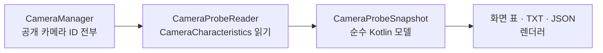

<h1 lang="en">What the HAL claims.</h1>

**PROBE는 측정이 아니라 선언입니다.** 카메라를 열지 않고 `CameraCharacteristics`를 읽어, Camera2 HAL이 공개한 사양을 카메라별 표로 보여 줍니다. 여기에 적힌 값은 HAL이 "할 수 있다"고 말한 것이며 실제로 그렇게 동작하는지는 [Benchmark](benchmark.md)가 답합니다.

이 그림은 사양 표가 만들어지는 개념적 순서입니다. `CameraProbeReader`만 `CameraManager`를 알고, 모델과 렌더러는 JVM 테스트로 검증합니다.

<h2 lang="en">Read the table for what it is.</h2>

| 확인할 항목 | 확인하는 이유 |
| --- | --- |
| 카메라 목록 | 공개 ID뿐 아니라 논리 카메라 뒤의 물리 카메라도 `0.2`처럼 별도 항목으로 읽습니다. 앱이 직접 열 수 없는 물리 카메라도 사양은 보입니다. |
| 섹션 | IDENTITY, CAPABILITIES, STREAMS, SENSOR, LENS, CONTROL, REQUEST, PROCESSING, SESSION KEYS, MANDATORY STREAM COMBINATIONS, HIGH SPEED VIDEO, REPROCESSING INPUTS, ALL CHARACTERISTICS 순서입니다. 섹션 제목을 누르면 접거나 펼칩니다. |
| enum 값의 이름 | `CameraMetadata` 상수에서 reflection으로 읽으므로 새 API 값도 숫자가 아니라 이름으로 표시됩니다. |
| 읽지 못한 항목 | 카메라나 섹션을 읽지 못하면 빈칸이 아니라 실패 목록에 남깁니다. 내보낸 파일에도 무엇이 빠졌는지 적힙니다. |
| 필터 | 단어를 넣으면 그 단어가 든 줄만 목록으로 나오고, 항목을 누르면 해당 줄로 이동합니다. 예: `JPEG`, `1080`, `x`. |

A capability table is a promise. Measure before you trust it.

<h2 lang="en">Take it with you.</h2>

`TXT`와 `JSON`은 모든 카메라의 사양을 파일로 공유하고, `복사`는 현재 카메라만 클립보드에 넣습니다. 이미지 픽셀은 포함되지 않습니다. 같은 기기의 빌드 전후를 비교하거나, 다른 기기의 HAL이 무엇을 공개하는지 나란히 볼 때 JSON을 씁니다. Benchmark 결과 JSON과는 별개 파일이며 자동으로 연결되지 않습니다.

<h2 lang="en">Where it sits in the app.</h2>

LIVE 상단 `도구` 메뉴에서 열며, 카메라를 열지 않으므로 닫기 완료를 기다리지 않고 바로 열립니다. `Benchmark` 화면에서도 현재 선택한 카메라로 바로 들어갈 수 있습니다. 배치 기준은 [APP-UI.md](https://github.com/TTolsun/hal-camera/blob/main/docs/design/APP-UI.md)의 "도구 메뉴와 독립 화면"에 있습니다.

코드 근거를 확인하세요

저장소의 <code>app/src/main/java/dev/halcamera/camera/</code>에서 <code>CameraProbe.kt</code>(모델·TXT·JSON 렌더러), <code>CameraProbeReader.kt</code>(CameraManager 읽기)와 <code>app/src/main/java/dev/halcamera/CameraProbeActivity.kt</code>(화면)를 확인하세요. 원고의 검토 상태는 아키텍처 문서 끝에 있습니다.

**다음 단계:** 사양 표에서 본 스트림 조합이 실제로 어떤 시간에 열리고 첫 프레임을 내는지 [Benchmark](benchmark.md)로 확인하세요.
