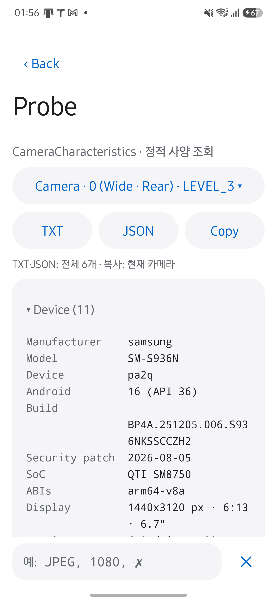

<h1 lang="en">What the HAL claims.</h1>

**Probe에서 카메라가 공개한 사양을 확인하세요.** 카메라를 열지 않고 `CameraCharacteristics`를 읽어, Camera2 HAL이 공개한 사양을 카메라별 표로 보여 줍니다. 이 값은 지원 사양이며 실측 결과는 아닙니다. 그 선언대로 통과하는지는 [CTS](cts.md)가, 실제로 얼마나 걸리는지는 [Benchmark](benchmark.md)가 답합니다.

## 앱에서 Probe를 여세요

1. Live에서 `Lab → Probe`를 엽니다.
2. 확인할 카메라를 선택합니다. 처음에는 Live에서 고른 카메라가 표시됩니다.
3. 필터에 `JPEG`처럼 찾을 단어를 입력하고 결과를 누릅니다.

**확인할 결과:** 선택한 카메라의 사양과 지원 값이 표시됩니다. 읽지 못한 항목은 실패 목록에 남습니다. 실제 출력 조합이 동작하는지는 [CTS](cts.md)로 따로 확인하세요.

다른 검사를 하려면 Lab으로 돌아갑니다. Probe는 카메라를 열지 않습니다.

아래 화면은 2026년 9월 29일 Galaxy S25+·Android 16에서 HAL CAMERA 0.15.0을 실행해 촬영했습니다. <a href="evidence.html#앱-화면-촬영">촬영 조건과 확인 범위</a>를 함께 확인하세요. 이미지를 누르면 원본이 열립니다.

<figure class="app-screenshot" id="screen-probe">

<figcaption>카메라 0을 선택하고 Device 영역을 펼쳤습니다. 제조사·모델·Android·SoC와 선택 카메라의 LEVEL_3 선언을 확인할 수 있습니다. <a href="assets/screenshots/probe.png">원본 보기</a></figcaption>
</figure>

## 사양 표를 읽으세요

| 확인할 항목 | 확인하는 이유 |
| --- | --- |
| 카메라 목록 | 항목 이름은 앱 전체가 함께 쓰는 `Camera · 0 (Wide · Rear)` 표기이며, 뒤에 하드웨어 레벨이 붙습니다. 공개 ID뿐 아니라 논리 카메라 뒤의 물리 카메라도 `Camera · 0.2 (UWide · Rear)`처럼 별도 항목으로 읽습니다. 앱이 직접 열 수 없는 물리 카메라도 사양은 보입니다. |
| 섹션 | IDENTITY, CAPABILITIES, SENSOR, LENS, CONTROL, PROCESSING, REQUEST, REQUEST · RESULT KEYS, SESSION KEYS(API 28 이상), MANDATORY STREAM COMBINATIONS(API 29 이상) 다음에 STREAMS가 출력 형식별로 나뉘어 옵니다(`STREAMS · PRIVATE (SurfaceTexture)`, `STREAMS · PRIVATE (MediaRecorder)`, `STREAMS · JPEG`처럼). 그 뒤에 HIGH SPEED VIDEO, REPROCESSING INPUTS, ALL CHARACTERISTICS입니다. 섹션 제목을 누르면 접거나 펼칩니다. |
| enum 값의 이름 | `CameraMetadata` 상수에서 reflection으로 읽으므로 새 API 값도 숫자가 아니라 이름으로 표시됩니다. |
| 읽지 못한 항목 | 카메라나 섹션을 읽지 못하면 빈칸이 아니라 실패 목록에 남깁니다. 내보낸 파일에도 무엇이 빠졌는지 적힙니다. |
| key 이름 목록 | REQUEST · RESULT KEYS와 SESSION KEYS는 값이 아니라 key 이름의 목록입니다. 사양 표는 어떤 key를 요청에 넣을 수 있고 결과로 돌려받는지만 알고, 그 값은 요청마다 정해지므로 여기에 없습니다. |
| 필터 | 단어를 넣으면 그 단어가 든 줄만 목록으로 나오고, 항목을 누르면 해당 줄로 이동합니다. 값이 여러 줄인 항목은 첫 줄과 남은 줄 수만 보입니다. 예: `JPEG`, `1080`, `✗`. |

A capability table is a promise. Measure before you trust it.

## 사양을 내보내세요

`TXT`와 `JSON`은 모든 카메라의 사양을 파일로 공유하고, `복사`는 현재 카메라만 클립보드에 넣습니다. 이미지 픽셀은 포함되지 않습니다. 같은 기기의 빌드 전후를 비교하거나, 다른 기기의 HAL이 무엇을 공개하는지 나란히 볼 때 JSON을 씁니다. Benchmark 결과 JSON과는 별개 파일이며 자동으로 연결되지 않습니다.

구현과 코드 근거

Live 카메라는 Lab 진입 전에 닫힙니다. 화면 배치 기준은 <a href="https://github.com/TTolsun/hal-camera/blob/main/docs/design/APP-UI.md">APP-UI.md</a>의 “Lab과 독립 화면”에 있습니다.

<code>CameraProbeReader</code>가 카메라 사양을 읽고, <code>CameraProbeSnapshot</code> 모델을 거쳐 화면 표·TXT·JSON으로 만듭니다. Reader만 <code>CameraManager</code>를 알며, 모델과 렌더러는 JVM 테스트로 검증합니다.

저장소의 <code>app/src/main/java/dev/halcamera/camera/</code>에서 <code>CameraProbe.kt</code>(모델·TXT·JSON 렌더러), <code>CameraProbeReader.kt</code>(CameraManager 읽기)와 <code>app/src/main/java/dev/halcamera/CameraProbeActivity.kt</code>(화면)를 확인하세요. 코드 확인과 기기 검증의 범위는 <a href="evidence.html">Validation</a>에서 구분합니다.

**다음 단계:** 사양 표에서 본 스트림 조합이 실제로 열리고 판정을 통과하는지 [CTS](cts.md)로 확인하세요.
