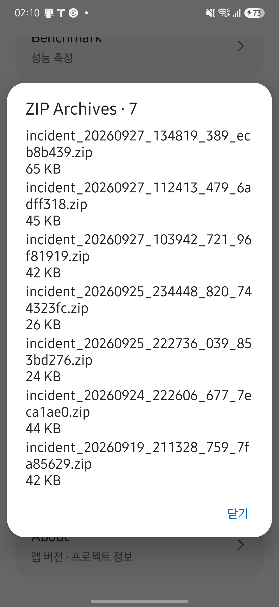

<h1 lang="en">Trace the cause.</h1>

**측정 결과가 예상과 다르면 세션 ID, 관측 창, `unknownReason`부터 확인하세요.** 그다음 원시 이벤트와 계산된 지표를 대조합니다. 지표에는 앱의 필터와 표본 수 규칙이 적용되어 있습니다.

| 지금 하려는 작업 | 이동할 절 |
| --- | --- |
| 재현에 필요한 정보를 모읍니다. | [문제 발생 시 수집할 정보](#문제-발생-시-수집할-정보) |
| 로그와 incident 번들을 확보합니다. | [로그와 진단 자료](#로그와-진단-자료) |
| 증상이 시작된 계층을 좁힙니다. | [앱과 프레임워크·HAL 구분](#앱과-프레임워크hal을-구분하세요) |
| 앱 버전과 SDK 설정을 확인합니다. | [빠른 시작의 빌드 정보](getting-started.md#앱-버전과-빌드-설정) |

실행 순서가 익숙하지 않다면 [주요 실행 흐름](architecture.md#주요-실행-흐름)을 먼저 읽으세요.

## 문제 발생 시 수집할 정보

재현 조건과 기록을 함께 남기세요. 앱 버전은 [빠른 시작의 빌드 정보](getting-started.md#앱-버전과-빌드-설정)와 대조합니다.

1. 기기 모델과 Android 빌드 번호를 기록합니다.
2. 사용한 엔진인 Camera2 또는 CameraX와 카메라 엔드포인트를 기록합니다.
3. 재현 절차와 반복 횟수 중 문제가 발생한 횟수를 기록합니다.
4. `이벤트 저장 · ZIP`으로 생성한 번들과 관련 로그를 확보합니다.

## 로그와 진단 자료

Live의 `이벤트 저장 · ZIP`은 직전 10초와 이후 5초의 이벤트를 incident ZIP으로 저장합니다. 저장한 파일은 `Lab → ZIP Archives`에서 공유합니다.

아래 화면은 2026년 9월 29일 Galaxy S25+·Android 16에서 HAL CAMERA 0.15.0을 실행해 촬영했습니다. <a href="evidence.html#앱-화면-촬영">촬영 조건과 확인 범위</a>를 함께 확인하세요. 이미지를 누르면 원본이 열립니다.

<figure class="app-screenshot" id="screen-incident-history">

<figcaption>Lab → ZIP Archives에서 기기에 저장된 incident 목록을 열었습니다. 기존 기록을 조회한 화면이며 이 촬영에서 ZIP 생성이나 공유를 실행하지 않았습니다. <a href="assets/screenshots/incident-history.png">원본 보기</a></figcaption>
</figure>

아래는 현재 추출기가 `TAG` 상수와 `Log.*` 호출에서 찾은 로그 태그입니다. 목록에 없다는 이유만으로 코드 전체에서 해당 태그를 사용하지 않는다고 단정할 수는 없습니다.

<!-- omm:begin id=log-tags -->

| 로그 태그 | 선언 위치 |
| --- | --- |
| `BenchmarkReport` | `app/src/main/java/dev/halcamera/benchmark/platform/BenchmarkReport.kt` |
| `BenchmarkStore` | `app/src/main/java/dev/halcamera/benchmark/platform/BenchmarkStore.kt` |
| `Camera2Ops` | `app/src/main/java/dev/halcamera/cts/Camera2Ops.kt` |
| `FastOnOffRunner` | `app/src/main/java/dev/halcamera/cts/onoff/FastOnOffRunner.kt` |
| `ProfileCompatibility` | `app/src/main/java/dev/halcamera/benchmark/platform/ProfileCompatibilityChecker.kt` |
| `StillPreviewCombinationRunner` | `app/src/main/java/dev/halcamera/cts/combination/StillPreviewCombinationRunner.kt` |
| `SwitchingRunner` | `app/src/main/java/dev/halcamera/cts/switching/SwitchingRunner.kt` |
| `VideoSnapshotRunner` | `app/src/main/java/dev/halcamera/cts/snapshot/VideoSnapshotRunner.kt` |

근거와 검토 정보

- 근거: `app/src/main/java/**/*.kt` 의 `TAG` 상수와 `Log.*` 호출
- 근거 수준: 코드 확인

<!-- omm:end id=log-tags -->

다음 명령으로 이 태그의 로그를 확인합니다.

~~~powershell
adb logcat -s BenchmarkReport BenchmarkStore ProfileCompatibility
~~~

incident 번들은 이벤트와 메타데이터를 담습니다. 이미지 픽셀은 저장하지 않습니다.

## 앱과 프레임워크·HAL을 구분하세요

<!-- omm:begin id=layer-isolation -->

**먼저 앱의 필터와 계산 규칙을 확인한 뒤 원시 이벤트를 대조하세요.** 프레임워크에서 받은 값과 앱이 계산한 지표를 구분해야 원인 계층을 좁힐 수 있습니다.

`Event.atNs`는 `FlightRecorder`가 주입받은 시계로 기록한 앱 시각이며, 앱에서는 `elapsedRealtimeNanos`를 사용합니다. 카메라가 제공한 센서 시각은 별도 필드인 `sensorNs`입니다. `intervalMs`, `resultFps`, `observedResultGap`은 앱이 계산한 파생값이므로 HAL 내부 상태의 직접 측정으로 해석하지 않습니다.

1. `unknownReason`, 세션 ID, 관측 창과 표본 수를 확인합니다. `INSUFFICIENT_SAMPLES`는 측정 대상의 고장을 뜻하지 않습니다.
2. `capture_failed.reason`, `buffer_lost`, `capture_result`의 센서 시각과 `frameDurationNs`를 대조합니다. `request_observed`는 요청 제출 시각이 아닙니다.
3. 센서 타임스탬프가 REALTIME 소스일 때만 앱 시각과 직접 비교합니다. 다른 시계의 값을 빼면 지연을 해석할 수 없습니다.
4. 앱 기록만으로 프레임워크와 HAL 중 원인을 확정하지 않습니다. 시스템 트레이스와 카메라 서비스 로그로 추가 확인해야 합니다.

### 표본과 보존 규칙

| 규칙 | 확인할 코드와 영향 |
| --- | --- |
| 닫힌 세션의 콜백을 버립니다. | `Telemetry.callback`의 `alive()`를 확인합니다. |
| 관측 세션과 시간 창을 선택합니다. | `RunAssembler.observe()`가 관측 시작 이전 결과를 워밍업으로 제외합니다. 고정 5프레임 규칙은 사용하지 않습니다. |
| 표본이 부족하면 값이 비어 있습니다. | `BenchmarkEvaluator`의 관측 통계는 해당 지표 표본 수가 15개 미만이면 `null`을 반환합니다. 3A 수렴은 워밍업 전 프레임도 사용합니다. |
| 오래된 이벤트를 제거합니다. | `FlightRecorder` 기본 설정은 30초·18,000개이며 `BenchmarkActivity`는 180초·60,000개로 구성합니다. 제거 횟수는 `Incident.capacityEvictions`이며 incident ZIP의 `incident.json`에는 `ringCapacityEvictionsSinceAppStart`(앱 시작 이후 누적)로 기록됩니다. |
| listener는 동기로 실행합니다. | `FlightRecorder.listener`에 무거운 처리를 추가하면 관측 경로에 영향을 줄 수 있습니다. |

지표의 표본 부족과 실행 전체의 validity는 별도로 계산됩니다. `MetricExtractor`는 워밍업을 제외한 프레임 수와 지표별 가용 데이터로 표본의 `unknownReason`을 정합니다. `RunAssembler`는 `observation.steadyFrames.size`를 `ValidityInputs.observedFrames`로 전달하고, `RunValidityEvaluator`는 이 값이 기본 15개에 미달하거나 시작·촬영 표본이 profile의 기대 개수보다 적으면 실행에 `INSUFFICIENT_SAMPLES` flag를 붙입니다. 이 평가는 개별 지표의 `unknownReason`을 읽지 않습니다.

### Callback에 값이 없을 때

현재 엔진과 Android 버전, 표시 중인 프레임의 요청 대상을 확인합니다. `No callback`은 관측할 수 없는 경로이며 `Awaiting data`와 다릅니다. 행별 수신 지점과 시간 기준, 상태별 의미는 [Callback](callback.md)에서 확인하세요.

### 사진 저장이나 노출이 예상과 다를 때

YUV Save Format이 NV21이면 파일 앱의 Download/HALCamera에서 `_YUV.nv21`을 확인합니다. JPEG이면 DCIM/HALCamera의 `_YUV.jpg`를 확인합니다. 두 포맷 모두 Download/HALCamera에 같은 촬영명의 `_metadata.json`을 저장합니다. NV21은 Camera2와 짝수 크기·프레임당 16 MiB 제한을 요구합니다. Camera2 사진은 최종 CaptureResult가 누락되면 5초 뒤 실패합니다.

Camera2의 기본 사진 저장에는 센서 타임스탬프가 일치하는 YUV·JPEG 버퍼가 모두 필요합니다. Live 스트림에서 출력을 하나만 켰다면 해당 출력만 기다리며, 그 이미지도 요청의 센서 시각과 일치해야 합니다. CameraX는 두 출력을 켰을 때 JPEG와 시각이 가장 가까운 analysis 프레임을 연결하므로, `media_saved.yuvOffsetNs`로 차이를 확인합니다. CameraX의 JPEG 단독 촬영은 analysis를 기다리지 않으며, YUV 단독 촬영은 요청 뒤의 analysis 프레임을 저장합니다. 엔진별 연결 기준을 먼저 구분한 뒤 Callback과 저장 오류를 대조하세요. 저장 완료 안내와 녹화 조작법은 [빠른 시작](getting-started.md#live에서-촬영하세요)에 있습니다.

Camera2의 Flash Auto·On에서 precapture 측광이 3초 안에 끝나지 않으면 안내 문구를 표시하고 촬영을 진행합니다. 촬영 지연을 확인할 때 이 대기 시간도 구분하세요. CameraX의 플래시 측광은 ImageCapture가 처리합니다.

AE 잠금을 켠 채 녹화를 시작하거나 멈추면 새 세션에서 노출을 다시 맞춘 뒤 잠급니다. 잠금 전과 1/3 EV 넘게 달라지면 차이를 알립니다. Camera2 녹화에서는 노출 시간이 30fps의 프레임 길이인 약 33 ms로 제한되므로 어두운 장면의 노출이 달라질 수 있습니다. 요청과 적용 결과는 `request_observed`·`capture_result`·`ae_relocked` 이벤트로 대조합니다.

### 실행 기록과 CSV의 개수가 다를 때

화면의 필터와 PC 집계의 적격성 필터가 다를 수 있습니다. [Benchmark의 실행 기록](benchmark.md#실행-기록에서-비교하고-내보내세요)에서 필터·내보내기·보관 한도를 확인하세요. CSV 출력 장치의 오류는 입력 JSON 오류와 구분하며, 출력 오류가 나면 작업은 실패로 종료합니다.

### CLI 작업이 끝나지 않을 때

PC의 대기 시간이 끝나도 앱 작업은 계속될 수 있습니다. 요청 ID로 상태를 확인하고 파일만 다시 회수하는 순서는 [CLI 오류 대응](cli.md#요청이-끝나지-않거나-파일이-없을-때)에 있습니다.

근거와 검토 정보

- 근거 파일: `app/src/main/java/dev/halcamera/cli/CommandStore.kt`, `tools/halcam/halcam/cli.py`, `app/src/main/java/dev/halcamera/MainActivity.kt`, `app/src/main/java/dev/halcamera/camera/CameraXStillCapture.kt`, `app/src/main/java/dev/halcamera/telemetry/Telemetry.kt`, `app/src/main/java/dev/halcamera/telemetry/FlightRecorder.kt`, `app/src/main/java/dev/halcamera/metrics/MetricExtractor.kt`, `app/src/main/java/dev/halcamera/benchmark/domain/RunAssembler.kt`, `app/src/main/java/dev/halcamera/benchmark/domain/RunValidity.kt`, `app/src/main/java/dev/halcamera/benchmark/domain/BenchmarkEvaluator.kt`, `app/src/main/java/dev/halcamera/benchmark/BenchmarkActivity.kt`, `app/src/main/java/dev/halcamera/benchmark/HistoryActivity.kt`
- 근거 수준: 코드 확인
- 검토 2026-10-09 @ `afeb6550` · Claude

<!-- omm:end id=layer-isolation -->

## 알려진 제약

미구현 지표와 추가 검증 사항은 [Architecture](architecture.md#미완성-기능과-추가-검증)에서 관리합니다. 기기에서 확인한 결과는 [Evidence](evidence.md)에 있습니다.

## 앱 규칙을 테스트로 확인하세요

동일한 이벤트 목록을 `MetricExtractor`에 입력하는 JVM 테스트로 계산 규칙을 확인할 수 있습니다. `MetricExtractorTest`는 표본 수가 14개일 때 부족으로 판정하고, 15개일 때 정상으로 판정하는 경계를 검사합니다.

앱의 결과 콜백 간격만으로 HAL 내부 프레임 드롭을 확정할 수 없습니다. 시스템 자료로 확인한 사실과 앱이 계산한 값을 구분해 기록하세요. 현재 기기 관찰 기록은 [Evidence](evidence.md)에서 확인할 수 있습니다.

## 문서 검토 상태

기준 앱 버전과 검토 커밋 확인

<!-- omm:begin id=status -->

- 검증 기준 앱 버전: 0.22.0 (versionCode 650)

| 항목 | 최신성 | 검토 |
| --- | --- | --- |
| 구조 원본 `data-flow` | 최신 | 검토 2026-10-09 @ `afeb6550` · Claude |
| 구조 원본 `state-transitions` | 최신 | 검토 2026-10-09 @ `afeb6550` · Claude |
| 원고 `layer-isolation` | 최신 | 검토 2026-10-09 @ `afeb6550` · Claude |

<!-- omm:end id=status -->

`코드 확인`과 실제 기기 검증은 서로 다른 근거입니다. 표의 검토 기록만으로 특정 기기에서 재현됐다고 판단하지 않습니다.

## 관련 코드

- `app/src/main/java/dev/halcamera/telemetry/`에서 이벤트 기록과 incident 내보내기를 확인합니다.
- `app/src/main/java/dev/halcamera/metrics/MetricExtractor.kt`에서 지표 계산 규칙을 확인합니다.

**다음 단계:** [문제 발생 시 수집할 정보](#문제-발생-시-수집할-정보)의 첫 단계에 따라 문제 실행의 `unknownReason`과 입력 조건을 확인하세요.
