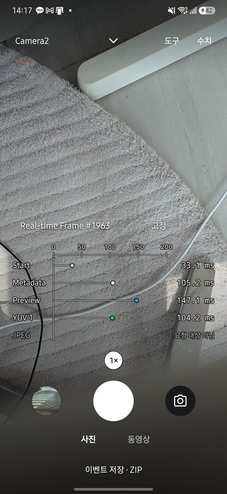
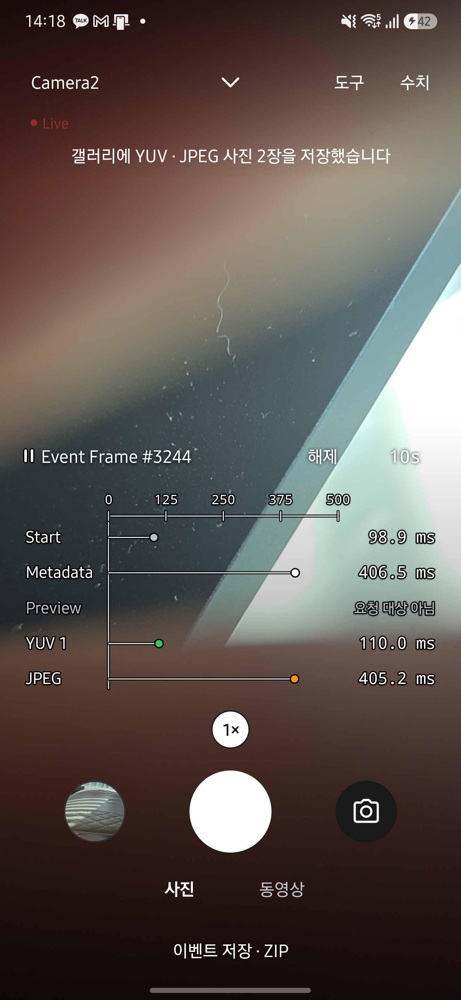
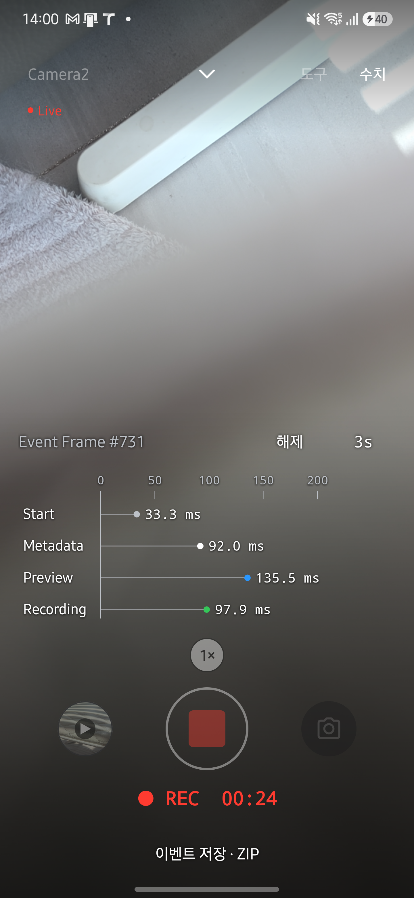

# Callback overlay review

Reviewed on 2026-09-27 against main 077e3f8. This is the author's code and UI review, not an independent approval.

## Behavior and review

- The session, requests and graph share StreamConfiguration and stable output IDs. Image timestamps are equality keys for frame correlation; graph offsets use only app callback arrival times relative to the previous Start. Partial is retained in telemetry but omitted from the graph. Unknown/unobservable results are never replaced by Metadata values.
- All displayed rows belong to one frame. Nonrepeating image arrivals hold that frame, late results may fill it, and a new photograph replaces it. Expired holds resume automatically. Default hold is enabled for 3 seconds; the duration cycles 3/5/10/15/30/1 seconds. Opening the graph cannot replay a prior photograph.
- Updates use the existing 100 ms UI tick. Removing the former 200 ms and 500 ms throttles avoids their approximately 600 ms combined cadence. A missing output cannot pin an old complete frame indefinitely: frames older than 250 ms remain eligible with missing rows explicitly waiting. Arrival sets avoid repeatedly scanning every track for each frame.
- Numerical values occupy a fixed right-aligned column; markers alone move. Outlines preserve text, ruler and marker contrast over a bright preview without a panel background. An actual hold displays a pause mark in a reserved slot; mode text and buttons retain their positions. FPS/ISO/AE/AF text is hidden while the graph is visible. Buttons retain 48 dp touch targets.
- Camera2 on Android 13+ receives PRIVATE recording buffers on a dedicated thread and transfers them through ImageWriter to MediaRecorder. It records arrival before timestamp conversion. REALTIME sensor timestamps are converted to the encoder's monotonic timebase; UNKNOWN timestamps are not subtracted from app time. Encoder release precedes relay cleanup to unblock any queueInputImage call. Benchmark recording is unchanged.
- Reviewed request targeting, per-session reset, frame matching, late/missing results, hold expiry, axis hysteresis, buffer ownership and lifecycle cleanup. No blocking finding remains in the reviewed change. Corrected stale documentation about the removed diagnostics panel, zoom behavior and graph refresh limits.

## Automated validation

- JDK 17: testDebugUnitTest (545 tests), lintDebug and assembleRelease passed for installed build 531. Release version override is an external local install script; the repository's version code is unchanged.
- Regression coverage includes configured stream identities, exact sensor-key correlation, previous-Start origin after ring eviction, recording arrival distinct from Metadata, per-update frame advancement, missing output fallback, hold duration/expiry/reconfiguration and stable axis shrink timing.
- Documentation regression tests: 21 passed. Coverage and generated page/site checks are part of the PR validation.

## Hardware validation

Galaxy S25+ (SM-S936N), Android 16, Camera2, wireless ADB:

- Build 531: visually checked fixed numerical alignment over a bright textured preview and an actual held still frame. Frame #3244 displayed Start 98.9 ms, Metadata 406.5 ms, YUV 1 110.0 ms and JPEG 405.2 ms; Preview correctly showed not targeted. The app reported both YUV and JPEG photographs saved. The pause mark appeared only while held.
- Build 529: actual Recording arrival displayed 97.9 ms for frame #731, alongside Start 33.3 ms, Metadata 92.0 ms and Preview 135.5 ms. Silent recording and a second start/stop succeeded, saving 1920x1080 MP4s of 77,971 ms and 7,600 ms. The same recorder implementation is retained in build 531.
- Build 530: 15-second gfxinfo observation with the graph visible reported 913 rendered frames, 0 modern janky frames, 4 legacy janky frames (0.44%), P95 6 ms and P99 8 ms. User interaction and scene changes occurred; this is not a controlled A/B benchmark. These are rendering metrics, not HAL latency or a direct measurement of graph update cadence.
- The earlier build 528 observation with the graph confirmed visible reported 916 frames, 0 modern janky frames, P95 7 ms and P99 11 ms after removing software rendering, repeated layout and main-thread PSS collection.

Limits: Preview measures TextureView update arrival, not HAL buffer return. Recording measures app buffer receipt, not encoder completion. Older Android versions retain the direct recorder path and cannot expose this callback; CameraX has no recording output in this app. Microphone/audio synchronization, other devices, large font settings and TalkBack were not hardware revalidated. No hardware result is inferred from JVM tests.

