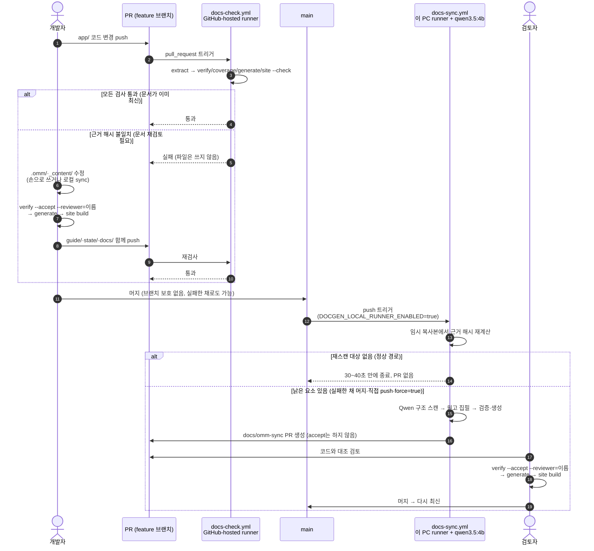

# docgen — 개발자 가이드 파이프라인 연결

`guide/`의 개발자 가이드를 코드 근거와 검토 기록에 맞춰 유지하고, `docs/`의 정적 사이트를 만듭니다. 파이프라인 코드는 이 저장소에 없습니다. 공용 엔진 [`@ttolsun/omm-doc-workflow`](https://github.com/TTolsun/omm-doc-workflow)를 `package.json`에 고정된 버전으로 설치하고, 이 디렉터리에는 엔진에 이 프로젝트를 연결하는 파일만 둡니다. 설계 근거와 내부 동작은 엔진 저장소의 README와 `docs/`에, 이 저장소의 과거 설계 기록은 [설계 문서](../../docs/design/DOCGEN-AUTOSYNC.md)에, runner 설치와 재부팅 절차는 [RUNNER-WINDOWS.md](RUNNER-WINDOWS.md)에 있습니다.

## 이 디렉터리의 파일

| 파일 | 역할 |
| --- | --- |
| `docflow.mjs` | 엔진 호출 진입점. `node tools/docgen/docflow.mjs <command>`로 실행하며 프로젝트 경로와 `project.json`을 고정해 넘깁니다 |
| `package.json` | 엔진 버전 고정. `npm ci --prefix tools/docgen --ignore-scripts`로 `node_modules/@ttolsun/omm-doc-workflow`에 설치합니다 |
| `project.json` | 엔진 설정. 코드 범위(`sourceInputs`), 바인딩 경로, 상태 디렉터리, 어댑터, Qwen 접속, 디자인 프리셋 |
| `extract-project.mjs` | 사실 추출 어댑터(`factsAdapter`). Gradle과 소스에서 `state/facts.json`의 값을 계산합니다 |
| `render-facts.mjs` | 사실 표 렌더러(`factsRenderer`). `build-facts`·`telemetry-facts` 블록을 Markdown 표로 만듭니다 |
| `coverage-project.mjs` | 담당 요소 검사 대상(`coverageAdapter`). `*Activity.kt`, manifest의 activity, `dev/halcamera/` 바로 아래 패키지를 대상으로 냅니다 |
| `state/` | `facts.json`(추출 결과), `evidence.json`(최신성과 검토 기록), `scan.json`(요소 스캔 캐시). 커밋 대상입니다 |
| `regression.test.mjs`, `workflow.test.mjs` | 이 저장소의 바인딩·어댑터·CI 설정이 엔진과 함께 동작하는지 확인하는 검사 |

집필 규칙(`style/`)은 엔진의 것을 그대로 사용합니다. 이 저장소에 복사본을 두지 않으며, 규칙이 바뀌면 원고 해시도 바뀌어 재검토 대상이 됩니다.

개발 중인 엔진을 쓰려면 `DOCFLOW_ENGINE_ROOT`에 엔진 작업본 경로를 지정합니다. `docflow.mjs`는 설치본보다 이 변수를 우선하며, 어느 쪽이든 `package.json`이 요구하는 버전과 같아야 실행합니다.

## 흐름

```
코드 ─ extract (factsAdapter) ─────→ state/facts.json           (결정론, 매번 재계산)
코드 ─ sync: 요소 단위 구조 스캔 (LLM) → .omm/<perspective>/     (구조, 근거, 제약)
.omm + facts + brief + _inputs ─ sync: 집필 (LLM) → guide/_content/<page>/<id>.md
위 원본 전부 ─ verify ─────────────→ state/evidence.json        (최신성, 검토 기록)
위 원본 전부 ─ generate ───────────→ guide/<page>.md 의 마커 블록
guide/ 전체 ─ site build ──────────→ docs/ 정적 사이트 (HTML, assets, _inputs, .nojekyll, .site-manifest.json)
```

`sync`는 임시 복사본에서 로컬 Ollama의 `qwen3.5:4b`를 호출합니다. 모델은 JSON 수정안만 반환하고 파일이나 셸 도구는 받지 않으며, 엔진이 검증한 결과만 원본에 반영합니다. 생성기는 글을 쓰지 않고 코드를 읽지 않습니다.

시각적 형식은 `docs/design/DESIGN.md`의 HAL CAMERA Editorial 규칙을 따릅니다. `project.json`은 `custom` 프리셋과 원본 `docs/design/editorial.css`를 연결하고, `docflow.mjs design`이 `guide/assets/docflow-design.css`를 생성합니다. `design --check`는 파일을 수정하지 않고 일치 여부를 검사합니다.

## 쓰기 권한

| 영역 | 작성 주체 |
| --- | --- |
| `.omm/**` | `sync` 구조 스캔 (LLM) |
| `guide/_content/**` | `sync` 집필 (LLM), 사람이 검토 |
| `tools/docgen/state/facts.json` | `extract` |
| `tools/docgen/state/evidence.json` | `verify` (검토 기록은 사람이 `--accept` 로) |
| `tools/docgen/state/scan.json` | `sync` (성공한 요소 스캔의 근거 해시와 완료 시각) |
| `guide/*.md` 의 마커 블록 내부 | `generate` |
| 마커 바깥 산문, front matter, `_bindings.yaml`, `_inputs/**`, `_config.yml`, `_layouts/**` | 사람 |
| `docs/*.html`, `docs/assets/**`, `docs/_inputs/**`, `docs/.nojekyll`, `docs/.site-manifest.json` | `site build` |

## 명령

먼저 엔진을 설치합니다. Node.js 24 이상이 필요합니다.

```bash
npm ci --prefix tools/docgen --ignore-scripts
```

```bash
node tools/docgen/docflow.mjs check [--ci|--build]   # CI 와 같은 순서의 전체 검사. --build 는 통과 뒤 docs/ 빌드
node tools/docgen/docflow.mjs extract                # 사실 추출
node tools/docgen/docflow.mjs verify                 # 최신성 상태 표
node tools/docgen/docflow.mjs verify --check         # CI: 최신이 아니면 실패
node tools/docgen/docflow.mjs verify --accept --reviewer=이름   # 검토 완료를 기록 (사람이 실행)
node tools/docgen/docflow.mjs coverage [--check]     # 담당 요소 표. --check 는 담당 없는 화면·패키지가 있으면 실패
node tools/docgen/docflow.mjs generate [--check]     # 페이지에 반영. --check 는 디스크와 다르면 실패
node tools/docgen/docflow.mjs design [--check]       # editorial.css → guide/assets/docflow-design.css
node tools/docgen/docflow.mjs site build             # guide/ → docs/ 정적 사이트
node tools/docgen/docflow.mjs site check             # CI: docs/ 가 빌드 결과와 다르거나 링크가 깨지면 실패
node tools/docgen/docflow.mjs site serve --base hal-camera   # 하위 경로 아래에서 미리보기
node tools/docgen/docflow.mjs brief <page> <id>      # 집필 프롬프트 출력
node tools/docgen/docflow.mjs sync [--dry-run|--scan-only|--write-only|--force]   # 낡은 원본을 LLM 으로 재생성
node tools/docgen/docflow.mjs sync --recover         # 중단된 파일 반영을 실행 전 상태로 복구
npm test --prefix tools/docgen                       # 이 저장소의 회귀 검사
```

`check`의 단계는 디자인 일치 → 사실 추출 → 최신성 → 담당 요소 → 생성 일치 → 사이트 일치 순서이고, `--ci`는 마지막에 `git diff --exit-code -- tools/docgen/state guide docs`를 더합니다. 실패하면 종료 코드 1과 실패한 단계 이름을 출력하고 뒤 단계를 실행하지 않습니다. 환경 문제(Node 버전, 인자)는 종료 코드 2입니다.

## 최신성 상태

| 상태 | 뜻 |
| --- | --- |
| 최신 | 검토 이후 관련 코드도 원본도 바뀌지 않음 |
| 관련 소스 변경됨 — 재검토 필요 | 근거 파일이 바뀜. `sync` 로 재생성하거나 직접 고친 뒤 `--accept` |
| 원본이 갱신됨 — 검토 대기 | `.omm/` 이나 원고가 바뀌었고 아직 사람이 검토하지 않음 |
| 검증 정보 없음 | 한 번도 `--accept` 하지 않음 |

최신성 판정 규칙은 다음과 같습니다.

- 해시 입력의 CRLF는 LF로 정규화합니다. 코드 근거는 텍스트 파일만 지정합니다.
- 원고 최신성에는 `based_on` 관점의 모든 `.omm` 필드와 코드 근거, 원고 자신, 바인딩의 집필 지침, facts, 두 사람 입력 파일(`_inputs/`)의 내용, `must_link` 파일, 엔진의 집필 규칙 원문이 포함됩니다. 인용 ID가 같아도 입력 파일 내용이 바뀌면 재검토 대상입니다.
- 공통 코드 파일 하나가 여러 요소의 근거일 수 있습니다. 예를 들어 `RunAssembler.kt` 변경은 요소 4개와 원고 5건의 재검토로 이어집니다.
- 검토 기록의 `accepted`는 사람이 `--accept --reviewer=이름`으로만 남깁니다. 자동 동기화는 이 값을 바꾸지 않으며, Codex의 코드 대조 기록은 사람의 승인이나 기기 실측을 뜻하지 않습니다.
- `--accept`는 git이 아니라 파일시스템을 걸으며 해시하므로, untracked 파일이 있는 tree에서 실행하면 CI가 모든 항목을 stale로 판정합니다. 깨끗한 worktree에서 실행합니다.

## 근거 수준

원고와 블록마다 `confidence` 를 둡니다. 생성기가 사람 입력과 대조합니다.

- `code`: 코드를 읽어 확인한 동작
- `device`: 실제 기기에서 검증한 동작. `_inputs/device-verification.yaml` 의 `V-xxx` 기록이 있어야 합니다.
- `intent`: 설계 의도나 추정. 이유는 `_inputs/decisions.md` 의 `D-xxx` 에 있는 것만 인용합니다.

모든 배포 페이지와 원고에는 엔진의 [공통 집필 규칙](https://github.com/TTolsun/omm-doc-workflow/blob/main/style/README.md)을 적용합니다. `brief`가 규칙 원문 전체를 모델에 전달하므로, 규칙이 바뀌면 원고 해시도 바뀌어 재검토가 필요합니다.

## 화면·패키지 추가

`verify` 는 기존 절이 낡았는지만 봅니다. 새 화면이 통째로 들어와도 기존 문단을 다시 검토하라고만 하므로, `coverage` 가 반대 방향을 검사합니다. `coverage-project.mjs`가 내는 대상, 즉 `app/src/main/java/dev/halcamera/` 아래의 모든 `*Activity.kt`(AndroidManifest 의 activity 포함)와 바로 아래 패키지 디렉터리는 `_bindings.yaml` 의 어떤 `sources.*.elements.*.evidence` 에든 들어 있어야 합니다. 관점 전체 evidence 의 넓은 글롭과 원고의 `sources:` 인용은 세지 않습니다. 인용은 문단 하나의 근거이지 요소의 소유가 아니기 때문입니다.

1. `.omm/<perspective>/…/<element>/` 디렉터리를 만들고 `description.md` 와 `meta.yaml` 을 씁니다. 화면이면 `overall-architecture/screens/` 아래가 자리입니다. 부모의 `meta.yaml` `children` 에도 이름을 넣습니다.
2. `_bindings.yaml` 의 해당 관점 `elements:` 에 요소 경로와 evidence 를 적습니다. 루트 키는 `.`이고, 지정하지 않은 요소는 가장 가까운 부모의 근거를 물려받습니다. 요소 하나의 근거는 Qwen 입력 한도(60,000자) 안이어야 하므로 큰 화면은 하위 요소로 나눕니다(`screens/probe-screen` 과 `screens/probe-screen/probe-model` 처럼).
3. `node tools/docgen/docflow.mjs coverage --check` 가 통과하는지 봅니다. 문서화하지 않을 파일은 `_bindings.yaml` 의 `coverage.ignore` 에 `path` 와 `reason` 을 함께 적습니다. 대상이 사라진 ignore 항목은 그 자체로 검사 실패입니다.
4. 요소를 추가하면 그 관점의 `.omm` 모델이 바뀌므로 `verify --accept` 로 검토를 기록하고 `generate` 를 실행합니다.

스캐너는 기존 요소의 필드만 갱신합니다. 요소 생성과 삭제는 이 절차대로 사람이 합니다.

## 페이지 추가

1. `guide/_bindings.yaml` 의 `pages` 에 페이지와 블록을 정의합니다.
2. 페이지 파일에 산문과 마커(`<!-- omm:begin id=… -->` / `<!-- omm:end id=… -->`)를 둡니다.
3. `content` 블록이면 `sync` 나 `brief` 로 원고를 만듭니다. 집필 근거는 원고 `sources`의 인용 파일과 `brief.must_link`에 대응하는 파일(`RunAssembler` → `RunAssembler.kt`)이며, 이 집합이 비면 `brief <page> <id>`로 첫 원고를 쓰라는 안내와 함께 실패합니다.
4. `generate` 를 실행하고 검토한 뒤 `verify --accept` 로 기록합니다.

## 사이트 빌드

- `site build`가 로컬에서 `guide/`를 `docs/`로 빌드하며, GitHub 측 Jekyll 빌드나 배포 workflow는 없습니다. Pages는 `main`의 `/docs`를 그대로 제공합니다.
- `check`는 커밋된 `docs/`가 `guide/`에서 다시 빌드한 결과와 같은지 검사하므로, `guide/`를 바꾼 PR은 `site build` 결과도 함께 커밋해야 합니다.
- 사이트 설정은 `guide/_config.yml`입니다. `output`, `nav`, `exclude`, 홈이 아닌 페이지 상단의 `page_label`을 여기서 정합니다.
- 헤딩 id는 kramdown GFM 규칙(소문자, 단어 문자·하이픈만 유지, 공백은 하이픈)으로 만들고 상대 `.md` 링크는 `.html`로 바꿉니다. 헤딩 텍스트를 바꾸면 그 헤딩을 가리키는 조각 링크도 함께 고쳐야 하며, 깨진 조각은 빌드 실패입니다.
- 레이아웃은 Mermaid 11.12.0을 CDN에서 불러와 구조도를 표시합니다.

## 로컬 Qwen 실행

1. `ollama list`에서 `qwen3.5:4b` 설치 여부를 확인합니다. Ollama 서버가 실행 중이어야 합니다.
2. 일반 디스크의 작업본에서는 `npm ci --prefix tools/docgen --ignore-scripts`로 엔진과 OMM CLI를 설치합니다.
3. `node tools/docgen/docflow.mjs sync --dry-run`으로 대상과 입력 크기를 확인한 뒤 `node tools/docgen/docflow.mjs sync`를 실행합니다.
4. diff를 코드와 대조한 뒤 검토 기록과 생성 페이지를 함께 갱신합니다.

Google Drive 작업본에서는 `npm install`이 0바이트 파일을 만들 수 있으므로 PowerShell에서 OMM을 로컬 디스크에 설치합니다. Windows에서는 엔진이 이 경로를 자동으로 찾고, 다른 위치에 설치했을 때만 `DOCGEN_OMM_CLI`를 지정합니다.

```powershell
$docgenTools = Join-Path $env:LOCALAPPDATA 'HALCamera/docgen-tools'
npm install --prefix $docgenTools --ignore-scripts oh-my-mermaid@0.2.0
$env:DOCGEN_OMM_CLI = Join-Path $docgenTools 'node_modules/oh-my-mermaid/dist/cli.js'
node tools/docgen/docflow.mjs sync
```

클라우드 API 키나 Claude 로그인이 필요하지 않습니다. 서버가 꺼졌거나 모델이 없으면 실패하며 다른 제공자로 전환하지 않습니다.

| 환경 변수 | 기본값 | 뜻 |
| --- | --- | --- |
| `DOCGEN_OLLAMA_URL` | `http://127.0.0.1:11434` | 루프백 주소만 허용합니다 |
| `DOCGEN_QWEN_MODEL` | `qwen3.5:4b` | 다른 로컬 모델을 쓸 때 지정합니다 |
| `DOCGEN_MAX_PROMPT_CHARS` | `60000` | 호출 하나의 입력 한도. 입력을 잘라 보내지 않으므로 넘으면 요소 이름·크기를 표시하고 실패합니다 |
| `DOCGEN_QWEN_CONTEXT` | `32768` (CI는 `49152`) | 컨텍스트 토큰. 올리기 전에 VRAM 여유를 확인합니다 |
| `DOCGEN_QWEN_NUM_PREDICT` | `8192` | 출력 토큰 한도. `done_reason`이 `stop`이 아니면 실패합니다 |
| `DOCGEN_LLM_TIMEOUT_MS` | `1800000` | 호출 전체 예산 |
| `DOCGEN_LLM_IDLE_MS` | `120000` | 마지막 청크 이후 무응답 한도 |
| `DOCFLOW_ENGINE_ROOT` | (없음) | 설치본 대신 사용할 엔진 작업본 경로 |

플래그는 네 가지입니다. `--dry-run`은 선택한 요소와 분할 개수·입력 크기를 계산하지만 모델을 호출하거나 파일을 쓰지 않습니다. `--scan-only`는 원고 집필을, `--write-only`는 구조 스캔을 건너뜁니다. `--write-only`는 코드가 바뀌었을 때 구조 갱신을 생략하는 수동 모드이므로, 먼저 일반 동기화나 `--scan-only`로 `.omm`을 갱신해야 합니다. `--force`는 최신성과 스캔 캐시(`state/scan.json`)를 무시하고 전체 요소를 다시 확인하며, 코드가 같아도 OMM 설명이나 집필 지침을 다시 검토할 때 씁니다.

스트리밍 전송, 요소 단위 스캔, 원고 근거 분할 요약의 동작 방식은 엔진 저장소의 문서에 있고, 이 저장소의 요소 근거 목록은 [실행 계획](../../docs/PLAN-docgen-autosync.md)에, 실제 실행 기록은 [validation-qwen.md](validation-qwen.md)에 있습니다.

## 실패와 복구

스캔, OMM 검증, 원고 계약, 페이지 생성 중 하나라도 실패하면 임시 복사본을 폐기하고 종료 코드 1을 반환합니다. 두 번째 원고가 실패해도 첫 번째 원고만 반영하지 않습니다. 실행 도중 원본이 바뀌면 결과를 반영하지 않습니다.

파일 반영 직전에 `state/sync-transaction/journal.json`에 이전 내용과 새 내용을 저장합니다. 처리 가능한 쓰기 오류는 즉시 되돌립니다. 프로세스가 강제로 종료되어 기록이 남으면 실행 중인 작업이 없는지 확인한 뒤 `node tools/docgen/docflow.mjs sync --recover`를 실행합니다. 복구 후 같은 동기화 명령을 다시 실행하면 됩니다. 복구 대상에 후속 편집이 있으면 해당 내용을 덮어쓰지 않고 중단합니다. 실행 잠금(`state/.sync-lock`)과 복구 기록은 커밋하지 않습니다. 이 절차는 프로세스 중단에 대한 복구이며 전원 장애에 대한 저장장치 내구성을 보장하지 않습니다.

형식 검증과 OMM 검사는 내용의 정확성을 보장하지 않습니다. 생성 원고에는 코드와 다른 주장이나 기존 조건의 누락이 생길 수 있으므로 PR에서 코드를 대조해야 합니다.

## 운영: 두 workflow의 역할과 PR이 생기는 조건

`docs-check.yml`은 모든 PR과 `main` push에서 GitHub-hosted runner로 엔진을 설치하고 검사만 하며 파일을 쓰지 않습니다. `docs-sync.yml`은 `main`의 코드·구조·바인딩·문서 도구 변경과 수동 실행에서만 동작하며, `.omm/`과 `guide/_content/`를 쓰는 유일한 자동 경로입니다. 저장소 변수 `DOCGEN_LOCAL_RUNNER_ENABLED=true`와 온라인 `docgen-qwen` runner가 필요하고, 변수가 없으면 작업은 시작 전에 건너뜁니다. 일반 GitHub-hosted runner는 개발자 PC의 Ollama에 접근할 수 없으며, 문서 동기화는 PR 이벤트를 받지 않습니다.

정상 경로에서는 `docs-sync`가 PR을 만들지 않습니다. `verify`는 커밋 해시가 아니라 파일 내용 해시(`codeHash`, `modelHash`)로 최신성을 판정하므로, PR 안에서 `--accept`까지 마치고 머지하면 `main`의 해시도 같아서 `재스캔 대상 perspective: (없음)`으로 30~40초 만에 끝납니다. 검토 기록의 `@ 커밋` 표기는 참고용 라벨입니다.

`docs-check`가 실패한 PR은 그 PR 안에서 사람이 문서를 고쳐야 합니다. `.omm/`과 `_content/`를 손으로 고치거나 로컬에서 `sync`를 실행한 뒤 `verify --accept --reviewer=이름`, `generate`, `site build`를 실행하고 그 결과를 같은 PR에 커밋합니다.

`docs-sync`가 실제로 `docs/omm-sync` PR을 여는 경우는 다음 세 가지입니다.

1. `docs-check`가 실패한 채로 머지했을 때. `main`에 브랜치 보호 규칙이 없으므로 빨간 검사를 무시하고 머지할 수 있습니다. 막으려면 GitHub Settings → Branches에서 `docs-check`를 required status check로 지정합니다.
2. `main`에 직접 push했을 때.
3. Actions에서 `force=true`로 수동 실행했을 때. 이 경우 전체 요소를 다시 스캔합니다.

즉 자동 PR은 사람이 문서 검토를 빠뜨렸을 때 뒤늦게 메우는 안전망이고, 정상 경로는 PR 안에서 사람이 끝내는 것입니다. 자동 PR의 원고는 4B 모델이 쓴 것이므로 그대로 머지하지 말고 코드와 대조해야 합니다(PR #66에서 실제로 수정했습니다).

위 내용을 한 PR의 흐름으로 그리면 다음과 같습니다. 위쪽 분기는 `docs-check`, 아래쪽 분기는 `docs-sync`입니다.



runner 서비스·Ollama 구성, 재부팅 뒤 절차, 실패한 실행의 복구는 [RUNNER-WINDOWS.md](RUNNER-WINDOWS.md)의 "운영과 재부팅" 절에 있습니다.

## 엔진 버전 올리기

1. 엔진 저장소에서 태그를 만들고 `npm test`가 통과하는지 확인합니다.
2. `tools/docgen/package.json`의 `github:TTolsun/omm-doc-workflow#v버전`과 `docflow.mjs`의 `REQUIRED_VERSION`을 같은 값으로 올립니다.
3. `npm install --prefix tools/docgen --ignore-scripts`로 `package-lock.json`을 갱신합니다.
4. `npm test --prefix tools/docgen`과 `node tools/docgen/docflow.mjs check`를 실행합니다. 집필 규칙이나 프롬프트 계약이 바뀐 버전이면 원고가 재검토 대상이 되므로, 차이를 확인한 뒤 `verify --accept --reviewer=이름`, `generate`, `site build`까지 같은 PR에 넣습니다.

## 테스트

```powershell
npm test --prefix tools/docgen                        # regression.test.mjs + workflow.test.mjs
node tools/docgen/docflow.mjs check                   # CI 와 같은 순서의 전체 검사
```

`regression.test.mjs`는 저장소를 임시 복사본에 복사한 뒤 줄바꿈·입력 변경·dry-run·마커 오류·담당 요소 검사를 확인하고, `workflow.test.mjs`는 `docs-sync.yml`의 실행 조건을 확인합니다. 모의 Ollama 응답과 실제 OMM CLI로 오류·복구를 검사하는 `sync.test.mjs`와 설치된 Qwen으로 전체 파이프라인을 확인하는 선택 검사(`DOCGEN_REAL_QWEN=1`)는 엔진 저장소에 있습니다. CI는 Windows와 Ubuntu에서 실행하며, 모든 검사는 임시 테스트 프로젝트 또는 모의 서버를 사용하므로 제품 코드나 배포 문서를 바꾸지 않습니다.

## 알려진 제약

- 엔진의 YAML 파서는 부분집합만 지원합니다(앵커, 여러 줄 스칼라, 인라인 매핑 없음).
- `.omm/` 바로 아래의 디렉터리는 모두 omm CLI 가 perspective 로 인식합니다. 그래서 추출 결과와 검증 상태는 `tools/docgen/state/` 에 둡니다.
